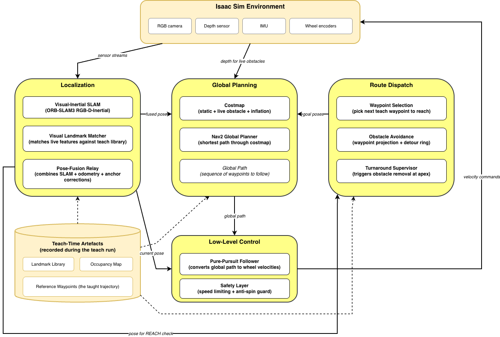
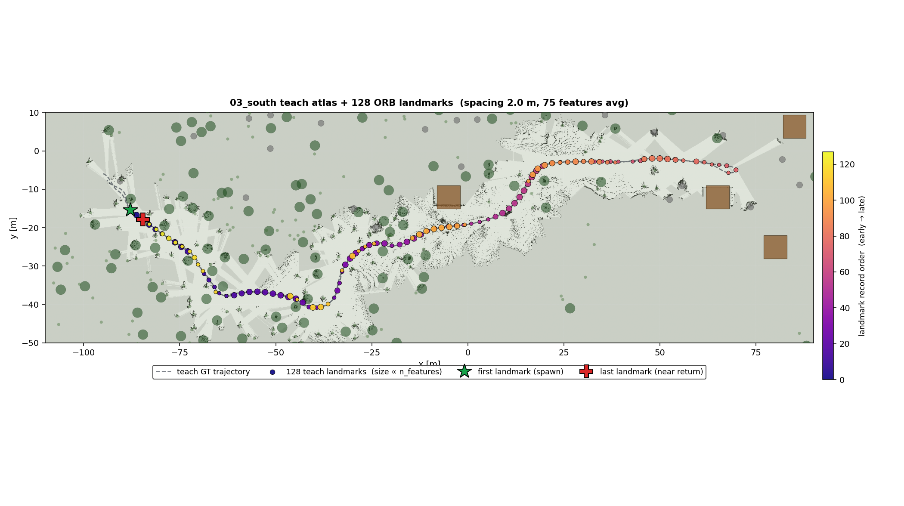
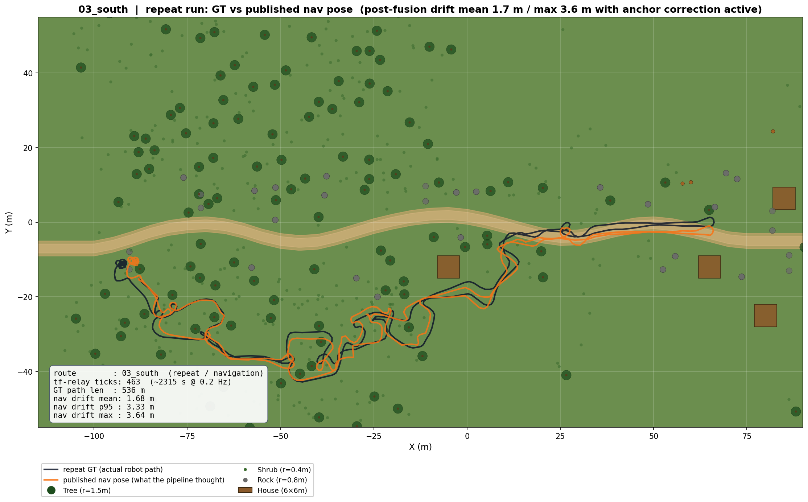
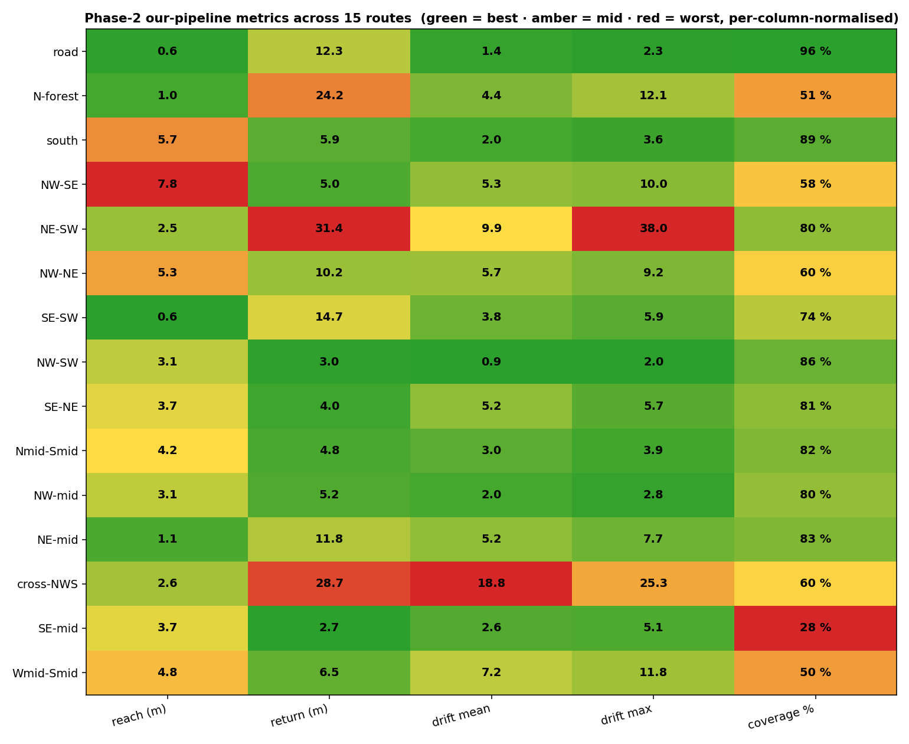

# Visual-Inertial SLAM and Navigation for outdoor UGV

bachelor thesis.  goal is visual-inertial point-to-point navigation with
obstacle avoidance for an autonomous ground robot (Clearpath Husky A200 style)
operating in outdoor environments, using an RGB-D camera and an IMU

the project has two halves. first half is benchmarking existing visual SLAM
methods on four public outdoor datasets - to figure out what works, where it
breaks, and what the real robot pipeline needs to look like.  second half is
building that pipeline in Isaac Sim and running a teach-and-repeat campaign
across 15 routes, with stock-Nav2 and RGB-D-only ablations for comparison

## How the final solution works



the system is a **two-pass teach-and-repeat** stack.  the diagram above
shows the full repeat-time graph; the teach pass uses the same Isaac +
Localization boxes but writes to disk instead of into Nav2.  i'll walk
through both passes with one route as a running example
(`03_south`, the south forest loop).

### Teach pass

on teach the robot is driven once along the planned route, while the
**Localization** subsystem records to disk what the repeat pass will
need.  only three of the diagram's boxes matter here:

- **Isaac Sim** publishes RGB + depth + IMU + wheel encoders
- **Localization** runs ORB-SLAM3 RGB-D-Inertial VIO and a relay
  ([`tf_wall_clock_relay.py --use-gt`](simulation/isaac/scripts/common/tf_wall_clock_relay.py))
  that publishes GT (not VIO) as `map -> base_link` so the recorded
  artefacts have no drift baked in.  in parallel
  [`visual_landmark_recorder.py`](simulation/isaac/scripts/common/visual_landmark_recorder.py)
  snapshots ORB descriptors + 3D depth points whenever the camera has
  moved another 2 m and the frame has enough features
- **Teach-Time Artefacts** (the cylinder) is what gets written:
  `landmarks.pkl` (ORB visual landmarks),
  `teach_map.{yaml,pgm}` (depth-derived occupancy at 0.1 m),
  the dense pose log `vio_pose_dense.csv`, and `traj_gt.csv` for
  later evaluation

Global Planning, Route Dispatch and Low-Level Control are all dormant
on teach - the robot follows the pre-planned A*-Chaikin trajectory
directly.



the teach plot above is `03_south`.  the dotted line is the planned
route, the orange dots are individual ORB landmarks the recorder
dropped along the way (one dot = one entry in `landmarks.pkl`,
~250-400 entries per route).  density is uneven on purpose - landmarks
are recorded only where the depth-variance gate passes, which means
clusters near houses, scattered through the forest, sparse on open
clearings.  the sparse stretches are exactly where VIO drift will need
to be tolerated on repeat.

### Repeat pass

on repeat the same teach trajectory is replayed autonomously, with
obstacles dropped along the outbound leg.  now all five subsystems on
the diagram are live:

- **Isaac Sim** publishes the same four sensor streams plus a depth
  point cloud (the obstacle layer needs it)
- **Localization** runs ORB-SLAM3 RGB-D-Inertial VIO + the visual
  landmark matcher (live frames matched against the teach
  `landmarks.pkl` via ORB + PnP-RANSAC) + the pose-fusion relay
  ([`tf_wall_clock_relay_v55.py`](simulation/isaac/scripts/common/tf_wall_clock_relay_v55.py))
  that combines VIO, wheel-odometry fallback and matcher anchor
  corrections through four fusion regimes (no_anchor / ok / strong /
  jump) and publishes `map -> base_link`
- **Global Planning** runs Nav2 `planner_server` on the static
  teach-time occupancy map + a depth-driven obstacle layer, with
  NavFn `GridBased` producing the global path
- **Route Dispatch** is a custom waypoint dispatcher
  ([`send_goals_hybrid.py`](simulation/isaac/scripts/nav_our_custom/send_goals_hybrid.py))
  - walks the teach WP list at 4 m spacing, projects unsafe WPs to
  the nearest free cell, falls back to a 4-7 m detour ring on plan
  failure, and the turnaround supervisor removes obstacles when GT is
  within 10 m of the apex so the return leg is obstacle-free
- **Low-Level Control** is a pure-pursuit follower
  ([`pure_pursuit_path_follower.py`](simulation/isaac/scripts/nav_our_custom/pure_pursuit_path_follower.py))
  with a safety speed-limiter and an anti-spin guard, emitting the
  velocity commands back into Isaac

the cylinder still feeds the live system: the matcher reads the
landmark library, the costmap loads the teach occupancy map, and the
dispatcher walks the teach waypoints.  closing the loop, the
Localization's published pose goes back to the dispatcher for the
REACH check.  see
[`simulation/isaac/routes/README.md#shared-pipeline`](simulation/isaac/routes/README.md#shared-pipeline)
for the exact process graph + scripts.



the repeat plot is the same `03_south` route at runtime: the green
line is what the relay was publishing as `map -> base_link` (i.e.
what Nav2 was planning against), the dotted line is GT, and you can
read drift right off as the gap between the two.  most of the run
sits within 1-2 m, with the matcher snapping pose back into agreement
each time the robot passes a landmark cluster - those snaps are the
visible kinks.  this is the "matcher pulls VIO drift back into the
map" pattern the whole stack is designed around.

## Isaac Sim teach-and-repeat campaign (15 routes)

### Headline results - 3-stack comparison across 15 routes

each stack ran on the same 15 teach trajectories, the same per-route
obstacle configuration, and the same 10 m endpoint threshold.

| stack | reach success | return success | avg WP coverage | avg drift mean |
|---|---|---|---|---|
| **our T&R** (RGB-D-Inertial + matcher + Nav2 + detour ring) | **15 / 15** (avg reach **3.5 m**) | **8 / 15** | **70 %** | 5.2 m |
| our pipeline, ORB-SLAM3 RGB-D only (no IMU) - exp 76 ablation | 10 / 15 | 7 / 15 | 51 % | 4.9 m |
| stock Nav2 baseline (no matcher, no detour ring) - exp 74 | 2 / 15 (08, 09) | 0 / 15 | 17 % | 1.5 m\* |

\* _stock Nav2's drift looks low because the robot stalls inside inflation
zones and barely accumulates distance - the route-completion columns are
the real signal._

the headline split is **matcher + detour ring** (RGB-D-only ablation) vs
**+ IMU** (full stack).  the matcher carries the short / mid-range
routes by itself; the IMU is load-bearing on the long forest crossings
(02, 03, 07) where matcher anchors are sparse and VIO drift is what
keeps the robot pointed at the next teach WP between corrections.

### Cross-campaign heatmap

[](simulation/isaac/results/final/phase2/18_metrics_heatmap_15.png)

three panels - WP coverage, reach distance, return distance.  rows are the
15 routes, columns are the three stacks.  green = ≤ 5 m / ≥ 75 %, lime up
to 10 m / 50 %, yellow at the threshold, orange / red beyond.  the
visual story:

- the **stock Nav2** column is mostly orange / red - it doesn't finish
- the **RGB-D-only** column is split: green on the short / mid-range
  routes, red on the long forest ones (02 / 03 / 07)
- the **full stack** column is green / lime everywhere except return
  on the longest corner crossings (05 / 13 / 15) where drift outruns
  the matcher's correction window

a per-group breakdown (forest density, length, obstacle type) lives in
[`simulation/isaac/routes/README.md#route-groups`](simulation/isaac/routes/README.md#route-groups);
per-route 3-stack overlays are at
`simulation/isaac/routes/<NN>/repeat/results/repeat_run/compare_stacks.png`.

## Project pipelines (chronological)

the Isaac campaign above is the final piece.  it stands on top of four
public-dataset benchmarks + a Gazebo bring-up that came before it.  in
the order the project actually ran:

| Pipeline | best result | where to read more |
|---|---|---|
| [**NCLT**](datasets/nclt/) | LiDAR ICP + GPS LC - 30.2 m winter, 151-188 m other seasons | [`datasets/nclt/CHANGELOG.md`](datasets/nclt/CHANGELOG.md), [`reports/orbslam3_nclt_report.md`](datasets/nclt/reports/orbslam3_nclt_report.md) |
| [**NCLT Kaggle**](datasets/nclt_kaggle/) | MinkLoc3D scaffold, training pending | [`README.md`](datasets/nclt_kaggle/README.md), [`PROJECT_CONTEXT.md`](datasets/nclt_kaggle/PROJECT_CONTEXT.md) |
| [**RobotCar**](datasets/robotcar/) | ORB-SLAM3 Stereo - 3.91 m ATE RMSE, 72.7% tracking | [`CHANGELOG.md`](datasets/robotcar/CHANGELOG.md), [`EXPERIMENTS_ROBOTCAR.md`](datasets/robotcar/EXPERIMENTS_ROBOTCAR.md) |
| [**4Seasons**](datasets/4seasons/) | ORB-SLAM3 Stereo-Inertial - **0.93 m** ATE RMSE, 99.99% tracking | [`CHANGELOG.md`](datasets/4seasons/CHANGELOG.md), [`EXPERIMENTS_4SEASONS.md`](datasets/4seasons/EXPERIMENTS_4SEASONS.md) |
| [**ROVER**](datasets/rover/) | ORB-SLAM3 RGB-D - **0.37 m** best (GL autumn), 11/15 success.  closest sensor match to our Husky | [`CHANGELOG.md`](datasets/rover/CHANGELOG.md), [`EXPERIMENTS_ROVER.md`](datasets/rover/EXPERIMENTS_ROVER.md), [`REPORT_experiment_1.1.md`](datasets/rover/REPORT_experiment_1.1.md) |
| [**Gazebo sim**](simulation/gazebo/) | RTAB-Map RGB-D 9.23 m on forest, ORB-SLAM3 failed | [`experiments/`](simulation/gazebo/experiments/) |
| [**Isaac sim T&R**](simulation/isaac/) | our stack **15/15 reach** + 8/15 return + 70 % WP coverage on the 15-route campaign | [`results/final/README.md`](simulation/isaac/results/final/README.md), [`routes/README.md`](simulation/isaac/routes/README.md) |

each row is a self-contained pipeline (own README, configs, results).
the chronology matters: NCLT ruled out 5 Hz fisheye + 48 Hz IMU, RobotCar
got the first working visual SLAM but no IMU, 4Seasons proved IMU
matters, ROVER picked the D435i sensor combo, Isaac built the T&R stack
on top of it.  see [Thesis story at a glance](#thesis-story-at-a-glance)
below for the one-paragraph narrative.

## Repository layout

```
datasets/
  nclt/           LiDAR ICP + ORB-SLAM3 + DROID-SLAM on NCLT campus dataset
  nclt_kaggle/    MinkLoc3D place recognition scaffold (Kaggle-hosted NCLT subset)
  robotcar/       hloc + ORB-SLAM3 Stereo on Oxford RobotCar
  4seasons/       ORB-SLAM3 Stereo-Inertial on TU Munich 4Seasons
  rover/          ORB-SLAM3 on ROVER UGV (RGB-D + stereo fisheye + SI) - last + closest to our Husky
simulation/
  gazebo/         Gazebo Harmonic + Nav2 baselines
  isaac/          Isaac Sim T&R campaign - 9 routes, 3 methods, full pipeline
```

each subdir is a self-contained pipeline with its own README, CHANGELOG / writeup,
configs, scripts, results.  see the pipeline READMEs above for the full story

## Where to read next

depending on what you want to know

- **just tell me what works on my UGV**: [`simulation/isaac/routes/README.md`](simulation/isaac/routes/README.md)   
  is the main campaign + 9-route table.  the pipeline scripts live in
  [`simulation/isaac/scripts/common/`](simulation/isaac/scripts/common/) and
  [`simulation/isaac/scripts/nav_our_custom/`](simulation/isaac/scripts/nav_our_custom/)

- **thesis defence / full arguement**: start with [`docs/thesis_reading_order.md`](docs/thesis_reading_order.md)
  which walks through the readmes in the order the thesis tells its story

- **reproducing a result**: each pipeline README has a `How to run` block
  with exact commands.  raw data needs to be downloaded separately (see each   
  dataset's setup section)

- **per-experiment details**: Isaac has 79 experiments in
  [`simulation/isaac/experiments/`](simulation/isaac/experiments/), indexed in
  [`docs/experiment_index.md`](docs/experiment_index.md) with 1-line summaries

- **code-only look**: [`simulation/isaac/scripts/common/tf_wall_clock_relay_v55.py`](simulation/isaac/scripts/common/tf_wall_clock_relay_v55.py)
  and [`visual_landmark_matcher.py`](simulation/isaac/scripts/common/visual_landmark_matcher.py)
  are the core anchor-fusion algorithm.  they have changelogs in the
  docstrings covering exps 51-64

## Setup

- Ubuntu 24.04, Python 3.10+
- NVIDIA GPU + CUDA 12.x for hloc / deep SLAM / Isaac Sim
- ORB-SLAM3 built from source in `third_party/ORB_SLAM3/` (clone separately,
  not tracked here - see each dataset's setup for the commit used)
- Isaac Sim 6.0.0 via pip (Python 3.12 required for this version)
- ROS 2 Jazzy + Gazebo Harmonic for the Gazebo side

per-dataset dependencies live in each pipeline's README

## Thesis story at a glance

the reason the project started with datasets and ended with Isaac Sim is
that I didn't trust the Husky simulator at first.  the datasets gave
calibrated ground truth and let me see what methods do on real fisheye
cameras and real IMU noise.  order went:

1. **NCLT** (LiDAR + fisheye) - visual SLAM fails on 5 Hz fisheye + 48 Hz IMU,
   LiDAR ICP is the only thing that works
2. **NCLT Kaggle** - side project, MinkLoc3D place recognition scaffold for
   later loop-closure work
3. **RobotCar** - first working visual SLAM (Stereo 3.91 m ATE).  but
   Stereo-Inertial impossible because no raw IMU is published
4. **4Seasons** - proves IMU matters.  same class of stereo + a real 2000 Hz
   IMU, ATE drops to 0.93 m
5. **ROVER** - last dataset, closest match to our real Husky (D435i + T265 on
   a ground robot).  RGB-D wins at 0.37 m, stereo fisheye fails without
   undistortion

once D435i RGB-D + real IMU was clearly the winning combo, the sim story
became clear: build Isaac Sim, drive Husky with D435i + phidgets-class IMU,
and prove a teach-and-repeat pipeline can beat stock Nav2.  the 9-route
campaign is that proof

## References

### SLAM and odometry

- **ORB-SLAM3** - Campos et al., 2021, IEEE TRO - [paper](https://arxiv.org/abs/2007.11898) - [code](https://github.com/UZ-SLAMLab/ORB_SLAM3)
- **DROID-SLAM / DPVO / DPV-SLAM** - Teed et al., 2021-2023 - [DROID](https://github.com/princeton-vl/DROID-SLAM) - [DPVO](https://github.com/princeton-vl/DPVO)
- **RTAB-Map** - Labbe & Michaud, 2019, IJRR - [code](https://github.com/introlab/rtabmap)
- **KISS-ICP** - Vizzo et al., 2023, RAL - [paper](https://arxiv.org/abs/2209.15397) - [code](https://github.com/PRBonn/kiss-icp)

### Visual localization / place recognition

- **hloc** - Sarlin et al., 2019, CVPR - [code](https://github.com/cvg/Hierarchical-Localization)
- **SuperPoint / SuperGlue / LightGlue** - DeTone 2018 / Sarlin 2020 / Lindenberger 2023
- **ALIKED** - Zhao et al., 2023 - [paper](https://arxiv.org/abs/2304.03608)
- **MinkLoc3D** - Komorowski, 2021, WACV - [paper](https://arxiv.org/abs/2011.04530) - [code](https://github.com/jac99/MinkLoc3D)

### Datasets

- **NCLT** - Carlevaris-Bianco et al., 2016, IJRR - [website](https://robots.engin.umich.edu/nclt/)
- **ROVER** - Ligocki et al., 2024 - [HuggingFace](https://huggingface.co/datasets/iis-esslingen/ROVER)
- **Oxford RobotCar / Seasons** - Maddern 2017 / Sattler 2018 - [website](https://robotcar-dataset.robots.ox.ac.uk)
- **4Seasons** - Wenzel et al., 2020, DAGM GCPR - [website](https://www.4seasons-dataset.com)

### Nav stack + tooling

- **Nav2** - Macenski et al., 2020 - [code](https://github.com/ros-navigation/navigation2)
- **ROS 2 Jazzy** - [docs](https://docs.ros.org/en/jazzy/)
- **Isaac Sim 6.0** - NVIDIA - [docs](https://docs.isaacsim.omniverse.nvidia.com/)
- **Gazebo Harmonic** - [website](https://gazebosim.org/)
- **evo** / **Open3D** / **OpenCV** / **COLMAP** - [evo](https://github.com/MichaelGrupp/evo), [Open3D](https://github.com/isl-org/Open3D), [OpenCV](https://opencv.org/), [COLMAP](https://github.com/colmap/colmap)

### Hardware

- **Clearpath Husky A200** - [product page](https://clearpathrobotics.com/husky-unmanned-ground-vehicle-robot/)
- **Intel RealSense D435i / T265** - [D435i](https://www.intelrealsense.com/depth-camera-d435i/) / [T265](https://www.intelrealsense.com/tracking-camera-t265/)
- **Phidgets Spatial 1042** IMU - [product page](https://www.phidgets.com/?prodid=32)
