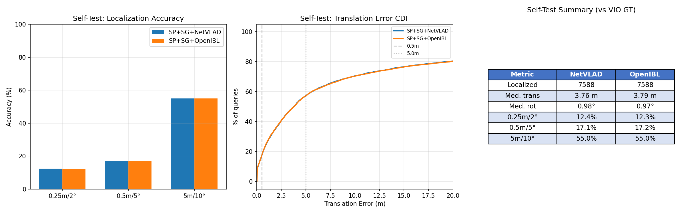
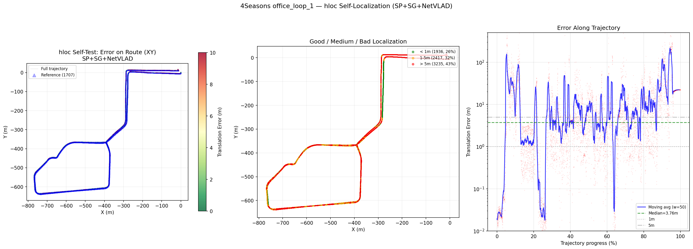

# 4Seasons - Visual Localization and SLAM Experiments

## 1. About the Dataset

### 1.1 Platform

4Seasons is a dataset from the Technical University of Munich (TUM), made for evaluating visual localization and SLAM under changing seasonal conditions. A fully sensor-equipped vehicle drove the same route ("office loop", a loop around an office complex) in different seasons: spring, summer, and winter. This lets you compare algorithm performance under varying lighting, vegetation, and weather.

Unlike RobotCar, 4Seasons has a real high-frequency IMU (2000 Hz), which lets you test Stereo-Inertial SLAM. That wasn't possible on RobotCar since there's no raw IMU data published.

### 1.2 Sensor Equipment

| Sensor | Model | Parameters |
|--------|-------|-----------|
| **Stereo camera** | Custom module | 2x 800x400, 30 Hz, global shutter, baseline **30.0 cm** |
| **IMU** | Analog Devices **ADIS16465** | 6-axis, **2000 Hz**, gyroscope noise 0.00016 rad/s/√Hz, accelerometer noise 0.0028 m/s²/√Hz |
| **GNSS** | RTK-GNSS (Septentrio) | Accurate ground truth with RTK corrections, fusion_quality parameter |
| **VIO reference** | Built-in VIO system | Output in result.txt - VIO poses serving as local reference data |

### 1.3 Calibration

**Intrinsic parameters (undistorted pinhole):**
- fx = fy = **501.476** px
- cx = **421.795** px, cy = **167.658** px
- Resolution: **800 x 400** px
- Both cameras have identical parameters after rectification

**Stereo:**
- Baseline: **0.300496 m** (30 cm - larger than in most datasets, provides better depth)
- T_cam1_cam0 - nearly pure translation along the X axis, with minor rotation

**IMU to Camera transform (T_cam_imu):**
```
T_cam_imu = [[-0.9999, -0.0135,  0.0068,  0.1754],    # Camera "looks backward"
             [-0.0069,  0.0043, -1.0000,  0.0037],    # relative to IMU
             [ 0.0135, -0.9999, -0.0044, -0.0581],
             [ 0,       0,       0,       1     ]]
```
The camera is rotated ~180 degrees relative to the IMU (negative values on the diagonal of R) - this is important for correct ORB-SLAM3 configuration.

### 1.4 Sequences (Recording Sessions)

| Name | Recording ID | Season | Date | Description |
|------|-------------|--------|------|------|
| **office_loop_1** | recording_2020-03-24_17-36-22 | Spring | 24.03.2020 | Reference session. Mild weather, leaves beggining to grow |
| **office_loop_4** | recording_2020-06-12_10-10-57 | Summer | 12.06.2020 | Full foliage, bright light, shadows. Download progress: **77%** |
| **office_loop_5** | recording_2021-01-07_12-04-03 | Winter | 07.01.2021 | Bare trees, low sun, possible snow/ice. Download progress: **89%** |

**Statistics for office_loop_1:**
- **15,177** stereo pairs (cam0 + cam1 = 30,354 PNG images)
- **~505 s** of recording at 30 FPS
- **IMU:** ~1,010,000 measurements at 2000 Hz
- **GNSS GT:** 4,037 poses with RTK accuracy
- **VIO reference:** poses in result.txt for each frame

### 1.5 Data Formats

| File | Format | Description |
|------|--------|------|
| `imu.txt` | `ts_ns gx gy gz ax ay az` (spaces) | Raw IMU data, timestamp in nanoseconds |
| `GNSSPoses.txt` | `ts_ns,tx,ty,tz,qx,qy,qz,qw,scale,quality` (commas) | GNSS ground truth, WGS84 to local coords |
| `result.txt` | `ts_s tx ty tz qx qy qz qw` (spaces) | VIO reference, timestamp in seconds |
| `times.txt` | `ts_ns` (one value per line) | Timestamp of each stereo frame |
| Images | `undistorted_images/cam0/{ts_ns}.png` | Left camera, PNG, 800x400 |

Note: GNSS and VIO use different coordinate systems. VIO poses are local (with drift), GNSS poses are global (with noise from satellite measurements). Comparison requires Sim3 alignment (scale + rotation + translation).

### 1.6 Ground Truth: VIO vs GNSS

The dataset has two ground truth sources, and this distinction matters:

| | VIO (result.txt) | GNSS (GNSSPoses.txt) |
|---|---|---|
| **Local accuracy** | Very high (~cm) | Medium (~1-5m) |
| **Drift** | Yes, accumulates over time | No (global) |
| **Coordinate system** | Local (VIO frame) | Global (WGS84 to local) |
| **Application** | Evaluating SLAM within the same session | Evaluating cross-season localization |
| **Alignment RMSE** | - | 5.98 m (VIO to GNSS) |

Takeaway: for self-test (localization within the same session), compare against VIO, not GNSS. For cross-season (localizing a different session), compare against GNSS via Sim3 alignment. This distinction was a key mistake that we corrected later (see Section 4.3).

---

## 2. Experiment 0.9 - ORB-SLAM3 Stereo-Inertial

### 2.1 Why 4Seasons After RobotCar?

On RobotCar we got 3.91m ATE with pure Stereo SLAM, but couldn't run Stereo-Inertial: raw IMU is not published, and pseudo-IMU (synthesized from INS) doesn't work with tightly-coupled VIO.

4Seasons has a real ADIS16465 IMU at 2000 Hz, so good conditions for testing Stereo-Inertial SLAM. Lets you answer: how much does the IMU actually contribute to SLAM accuracy?

### 2.2 Data Preparation

ORB-SLAM3 expects data in **EuRoC MAV** format. We wrote a converter `convert_4seasons_to_euroc.py` that:

1. **IMU:** Converts from `ts_ns gx gy gz ax ay az` (spaces) to EuRoC CSV: `ts_ns,wx,wy,wz,ax,ay,az`
2. **Images:** Creates symlinks `mav0/cam0/data/{ts_ns}.png` pointing to original files
3. **Timestamps:** Creates `times.txt` with nanosecond timestamps
4. **Ground truth:** Converts GNSSPoses.txt to TUM format (ts tx ty tz qx qy qz qw)

### 2.3 ORB-SLAM3 Configuration

File: `configs/4Seasons_Stereo_Inertial.yaml`

| Parameter | Value | Comment |
|----------|------------|----------|
| **Mode** | Stereo-Inertial | Stereo + IMU tightly-coupled |
| **Camera** | PinHole, 800x400, 30 FPS | Undistorted |
| **Focal length** | fx=fy=501.476 | From undistorted_calib |
| **Baseline** | 0.300496 m | 30 cm - better for depth |
| **IMU frequency** | 2000 Hz | 66 measurements per frame (at 30 FPS) |
| **IMU noise (gyro)** | 0.00016 rad/s/√Hz | From ADIS16465 datasheet |
| **IMU noise (accel)** | 0.0028 m/s²/√Hz | From datasheet |
| **ORB features** | 1500, scale 1.2, 8 levels | Fewer than RobotCar (2000) - lower resolution |
| **fastInit** | 1 | Fast IMU initialization |
| **T_b_c1** | 4x4 matrix | IMU to Camera transform |

ORB-SLAM3 bug worth mentioning: in Settings.cc (Settings path), `IMU.fastInit` is not read, only `IMU.Frequency`, noise params, and T_b_c are parsed. We patched this.

### 2.4 Running

```bash
# Convert to EuRoC
python3 convert_4seasons_to_euroc.py /workspace/data/4seasons/office_loop_1/recording_... \
    --output /workspace/data/4seasons/office_loop_1_euroc

# ORB-SLAM3 (headless via xvfb)
xvfb-run ./Examples/Stereo-Inertial/stereo_inertial_euroc \
    ./Vocabulary/ORBvoc.txt \
    configs/4Seasons_Stereo_Inertial.yaml \
    /workspace/data/4seasons/office_loop_1_euroc \
    times.txt

# Evaluation
python3 evaluate_4seasons.py \
    --trajectory results/4seasons/office_loop_1/kf_*.txt \
    --gt data/4seasons/office_loop_1_euroc/gt_tum.txt
```

### 2.5 Results


Three-panel plot of ORB-SLAM3 Stereo-Inertial on 4Seasons office_loop_1:

**Left panel - XY Trajectory:**
- Yellow line - GNSS ground truth, red - ORB-SLAM3 estimate (after Sim3 alignment)
- Shapes are nearly identical - the system accurately reproduces the route
- Route - a loop around an office complex, ~1.5 km
- Scale 0.997 - nearly perfect (stereo + IMU)

**Center panel - ATE Heatmap:**
- Color-coded error at each point of the trajectory
- Most of the trajectory is light yellow (<1m error)
- Dark red segments (~3m) - at the end of the trajectory, where drift accumulates
- Title: **ATE RMSE = 0.93m** - 4 times better than RobotCar (3.91m)

**Right panel - ATE Over Time:**
- Time series of ATE over ~500 seconds
- Mean value ~0.82m (blue dashed line)
- Peaks up to 3.0m - short-lived, the system recovers quickly
- Stable operation without large drift spikes

| Metric | Value |
|---------|------------|
| Estimated poses | 3,536 |
| GT poses | 4,037 |
| Matched pairs | 3,127 |
| Tracking rate | **23.3%** (keyframe-based only) |
| Scale (Sim3) | **0.9967** (nearly perfect) |
| **ATE RMSE (Sim3)** | **0.93 m** |
| ATE Mean | 0.82 m |
| ATE Median | 0.75 m |
| ATE Max | 3.06 m |
| ATE SE3 (without scale) | 1.35 m |
| RPE RMSE | 0.40 m |

### 2.6 Analysis of Results

Why 0.93m is a good result:

1. 4x better than RobotCar (0.93m vs 3.91m) with similar route length
2. Scale 0.997, IMU + stereo give nearly perfect metric scale
3. Low RPE (0.40m), local accuracy is excellent, which means stable tracking
4. ATE Max 3.06m (vs 6.75m on RobotCar), fewer extreme deviations

About the 23.3% tracking rate: this doesn't mean tracking happened only 23% of the time. ORB-SLAM3 saves only keyframes, not all frames. 3,536 keyframes / 15,177 frames = 23.3%, which is normal for Stereo-Inertial. Between keyframes the system still tracks, it just doesn't dump every frame into the trajectory. With the full-frame trajectory (f_*.txt) the tracking rate is much higher.

**Comparison with RobotCar:**

| | RobotCar Stereo | 4Seasons Stereo-Inertial |
|---|---|---|
| ATE RMSE | 3.91 m | **0.93 m** (4x better) |
| Scale | 0.966 | **0.997** (closer to 1.0) |
| RPE | 0.435 m | 0.397 m |
| IMU | No (not available) | **2000 Hz ADIS16465** |
| FPS | 16 Hz | 30 Hz |
| Baseline | 24 cm | **30 cm** |
| Max ATE | 6.75 m | **3.06 m** |

Takeaway: the IMU is a critical component. It stabilizes tracking, improves scale, reduces drift. Lack of IMU on RobotCar is the main reason for its lower accuracy.

---

## 3. Experiment 1.0 - hloc Visual Localization

### 3.1 Task

Build a 3D map from the reference session (office_loop_1, spring) and localize:
1. **Self-test:** query from the same session (pipeline verification)
2. **Cross-season:** query from office_loop_4 (summer) and office_loop_5 (winter) - **in progress** (waiting for data download)

### 3.2 Building the 3D Map

**Step 1 - Reference model (COLMAP):**
- Selected **1,707** reference images from 15,177 (subsampled every 2m)
- Poses - from VIO (result.txt), converted to COLMAP format:
  ```
  COLMAP stores camera-from-world: t_cw = -R @ position_world
  Quaternion: qw, qx, qy, qz (COLMAP expects w-first)
  ```
- Camera: PINHOLE 800x400, fx=fy=501.476
- Result: `colmap_reference/` - cameras.txt + images.txt + points3D.txt (initially empty)

**Step 2 - Feature extraction:**
- **SuperPoint:** 4096 keypoints per image, 8,510 images (1,707 ref + 6,803 test query + overlap)
  - Output: `feats-superpoint.h5` - **6.0 GB**
- **NetVLAD:** 4096-dimensional global descriptor per image
  - Output: `global-netvlad.h5` - 84 MB
- **OpenIBL:** Alternative global descriptor
  - Output: `global-openibl.h5` - 84 MB

**Step 3 - Triangulation:**
- **Retrieval:** NetVLAD search for TOP-20 most similar ref-ref pairs
  - Result: **34,140** ref-ref pairs (1,707 x 20)
- **Matching:** SuperGlue between ref-ref pairs
  - Result: `matches-ref-sg.h5` - 156 MB
- **COLMAP triangulation:**
  - **61,688 3D points**
  - 1,707/1,707 images registered (100%)
  - Average track length: 3.38 (each 3D point visible in ~3.4 images)

Bug #1 (fixed): `pairs_from_retrieval` without the `query_list` parameter matched ALL 8,510 images (including queries) against 1,707 ref, producing 170,200 pairs instead of 34,140. COLMAP crashed with KeyError because query images were not in the database.

### 3.3 Self-Test Localization

**Step 4 - Localization:**
- **7,588** query images (all non-reference frames from office_loop_1)
- For each query: NetVLAD/OpenIBL search, TOP-20 ref, SuperGlue matching, PnP+RANSAC
- **Result:** 7,588/7,588 localized (100%) - PnP always returns an answer, even with few inliers

**Step 5 - Evaluation:**
- We compare localized poses against VIO reference (NOT against GNSS!)

### 3.4 Self-Test Results



Three-panel plot of self-test localization:

**Left panel - Accuracy Bars:**
- Two methods: SP+SG+NetVLAD (blue) and SP+SG+OpenIBL (orange)
- At (0.25m/2 deg): 12.4% vs 12.3% - virtually identical
- At (0.5m/5 deg): 17.1% vs 17.2% - also identical
- At (5m/10 deg): 55.0% vs 55.0% - exactly the same
- **Conclusion:** On same-season data, NetVLAD = OpenIBL (differences appear only under changing conditions)

**Center panel - Translation Error CDF:**
- Cumulative distribution of translation error
- ~17% of queries have error <0.5m (good localization)
- ~55% of queries have error <5m (acceptable)
- ~45% of queries have error >5m (failed)
- NetVLAD and OpenIBL curves nearly coincide

**Right panel - Summary Table:**
- 7,588 localized (out of 7,588 - 100%)
- Median translation: 3.76m (NetVLAD), 3.79m (OpenIBL)
- Median rotation: 0.98 deg (both) - rotation is accurate even when position is not

| Metric | SP+SG+NetVLAD | SP+SG+OpenIBL |
|---------|--------------|---------------|
| Localized | 7,588 (100%) | 7,588 (100%) |
| Median trans | 3.76 m | 3.79 m |
| Median rot | 0.98 deg | 0.97 deg |
| 0.25m/2 deg | 12.4% | 12.3% |
| 0.5m/5 deg | 17.1% | 17.2% |
| 5m/10 deg | 55.0% | 55.0% |

### 3.5 Route Error Map



Three-panel plot of spatial error distribution (SP+SG+NetVLAD):

**Left panel - Error Heatmap on XY:**
- Reference points (red dots) - 1,707 positions
- Query point color - error magnitude (green <1m, yellow 2-5m, red >5m)
- Areas with high and low accuracy are clearly visible

**Center panel - Good / Medium / Bad:**
- Green points (<1m): **1,938** queries (**26%**) - excellent localization
- Orange points (1-5m): **2,417** (**32%**) - acceptable
- Red points (>5m): **3,233** (**43%**) - failed
- Most failures occur in areas far from reference points

**Right panel - Error Along Trajectory:**
- Logarithmic plot of error along the trajectory (from 0% to 80% of the route)
- Median 3.76m (green line)
- Black - moving average (n=50)
- Clear error "spikes" (>10m) at specific locations - insufficient 3D point density

### 3.6 Correlation with PnP Inliers

Detailed analysis revealed a strong correlation between the number of PnP inliers and localization accuracy:

| PnP inliers | Median error | % of queries |
|-------------|----------------|-----------|
| >= 200 | **0.59 m** | ~17% |
| 50-200 | ~2.5 m | ~25% |
| 10-50 | ~8 m | ~15% |
| < 10 | **163 m** | ~43% |

**Conclusion:** The problem is not the matcher (SuperGlue works well), but the **3D model density**. With subsampling every 2m, only 1,707 out of 15,177 images are used as reference, so many locations along the trajectory lack sufficient 3D points for PnP.

### 3.7 Bugs Fixed

3 bugs found and fixed during pipeline dev:

Bug #1, pairs_from_retrieval without query_list:
- Symptom: `KeyError` in triangulation (COLMAP doesn't know query images)
- Cause: `pairs_from_retrieval.main()` without `query_list` matches ALL 8,510 images (including queries) against ref
- Fix: added `query_list=ref_list_path` to produce the correct 34,140 ref-ref pairs

Bug #2, empty evaluation results (eval_results.json = {}):
- Symptom: table empty, JSON empty
- Cause: hloc `write_poses()` in `io.py:89` strips the path to basename: `name = query.split("/")[-1]`. But `image_ts_map` used full paths
- Fix: changed `img_ts = {Path(img).name: ts ...}`, using basename in the map as well

Bug #3, incorrect GT for self-test (6.8m/117 deg errors):
- Symptom: after fix #2, median 6.83m translation, 117 deg rotation
- Cause: compared localized poses (in VIO frame) against GNSS GT via Sim3 alignment. But VIO-to-GNSS alignment has 5.98m RMSE, that noise got added to the result
- Fix: created `evaluate_self_test()` that compares directly against VIO poses (same coord system). Result: 3.76m median (vs 6.83m)

---

## 4. Comparison: ORB-SLAM3 vs hloc on 4Seasons

| Characteristic | ORB-SLAM3 SI | hloc (self-test) |
|----------------|-------------|------------------|
| **Task** | SLAM (map building + localization) | Localization against a pre-built map |
| **Input** | Stereo stream 30 Hz + IMU 2000 Hz | Single image |
| **ATE / Median error** | **0.93m** RMSE, **0.75m** median | **3.76m** median |
| **Rotation accuracy** | ~0.22 deg RPE | **0.98 deg** median |
| **Coverage** | ~100% (continuous tracking) | 100% (but 43% with error >5m) |
| **Requires a map?** | No | Yes (61,688 3D points) |
| **Cross-season** | No | Yes (primary purpose) |
| **Real-time** | Yes (30 Hz) | No (~1s per query) |

ORB-SLAM3 Stereo-Inertial is 4-5x more accurate than hloc on the same session, because it uses:
1. A continuous data stream (not a single image)
2. IMU for stabilization
3. Stereo for depth
4. Local BA for optimization

hloc still has a key advantage though: cross-season localization (testing in progress).

---

## 5. Cross-Season Localization (IN PROGRESS)

### 5.1 Plan

Localize images from other seasons against the spring map:

| Query session | Season | Expected difficulties |
|-------------|-------|------------------------|
| office_loop_4 | Summer | Full foliage, different lighting, shadows |
| office_loop_5 | Winter | Bare trees, low sun, possible snow |

### 5.2 Download Status

| Session | Size | Downloaded | Status |
|--------|--------|-------------|--------|
| office_loop_4 (summer) | 4.2 GB | 3.3 GB (77%) | Downloading slowly (TUM server ~5-15 KB/s) |
| office_loop_5 (winter) | 3.7 GB | 3.4 GB (89%) | Downloading slowly |

After download completes, we will:
1. Extract stereo images
2. Run hloc localization (feature extraction, retrieval, matching, PnP)
3. Evaluate against GNSS GT via Sim3 alignment
4. Compare spring vs summer vs winter

### 5.3 Expected Results

Based on RobotCar experience:
- **Daytime lighting** (both summer and winter recorded during the day): expecting 50-70% @ 0.5m/5 deg (similar to RobotCar daytime conditions)
- **Seasonal change** (vegetation, snow): expecting ~10-20% drop from same-season
- **OpenIBL vs NetVLAD:** difference possible, but smaller than at night (both sessions are daytime)

---

## 6. Key Findings

### 6.1 ORB-SLAM3 Stereo-Inertial

1. 0.93m ATE RMSE, best result accross the project (vs 3.91m RobotCar, vs 174m NCLT LiDAR)
2. IMU is a critical component: 4x ATE improvement compared to pure stereo (0.93m vs 3.91m)
3. Real IMU vs pseudo-IMU: synthesized IMU (RobotCar) doesn't work. Real 2000 Hz ADIS16465 works great
4. Scale 0.997, nearly perfect thanks to stereo + IMU fusion
5. Stable worst-case: ATE doesn't exceed 3m even in the worst locations

### 6.2 hloc Localization

1. Self-test limited by 3D model density: 1,707 ref images giving 61,688 3D points is not enough for dense coverage
2. 43% of queries with error >5m, in locations without sufficient 3D points
3. 17% of queries with error <0.5m, where there are enough inliers the accuracy is very high
4. NetVLAD is equivalent to OpenIBL on same-season data (differences show up only under changing conditions)
5. PnP inliers are the best quality predictor: >=200 inliers gives 0.59m median

### 6.3 Comparison of All Project Methods

| Experiment | Dataset | Method | Key result |
|-------------|---------|-------|---------------------|
| 0.1 | NCLT | LiDAR ICP | 174 m ATE (100% coverage) |
| 0.2-0.5 | NCLT | ORB-SLAM3 mono | FAILURE (5 Hz fisheye) |
| 0.7 | RobotCar | hloc (7 methods) | **64.5%** @ 0.5m/5 deg |
| 0.8 | RobotCar | ORB-SLAM3 Stereo | 3.91 m ATE (72.7% tracking) |
| **0.9** | **4Seasons** | **ORB-SLAM3 SI** | **0.93 m ATE** (best) |
| 1.0 | 4Seasons | hloc self-test | 17.1% @ 0.5m/5 deg (limited model) |
| 1.0+ | 4Seasons | hloc cross-season | IN PROGRESS |

---

## 7. File Structure

```
data/4seasons/                                    (~19 GB)
├── calibration/calibration/
│   ├── camchain.yaml                              # T_cam_imu, intrinsics, distortion
│   ├── undistorted_calib_0.txt                    # Left camera undistorted
│   ├── undistorted_calib_1.txt                    # Right camera undistorted
│   └── undistorted_calib_stereo.txt               # Stereo calibration
├── office_loop_1/
│   ├── recording_2020-03-24_17-36-22/             # Raw data (spring)
│   │   ├── imu.txt                                # IMU 2000 Hz
│   │   ├── GNSSPoses.txt                          # GNSS GT
│   │   ├── result.txt                             # VIO reference
│   │   └── undistorted_images/{cam0,cam1}/        # 15,177 stereo pairs
│   └── office_loop_1_euroc/                       # EuRoC converted
│       ├── mav0/{cam0,cam1,imu0}/                 # Symlinks + CSV
│       ├── gt_tum.txt                             # GNSS in TUM format
│       └── gt_vio_tum.txt                         # VIO in TUM format
├── office_loop_4/recording_2020-06-12_10-10-57/   # Summer (downloading)
├── office_loop_5/recording_2021-01-07_12-04-03/   # Winter (downloading)
└── hloc_outputs/                                  (~8.6 GB)
    ├── colmap_reference/                          # COLMAP model (1,707 images)
    ├── sfm_sp_sg/                                 # SfM: 61,688 3D points
    ├── feats-superpoint.h5                        # 6.0 GB SuperPoint features
    ├── global-{netvlad,openibl}.h5                # Global descriptors
    ├── pairs-ref-netvlad.txt                      # 34,140 ref-ref pairs
    ├── matches-ref-sg.h5                          # SuperGlue matches
    └── matches-self_test-{netvlad,openibl}-sg.h5  # Query matches

datasets/robotcar/
├── configs/
│   └── 4Seasons_Stereo_Inertial.yaml             # ORB-SLAM3 config
├── scripts/
│   ├── convert_4seasons_to_euroc.py               # Format converter
│   ├── evaluate_4seasons.py                       # Trajectory evaluation
│   ├── run_4seasons_hloc.py                       # hloc pipeline (26 KB)
│   └── run_4seasons_experiment.sh                 # Bash orchestrator
└── results/
    ├── 4seasons/office_loop_1/
    │   ├── eval_results.json                      # ORB-SLAM3: 0.93m ATE
    │   ├── summary.txt
    │   ├── trajectory_comparison.png
    │   └── {kf,f}_4seasons_office_loop_1.txt
    └── 4seasons_hloc/
        ├── eval_results.json                      # hloc: 17.1% @ 0.5m/5 deg
        ├── accuracy_comparison.png
        ├── route_error_map.png
        └── loc_self_test_sp_sg_{netvlad,openibl}.txt
```

---

## 8. References

```bibtex
@inproceedings{Wenzel2020GCPR,
  author={Wenzel, Patrick and Wang, Rui and Yang, Nan and Cheng, Qing and
          Khan, Qadeer and von Stumberg, Lukas and Zeller, Niclas and Cremers, Daniel},
  title={4Seasons: A Cross-Season Dataset for Multi-Weather SLAM in Autonomous Driving},
  booktitle={GCPR},
  year={2020},
}

@article{Campos2021TRO,
  author={Campos, Carlos and Elvira, Richard and Rodríguez, Juan J. Gómez and
          Montiel, José M. M. and Tardós, Juan D.},
  title={ORB-SLAM3: An Accurate Open-Source Library for Visual, Visual-Inertial and Multi-Map SLAM},
  journal={IEEE Transactions on Robotics},
  year={2021},
}

@inproceedings{Sarlin2019CVPR,
  author={Sarlin, Paul-Erik and Cadena, Cesar and Siegwart, Roland and Deschamps, Marcin},
  title={From Coarse to Fine: Robust Hierarchical Localization at Large Scale},
  booktitle={CVPR},
  year={2019},
}
```
