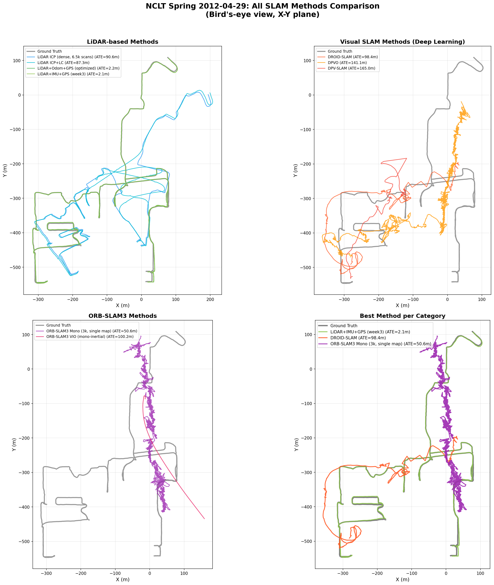
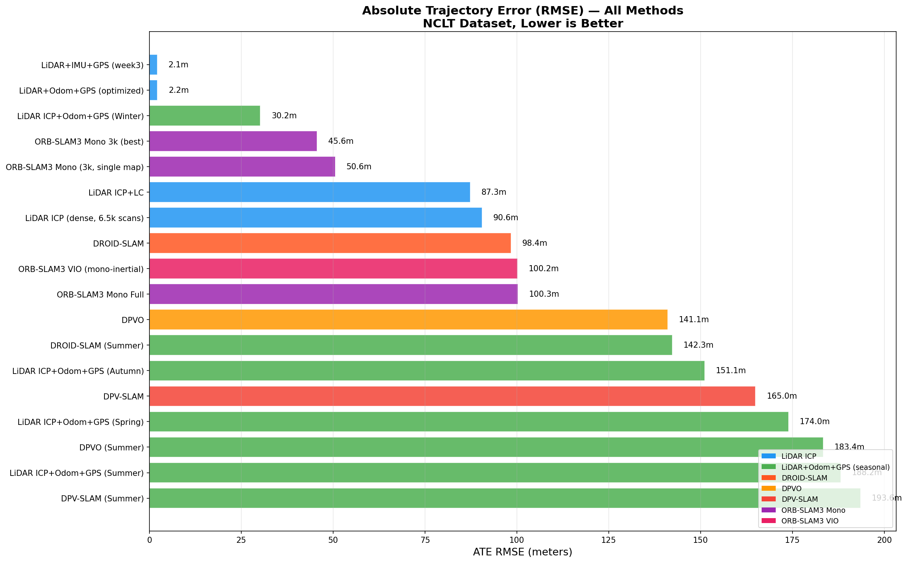

# NCLT SLAM Pipeline

Evaluation of odometry and SLAM methods on the University of Michigan North Campus Long-Term (NCLT) dataset.

## The NCLT Dataset

The NCLT dataset was collected by the University of Michigan Perceptual Robotics Laboratory (PeRL) over **15 months** (January 2012 - April 2013) on the North Campus of the University of Michigan, Ann Arbor. A Segway RMP robot was driven across **27 sessions** totaling **147.4 km** and **34.9 hours** of data, capturing all four seasons, varied weather conditions (sun, rain, snow), lighting conditions (morning to dusk), and long-term structural changes (construction, vegetation growth).

**Paper:** N. Carlevaris-Bianco, A. K. Ushani, and R. M. Eustice, "University of Michigan North Campus Long-Term Vision and Lidar Dataset," *The International Journal of Robotics Research*, vol. 35, no. 9, pp. 1023--1035, 2016. [DOI: 10.1177/0278364915614638](https://doi.org/10.1177/0278364915614638)

**Website:** [robots.engin.umich.edu/nclt](https://robots.engin.umich.edu/nclt/)

---

## Robot Platform

The data collection platform is a **Segway RMP** (Robotic Mobility Platform) - a two-wheeled self-balancing robot based on the Segway Human Transporter. The sensor suite is mounted on a vertical pole above the platform, providing a human-height viewpoint (~1.2 m for the Ladybug3 camera).

The body frame origin is centered at the two-wheel axle axis. The coordinate system follows the **NED convention** (x-forward, y-right, z-down) for the body frame, with the world frame georeferenced to a local GPS origin.

```
         [Ladybug3]  <- 1.23m above body origin
             |
         [Velodyne]
             |
        _____|_____
       |   Pole    |
       |           |
  ====[  Segway  ]====
       Wheel  Wheel
       <- Body origin (axle center)
```

---

## Sensors

### Velodyne HDL-32E (3D LiDAR)

The primary distance sensor for odometry and mapping.

| Parameter | Value |
|-----------|-------|
| Channels | 32 laser/detector pairs |
| Wavelength | 905 nm (Class 1 eye-safe) |
| Range | up to 100 m |
| Range accuracy | < 2 cm |
| Vertical FOV | +10.67 to -30.67 (41.3 total) |
| Horizontal FOV | 360 |
| Vertical resolution | 1.33 between beams |
| Rotation rate | 10 Hz (in NCLT) |
| Points per revolution | ~17,000--70,000 (varies by session and environment) |
| Dimensions | 85.3 mm diameter x 144.2 mm height |
| Weight | 1.0 kg |

**Data format:** Binary files in `velodyne_sync/`. Each scan is a separate file named `{utime}.bin`. Point format: 8 bytes per point - x, y, z as uint16 (convert: `value * 0.005 - 100.0` meters), intensity as uint8, laser_id as uint8 (0--31).

### Point Grey Ladybug3 (Omnidirectional Camera)

A spherical camera system providing near-complete surround coverage.

| Parameter | Value |
|-----------|-------|
| Model | Ladybug3 (LD3-20S4C-33B) |
| Cameras | 6 total: 5 side + 1 top |
| Image sensor | Sony ICX274 CCD, 1/1.8" |
| Resolution per camera | 1616 x 1232 pixels |
| Spherical coverage | ~80% of full sphere |
| Frame rate (in NCLT) | 5 Hz |
| FOV per camera | ~110 (fisheye) |
| Shutter | Global shutter |
| Output | 8-bit Bayer (color), JPEG-compressed TIFF |
| Interface | IEEE 1394b (FireWire 800) |

**Camera arrangement** (determined via feature-matching adjacency, optical flow analysis, and body-to-LB3 extrinsic transform):

```
            FORWARD (direction of travel)
               |
               |
        Cam5 [FWD]
       /    0       \
   Cam4            Cam1
   [LEFT]          [RIGHT]
   -72           +73
      \              /
   Cam3            Cam2
   [BACK-L]      [BACK-R]
   -143          +144
         \      /
          \  /
         BACKWARD

   Cam0 = TOP (sky-facing, not usefull for SLAM)
```

| Camera | Direction | Angle | Scene content | Brightness | ORB features |
|--------|-----------|-------|---------------|------------|-------------|
| Cam0 | UP (sky) | -- | Sky, clouds, treetops | 94 | 851 |
| Cam1 | Right | +73 | Road, forest (dark) | 34 | 1632 |
| Cam2 | Back-right | +144 | Sidewalk, pedestrians | 44 | 2170 |
| Cam3 | Back-left | -143 | Campus buildings | 50 | 2193 |
| Cam4 | Left | -72 | Buildings (close) | 74 | 1143 |
| Cam5 | Forward | 0 | Road ahead, trees | 83 | 2349 |

**Data format:** Images stored per camera in `images/{session}/lb3/Cam{0-5}/`. Filename: `{utime}.tiff`. Each file is a JPEG-compressed TIFF, 1616x1232 pixels, ~72--924 KB (mean ~770 KB for side cameras, ~364 KB for Cam0/sky).

**Important:** The official camera calibration files (`cam_params.zip`) are no longer available from the NCLT website (404/403). COLMAP self-calibration on 300 images from Cam5 yielded `SIMPLE_PINHOLE f=221, cx=404, cy=309` for half-resolution (808x616). The true fisheye focal length for a Kannala-Brandt equidistant model is approximately `f=579`.

### Microstrain 3DM-GX3-45 (IMU)

A GPS-aided inertial navigation system providing accelerometer, gyroscope, and magnetometer data.

| Parameter | Value |
|-----------|-------|
| Type | 9-axis MEMS IMU (3 accel + 3 gyro + 3 mag) |
| Internal sampling | 30 kHz |
| Output rate (in NCLT) | ~47--50 Hz |
| Kalman filter rate | up to 100 Hz |
| Temperature compensated | Yes |

**Data format:** `ms25.csv` - 10 columns: `utime, mag_x, mag_y, mag_z, accel_x, accel_y, accel_z, rot_x, rot_y, rot_z`. Units: magnetometer in Gauss, accelerometer in m/s^2, gyroscope in rad/s. Also available: `ms25_euler.csv` with 4 columns: `utime, roll, pitch, yaw` (radians).

**Note:** Despite the "ms25" naming in the dataset, the actual sensor is a Microstrain 3DM-GX3-45. The output rate of ~47 Hz is lower than the typical 100--200 Hz expected by visual-inertial SLAM methods such as ORB-SLAM3 VIO.

### Garmin GPS 18x (Consumer GPS)

| Parameter | Value |
|-----------|-------|
| Update rate (in NCLT) | ~5--8 Hz |
| Accuracy (WAAS) | < 3 m (95%) |
| Accuracy (standalone) | < 15 m (95%) |
| Protocol | NMEA 0183 |

**Data format:** `gps.csv` - 8 columns: `utime, mode, num_satellites, latitude, longitude, altitude, track, speed`.

### NovAtel DL-4 Plus (RTK GPS)

| Parameter | Value |
|-----------|-------|
| Type | 24-channel dual-frequency GPS |
| Signals | L1 C/A code, L1/L2 carrier phase |
| Update rate (in NCLT) | ~2.5 Hz |
| Accuracy (RTK) | Centimeter-level (when corrections available) |
| Accuracy (WAAS) | ~80 cm |

**Data format:** `gps_rtk.csv` - 8 columns: `utime, mode, num_satellites, latitude, longitude, altitude, track, speed`. Used in ground truth generation.

### KVH DSP-1760 (Fiber Optic Gyroscope)

A high-precision single-axis gyroscope for heading estimation.

| Parameter | Value |
|-----------|-------|
| Axes | Single (yaw/heading) |
| Bias instability | 0.05 /hr (typical) |
| Angle random walk | 0.012 /sqrt(hr) |
| Max rate | +/-490 /s |
| Output rate (in NCLT) | ~94 Hz |

**Data format:** `kvh.csv` - 2 columns: `utime, heading` (radians). Added to the dataset in August 2018.

### Wheel Odometry

Integrated from Segway differential wheel encoders and KVH FOG heading.

| Parameter | Value |
|-----------|-------|
| Source | Differential wheel encoders + FOG integration |
| Output rate | ~5 Hz (raw), ~100 Hz (interpolated) |
| Output | Integrated 6-DOF poses |

**Data format:** `odometry_mu.csv` / `odometry_mu_100hz.csv` - 7 columns: `utime, x, y, z, roll, pitch, yaw`. Positions in meters, orientations in radians. Also available: `wheels.csv` with raw left/right wheel velocities (3 columns: `utime, left_vel, right_vel`).

### Hokuyo UTM-30LX-EW (Planar LiDAR, 30 m range)

| Parameter | Value |
|-----------|-------|
| Range | 0.1--30 m |
| FOV | 270 |
| Angular resolution | 0.25 |
| Scan rate | 40 Hz |
| Multi-echo | Yes |

### Hokuyo URG-04LX (Planar LiDAR, 4 m range)

| Parameter | Value |
|-----------|-------|
| Range | 0.02--5.6 m |
| FOV | 240 |
| Angular resolution | ~0.36 |
| Scan rate | ~10 Hz |

**Hokuyo data format:** Binary files. Each scan: 8-byte timestamp (uint64), followed by range values as uint16. The 30 m sensor provides 1081 measurements per scan, the 4 m sensor provides 726.

---

## Ground Truth

Ground truth poses were generated using a multi-step SLAM pipeline:

1. Factor graph construction from LiDAR ICP scan matching, RTK GPS fixes, and wheel odometry
2. Manual inspection to remove incorrect loop closure constraints
3. Graph optimization to produce keyframe poses
4. Odometric interpolation between keyframes at ~148 Hz
5. All sessions georeferenced to a common coordinate frame

**Data format:** `groundtruth_{session}.csv` - 7 columns: `utime, x, y, z, roll, pitch, yaw`. Positions in meters, Euler angles in radians. Companion covariance files are also provided.

**Note:** The ground truth columns are Euler angles (roll, pitch, yaw), **NOT** quaternions. The quaternion `qw` is not stored and must be computed if needed.

---

## Sessions Used

This project uses 4 of the 27 available sessions, spanning all four seasons:

| Session | Season | Duration | Distance | Velodyne | Images | GT poses |
|---------|--------|----------|----------|----------|--------|----------|
| 2012-01-08 | Winter | 93 min | ~6.5 km | 28,127 scans | -- | 835,469 |
| 2012-04-29 | Spring | 43 min | 3.2 km | 12,971 scans | 21,510/cam | 386,134 |
| 2012-08-04 | Summer | 80 min | 5.5 km | 24,116 scans | 24,138/cam | 709,396 |
| 2012-10-28 | Autumn | 86 min | 5.7 km | 25,691 scans | -- | 758,620 |

Camera images (Ladybug3) are only available for the spring and summer sessions.

### Sensor rates per session

| Sensor | 2012-01-08 | 2012-04-29 | 2012-08-04 | 2012-10-28 |
|--------|-----------|-----------|-----------|-----------|
| Velodyne | 5.0 Hz | 5.0 Hz | 5.0 Hz | 5.0 Hz |
| Ladybug3 | -- | 3.9 Hz | 5.0 Hz | -- |
| MS25 IMU | 47.9 Hz | 47.6 Hz | 47.0 Hz | 47.2 Hz |
| KVH FOG | 94.5 Hz | 94.5 Hz | 94.4 Hz | 94.6 Hz |
| GPS | 8.4 Hz | 4.4 Hz | 6.7 Hz | 7.7 Hz |
| RTK GPS | 2.5 Hz | 2.7 Hz | 2.5 Hz | 2.4 Hz |
| Odometry | 5.0 Hz | 5.0 Hz | 5.0 Hz | 5.0 Hz |
| Odom 100Hz | 108.7 Hz | 108.2 Hz | 107.1 Hz | 107.4 Hz |
| Wheels | 41.8 Hz | 47.4 Hz | 50.1 Hz | 51.1 Hz |
| Ground truth | 149.5 Hz | 148.7 Hz | 147.4 Hz | 147.6 Hz |

---

## Experiment Results

| # | Method | Spring ATE | Summer ATE | Coverage | Verdict |
|---|--------|-----------|------------|----------|---------|
| 0.1 | LiDAR ICP + GPS loop closure | **174 m** | **188 m** | 100% | **Best available** |
| 0.2 | ORB-SLAM3 mono (Cam0) | 2.9 m* | fail | 0.5% | Cam0 = sky |
| 0.3 | ORB-SLAM3 mono v2 (Cam0) | 45.6 m* | 54.8 m* | 24% | 35 disconnected maps |
| 0.4 | DROID-SLAM / DPVO / DPV-SLAM | 110--166 m | 142--194 m | 54--100% | Trajectories do not follow roads |
| 0.5 | ORB-SLAM3 tuned (side cameras) | N/A | -- | 28% max | No viable configuration found |

\*Misleading - covers a small trajectory fraction or disconnected maps.

See [CHANGELOG.md](CHANGELOG.md) for detailed per-experiment analysis.





### Key Findings

1. **Cam0 points at the sky** - early visual SLAM attempts on Camera 0 were invalid. Only Cam3/4/5 (side-facing) provide useful imagery, but with 120-degree fisheye distortion and no official calibration files (server returns 404).
2. **5 Hz camera, 48 Hz IMU** - the Ladybug3 shoots at only 5 fps. Combined with IMU noise 14-57x worse than EuRoC benchmarks, ORB-SLAM3's visual-inertial pipeline cannot initialize properly (needs sustained acceleration that a slow Segway doesn't provide).
3. **LiDAR ICP is the only functional method** - Velodyne HDL-32E at 10 Hz with ~70K points per scan gives reliable frame-to-frame registration. Adding GPS loop closure reduces long-range drift but ATE remains 174-188 m over 3-6 km routes (expected for odometry-only on campus-scale).
4. **Deep visual SLAM (DROID-SLAM, DPVO) fails similarly** - produces trajectories that don't follow road geometry. The real bottleneck is sensor hardware, not algorithm quality.

---

## Setup

### Requirements

- Python 3.10+ with packages: `pip install -r requirements.txt`
- [Open3D](http://www.open3d.org/) for point cloud processing and ICP
- ORB-SLAM3 built at `../third_party/ORB_SLAM3/` (for visual SLAM experiments)
- [KISS-ICP](https://github.com/PRBonn/kiss-icp) (`pip install kiss-icp`) for ICP baseline comparison

### Download Data

```bash
# downloads 4 seasonal sessions from the NCLT AWS mirror (~100 GB total)
python3 download_nclt.py
```

Data is placed in `../nclt_data/` with the structure described in [Data Directory](#data-directory).

### How to Run

```bash
# 1. verify data loading works (interactive demo)
python3 scripts/demo.py

# 2. LiDAR ICP baseline (custom ICP, ~20 min per session)
python3 scripts/run_week2_icp.py

# 3. LiDAR ICP + loop closure + GPS (best method, ~2 hours for all 4 seasons)
python3 scripts/run_week3_imu_localmap.py

# 4. ORB-SLAM3 on Ladybug3 cameras (overnight, ~12+ hours)
python3 scripts/run_week0_orbslam3_proper.py

# 5. generate summary plots from all results
python3 scripts/plot_all_results.py
```

Results are saved to `results/` with per-experiment subdirectories.

---

## Project Structure

```
datasets/nclt/
  src/
    data_loaders/           # VelodyneLoader, SensorLoader, GroundTruthLoader, HokuyoLoader
    slam/                   # ICP, loop closure, pose graph optimization, IMU fusion
    evaluation/             # ATE/RPE metrics, trajectory sync, Umeyama alignment
    calibration/            # Sensor calibration and projection
  scripts/
    run_week0_seasonal.py   # Cross-season LiDAR evaluation
    run_week0_orbslam3_v2.py # ORB-SLAM3 v2 experiment
    run_week0_visual_slam.py # Deep visual SLAM benchmark
    run_orbslam3_tuning.py  # ORB-SLAM3 parameter tuning
  configs/                  # YAML configs for SLAM methods
  results/                  # Per-experiment results, plots, trajectories
  CHANGELOG.md              # Detailed experiment log
  README.md                 # This file
```

## Data Directory

```
nclt_data/
  ground_truth/             # groundtruth_{session}.csv
  ground_truth_cov/         # Covariance files
  sensor_data/{session}/    # ms25.csv, gps.csv, gps_rtk.csv, odometry_mu.csv, kvh.csv, wheels.csv
  velodyne_data/{session}/  # velodyne_hits.bin, velodyne_sync/*.bin
  images/{session}/lb3/     # Cam0/..Cam5/ (TIFF, 1616x1232)
  images_prepared/{session}/ # Pre-processed PNG (808x616, Cam5 forward-facing)
  hokuyo_data/{session}/    # hokuyo_30m.bin, hokuyo_4m.bin
```

## Environment

- Ubuntu 24.04, Python 3.12
- NVIDIA RTX 3090 24GB, CUDA 12.x, PyTorch 2.10
- Open3D, OpenCV 4.13, Ceres 2.2.0

## Limitations

- ORB-SLAM3 monocular and monocular-inertial never produced usable trajectories on Ladybug3 side cameras (max 28% tracking). The 5 Hz shutter and missing fisheye calibration are the main blockers. A working pipeline would need either (a) fresh calibration of the 6 cameras with Kannala-Brandt, (b) IMU fusion at ~200 Hz (not present in NCLT), or (c) a different camera model that tolerates fisheye natively (e.g. VINS-Fusion).
- LiDAR ICP is the only method with 100% coverage, but 174--188 m ATE over 3--6 km loops is still odometry-grade; improving this needs RTK-GPS tightly coupled (we only use it as loop-closure candidates) or Hokuyo planar LiDAR as a secondary factor.
- Only 4 of 27 sessions are used so seasonal cross-localisation (e.g. winter -> summer) is not covered here.

## References

- [NCLT Dataset](https://robots.engin.umich.edu/nclt/), official website
- [NCLT Paper (PDF)](https://robots.engin.umich.edu/nclt/nclt.pdf)
- [NCLT Dataset Tools](https://github.com/aljosaosep/NCLT-dataset-tools), Python devkit
- [Velodyne HDL-32E Manual](https://s3.us-east-2.amazonaws.com/nclt.perl.engin.umich.edu/manuals/HDL-32E_manual.pdf)
- [Ladybug3 Technical Reference](https://s3.us-east-2.amazonaws.com/nclt.perl.engin.umich.edu/manuals/Ladybug3-Technical-Reference.pdf)

```bibtex
@article{carlevaris2016university,
  title={University of {Michigan} {North} {Campus} long-term vision and lidar dataset},
  author={Carlevaris-Bianco, Nicholas and Ushani, Arash K and Eustice, Ryan M},
  journal={The International Journal of Robotics Research},
  volume={35}, number={9}, pages={1023--1035},
  year={2016}, publisher={SAGE Publications},
  doi={10.1177/0278364915614638}
}
```
