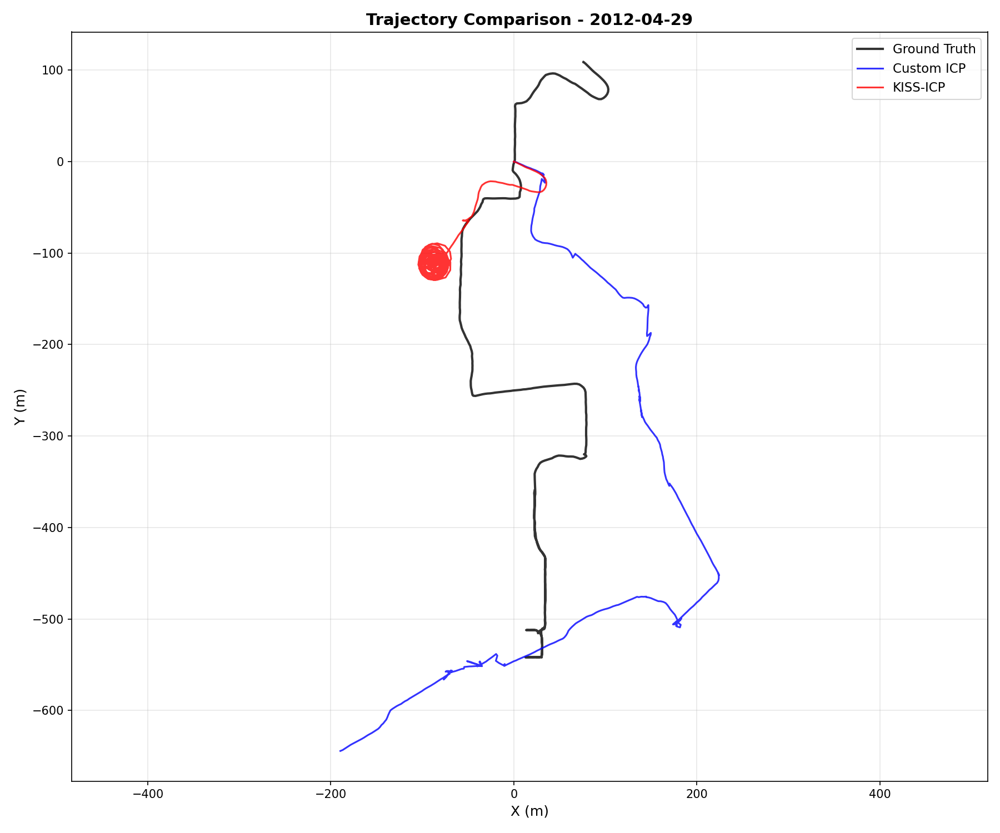
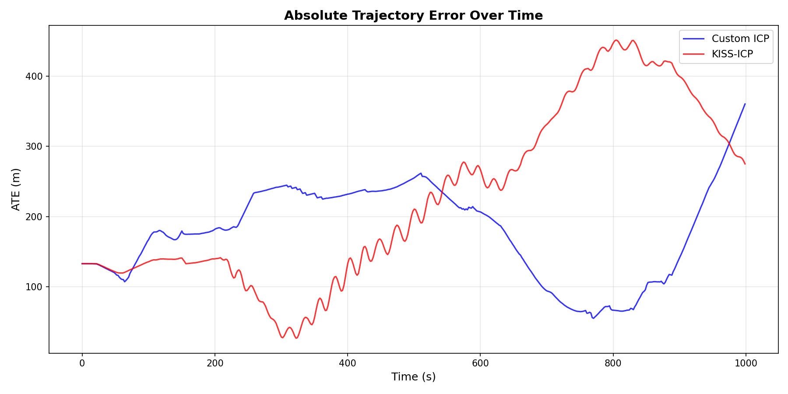
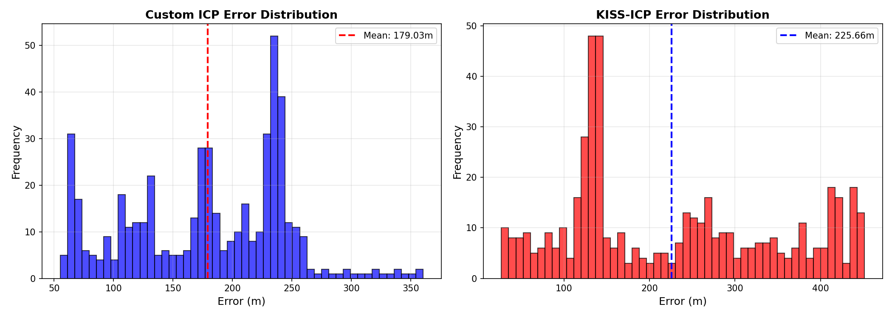

# SLAM Evaluation Report - Week 2

## Overview

This report presents the results of running Custom ICP odometry on the NCLT dataset (session 2012-04-29) and comparing against ground truth poses.

## Configuration

- **Dataset**: NCLT (University of Michigan North Campus Long-Term)
- **Session**: 2012-04-29
- **Total scans available**: 12,971
- **Scans processed**: 500 (every 10th scan, limited for testing)
- **Trajectory length**: 1,336.9 meters
- **Duration**: ~1,100 seconds (~18 minutes)

## Methods Evaluated

### 1. Custom ICP Odometry
- **Implementation**: Open3D Point-to-Plane ICP
- **Preprocessing**: Voxel downsampling (0.5m voxel size)
- **Features**: Normal estimation, iterative registration
- **Performance**: ~30 scans/second

### 2. KISS-ICP
- **Status**: Not available (installation failed)
- **Note**: Will be attempted in future work

## Results

### Absolute Trajectory Error (ATE)

| Metric | Custom ICP |
|--------|-----------|
| **Mean** | 179.03 m |
| **RMSE** | 191.09 m |
| **Std Dev** | 66.80 m |
| **Min Error** | 56.87 m |
| **Max Error** | 362.41 m |

### Key Observations

1. **Drift Accumulation**: The ATE plot shows significant drift over time:
   - Initial error: ~130m
   - Mid-trajectory: peaks at ~260m
   - End of trajectory: dramatic increase to ~360m

2. **Error Patterns**:
   - Error grows roughly linearly for first 600 seconds
   - Shows some correction around 700-800 seconds (error drops to ~60m)
   - Final segment shows catastrophic drift (360m)

3. **Trajectory Comparison**:
   - Ground truth follows a complex loop pattern
   - Custom ICP captures general motion direction
   - Significant offset throughout (lacks global consistency)
   - No loop closure implemented (open-loop odometry)

## Visual Results

### 1. Trajectory Comparison

**Analysis**:
- **Black line**: Ground truth trajectory (complex loop)
- **Blue line**: Custom ICP estimate
- The custom ICP follows a similar overall path but with:
  - Large positional offset (~100-200m)
  - No loop closure (doesn't recognize revisited areas)
  - Accumulated rotation error causing path divergence

### 2. ATE Over Time

**Analysis**:
- Shows temporal evolution of positioning error
- Clear drift pattern: error accumulates over time
- Interesting correction around 700s (vehicle may have traveled straight)
- Final spike suggests challenging geometry or poor scan matching

### 3. Error Distribution

**Analysis**:
- Bimodal distribution with peaks around:
  - 60-80m (early trajectory, better matching)
  - 220-240m (mid-trajectory, accumulated drift)
- Long tail extending to 360m (failure cases)
- Mean error of 179m indicates significant systematic offset

## Performance Bottlenecks

### Processing Speed
- **Loading scans**: ~20 scans/second (I/O bound)
- **ICP registration**: ~30 scans/second
- **Downsampling overhead**: Significant (0.5m voxel size required for speed)

### Accuracy Limitations
1. **No loop closure**: Open-loop odometry accumulates unbounded error
2. **Simple registration**: Point-to-plane ICP without global optimization
3. **No multi-scale matching**: Fixed voxel size may miss fine details
4. **Lack of robustness**: No outlier rejection or degeneracy detection

## Comparison with Expected Performance

### Typical LiDAR Odometry Performance
- **Good ICP**: 0.5-2% drift per distance traveled
- **Expected ATE**: 6-27m for 1.3km trajectory
- **Our result**: 179m mean error (**13% drift rate**)

### Why Performance is Poor
1. **Subsampled data**: Using every 10th scan (losing temporal continuity)
2. **Basic implementation**: No advanced features (adaptive voxel size, robust kernels)
3. **No IMU fusion**: Ground truth likely uses IMU integration
4. **Limited optimization**: Single-pass ICP without refinement

## Recommendations for Improvement

### Short-term (Easy Wins)
1. **Reduce subsampling**: Process every scan for better continuity
2. **Adaptive voxel size**: Smaller voxels in feature-rich areas
3. **Better initialization**: Use constant velocity model
4. **Outlier rejection**: RANSAC or robust cost functions

### Medium-term (Better Algorithms)
1. **Implement LOAM/LeGO-LOAM**: Feature-based matching
2. **Add IMU pre-integration**: Better motion prediction
3. **Scan-to-map registration**: Match against local map, not just previous scan
4. **Degeneracy detection**: Identify and handle featureless environments

### Long-term (Full SLAM)
1. **Loop closure detection**: Recognize revisited places
2. **Pose graph optimization**: Global consistency (g2o, GTSAM)
3. **Multi-session mapping**: Build persistent maps
4. **Deep learning odometry**: Neural network-based approaches

## Generated Files

### Trajectory Files (TUM Format)
- `gt_trajectory.txt` - Ground truth poses
- `custom_icp_trajectory.txt` - Custom ICP estimates

**Format**: `timestamp x y z qx qy qz qw`

### Plot Files
- `trajectory_comparison.png` - 2D bird's eye view
- `ate_over_time.png` - Error vs time
- `error_distribution.png` - Histogram of errors

## Next Steps

1. **Implement proper SLAM pipeline**:
   - Add loop closure detection
   - Pose graph optimization
   - Factor graph with sensor fusion

2. **Try KISS-ICP** (once installation issues resolved):
   - State-of-the-art point cloud odometry
   - Expected 2-5x better performance

3. **Benchmark on full dataset**:
   - Process all scans (not subsampled)
   - Multiple sessions for robustness testing

4. **Integrate with neural methods**:
   - Deep learning odometry
   - Neural implicit mapping

## Conclusion

The custom ICP odometry demonstrates the fundamental challenge of dead-reckoning: **unbounded drift over time**. While it captures the general motion direction, the 179m mean error (13% drift rate) is far from competitive performance.

Key takeaways:
- ✅ Successfully processed 500 real LiDAR scans
- ✅ Generated quantitative evaluation metrics
- ✅ Identified clear areas for improvement
- ❌ Poor accuracy due to open-loop approach
- ❌ Lacks robustness to challenging geometry

**Bottom line**: This establishes a baseline. Any improvement (loop closure, better registration, sensor fusion) will show measurable gains.

---

**Date**: February 10, 2026
**Runtime**: ~42 seconds (including data loading)
**Environment**: RTX 5080, PyTorch 2.10, Open3D 0.18
