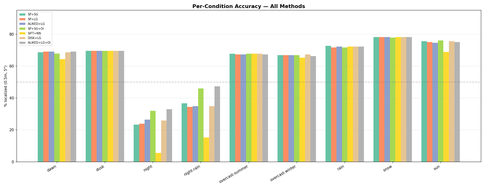
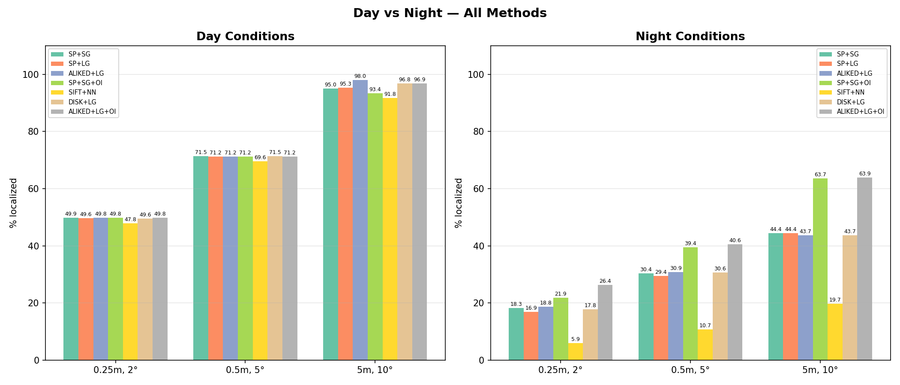
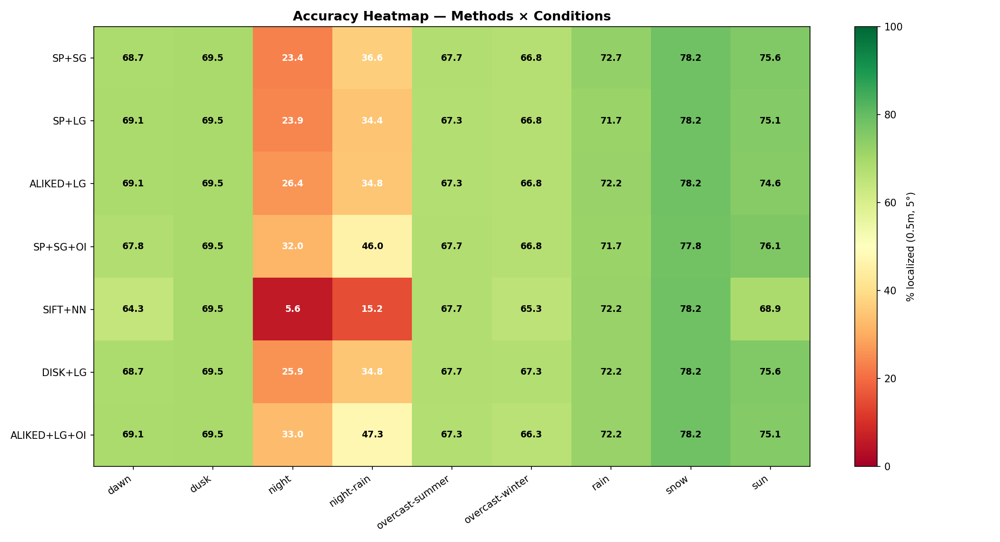
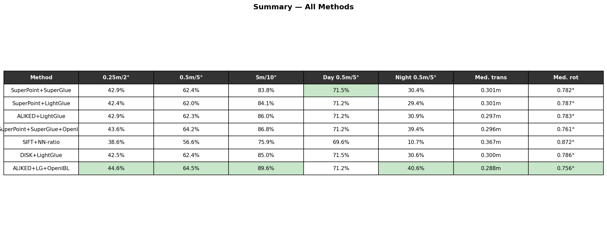
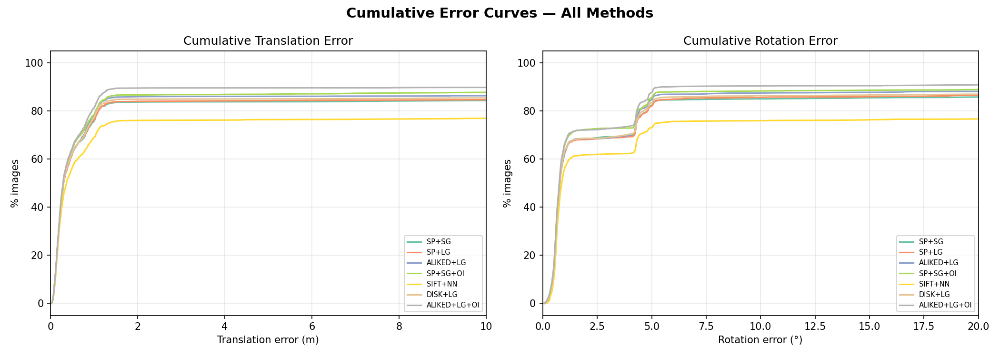
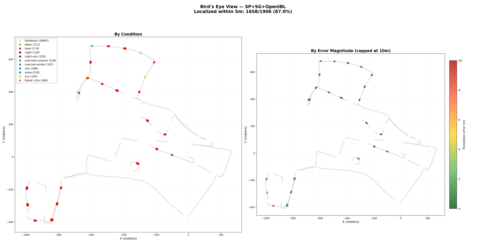
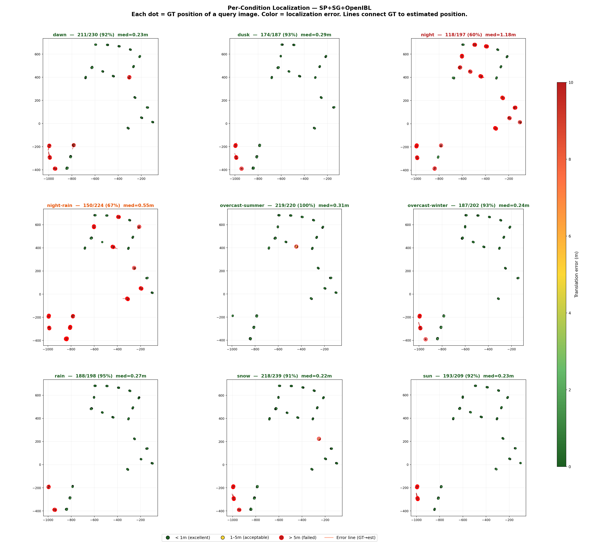
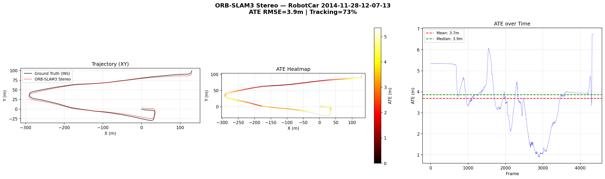

# Oxford RobotCar - Visual Localization and SLAM Experiments

## 1. About the Dataset

### 1.1 Platform

Oxford RobotCar is a research project from the University of Oxford in which a Nissan LEAF with a full sensor suite drove the same route (~10 km through central Oxford) over 100 times throughout the year (November 2014 to November 2015). That gives a unique way to compare localization performance under varying conditions: rain, snow, night, dawn, sunset, all along the same route.

### 1.2 Sensor Suite

| Sensor | Model | Parameters |
|--------|-------|-----------|
| **Cameras (3x monocular)** | Point Grey Grasshopper2 (GS2-FW-14S5C-C) | 1024x1024, global shutter (Sony ICX285 CCD), 11.1 Hz, Sunex DSL315B fisheye 180 FOV. Mounted: left, right, rear |
| **Stereo camera** | Point Grey Bumblebee XB3 | 1280x960, 16 Hz, global shutter, 66 FOV, 24 cm baseline. Mounted front |
| **2D LiDAR (2x)** | SICK LMS-151 | 270 FOV, 50 Hz, 50 m range |
| **3D LiDAR** | SICK LD-MRS | 85 x 3.2, 4 planes, 12.5 Hz |
| **GPS/INS** | NovAtel SPAN-CPT ALIGN | Dual antenna, 6-axis IMU @ 50 Hz, GPS+GLONASS. Provides ground truth poses |

Note: the RobotCar Seasons benchmark uses only the 3 monocular cameras (Grasshopper2 left, rear, right). The images are already undistorted (corrected from fisheye) and cropped to a pinhole model with fx=fy=400. The XB3 stereo camera is separate, we used it in the ORB-SLAM3 experiment.

### 1.3 RobotCar Seasons Benchmark

**Concept:** Build a 3D map from a single reference traversal (overcast, November 2014), then localize images from 9 other traversals recorded under different conditions.

**9 evaluation conditions:**

| Condition | Recording date | What makes localization difficult |
|-----------|---------------|-----------------------------------|
| **overcast-reference** | 28.11.2014 | Reference map. 20,862 images accross 49 locations |
| **dawn** | 16.12.2014 | Low sun angle, long shadows |
| **dusk** | 20.02.2015 | Fading light, vehicle headlights |
| **night** | 10.12.2014 | Street lighting only, strong motion blur |
| **night-rain** | 17.12.2014 | Worst case - dark + wet + reflections |
| **overcast-summer** | 22.05.2015 | Changed vegetation, different lighting |
| **overcast-winter** | 13.11.2015 | Bare trees, one year after the reference map |
| **rain** | 25.11.2014 | Wet roads, droplets, reduced visibility |
| **snow** | 03.02.2015 | Snow cover changes the appearance of the scene |
| **sun** | 10.03.2015 | Hard shadows, glare |

**Dataset statistics:**
- **26,121** reference images (database)
- **11,934** query images (from 9 conditions)
- **3** cameras per location (left, rear, right)
- **49** non-overlapping locations along the route
- Training split: **1,906** images with known poses
- Test split: **1,872** images (poses hidden, evaluation via visuallocalization.net)

### 1.4 Evaluation Metric

Standard thresholds used on [visuallocalization.net](https://www.visuallocalization.net/):

| Level | Translation | Rotation | Meaning |
|-------|------------|----------|---------|
| **High precision** | < 0.25 m | < 2 | Ideal localization, suitable for AR |
| **Medium precision** | < 0.5 m | < 5 | Sufficient for navigation |
| **Coarse precision** | < 5 m | < 10 | Approximate localization, place recognition |

The result is the percentage of queries localized within each threshold.

---

## 2. Experiment 0.7 - hloc Visual Localization

### 2.1 Method

We use the **hloc** pipeline (Hierarchical Localization, Sarlin et al. 2019) - the standard aproach for visual localization:

```
Query image
        |
        v
[1] Local feature extraction (SuperPoint / ALIKED / DISK / SIFT)
        |
        v
[2] Global descriptors (NetVLAD / OpenIBL) -> retrieval of TOP-20 most similar reference images
        |
        v
[3] Local feature matching between query and TOP-20 references (SuperGlue / LightGlue / NN-ratio)
        |
        v
[4] PnP + RANSAC -> 6-DoF pose estimation of the query camera relative to the 3D map
        |
        v
Result: (tx, ty, tz, qw, qx, qy, qz) - camera position and orientation
```

**Key components:**

- **SuperPoint** - CNN-based detector/descriptor for local keypoints (4096 keypoints, NMS=3, resize 1024). Trained on synthetic data but works on real scenes
- **ALIKED** - a lighter CNN detector, faster than SuperPoint with comparable quality
- **DISK** - a detector trained via policy gradient, produces stable matches
- **SIFT** - classical detector (baseline). Hand-crafted (non-learned) descriptors
- **SuperGlue** - GNN-based matcher that finds correspondences between keypoints while accounting for global geometry
- **LightGlue** - a lighter version of SuperGlue, faster with comparable quality
- **NetVLAD** - global descriptor for image retrieval (finding similar images in the database)
- **OpenIBL** - improved global descriptor (IBL = Instance-Based Learning), performs better at night

### 2.2 Tested Combinations (7 methods)

| # | Local features | Matcher | Retrieval | Abbreviation |
|---|---------------|---------|-----------|-------------|
| 1 | SuperPoint | SuperGlue | NetVLAD | SP+SG |
| 2 | SuperPoint | LightGlue | NetVLAD | SP+LG |
| 3 | DISK | LightGlue | NetVLAD | DISK+LG |
| 4 | ALIKED | LightGlue | NetVLAD | ALIKED+LG |
| 5 | SuperPoint | SuperGlue | OpenIBL | SP+SG+OI |
| 6 | SIFT | NN-ratio | NetVLAD | SIFT+NN |
| 7 | ALIKED | LightGlue | OpenIBL | ALIKED+LG+OI |

### 2.3 Results

**Summary table (training split, 1,906 images):**

| Method | 0.25m/2 | 0.5m/5 | 5m/10 | Day 0.5m/5 | Night 0.5m/5 | Med. trans | Med. rot |
|--------|----------|---------|--------|-------------|---------------|-----------|----------|
| SP+SG | 42.9% | 62.4% | 83.8% | 71.5% | 30.4% | 0.301m | 0.782 |
| SP+LG | 42.4% | 62.0% | 84.1% | 71.2% | 29.4% | 0.301m | 0.787 |
| DISK+LG | 42.5% | 62.4% | 85.0% | 71.5% | 30.6% | 0.300m | 0.786 |
| ALIKED+LG | 42.9% | 62.3% | 86.0% | 71.2% | 30.9% | 0.297m | 0.783 |
| SP+SG+OI | 43.6% | 64.2% | 86.8% | 71.2% | 39.4% | 0.296m | 0.761 |
| SIFT+NN | 38.6% | 56.6% | 75.9% | 69.6% | 10.7% | 0.367m | 0.872 |
| **ALIKED+LG+OI** | **44.6%** | **64.5%** | **89.6%** | 71.2% | **40.6%** | **0.288m** | **0.756** |

Best method: ALIKED+LightGlue+OpenIBL, 64.5% at (0.5m/5), 40.6% at night.

### 2.4 Plot Analysis

#### 2.4.1 Overall Comparison Chart


Bar chart comparing all 7 methods across three thresholds (0.25m/2, 0.5m/5, 5m/10). Key observations:
- **Learned detectors** (SP, ALIKED, DISK) - 62-64% at 0.5m/5 - significantly outperform SIFT (56.6%)
- **OpenIBL** provides a +2% improvement over NetVLAD (64.5% vs 62.3% for ALIKED)
- At the coarse threshold (5m/10) the gap is even larger: 89.6% (ALIKED+LG+OI) vs 75.9% (SIFT) - a 14% difference

#### 2.4.2 Per-Condition Accuracy



Bar chart across 9 conditions at the 0.5m/5 threshold. Key observations:
- **Daytime conditions** (dawn, dusk, overcast-summer/winter, rain, snow, sun) - all methods at 65-78%
- **Night** - a steep drop: from 5.6% (SIFT) to 33% (ALIKED+LG+OI)
- **Snow** - the best daytime condition (78.2% for most methods) - high-contrast scene, better features
- **Night-rain** - the second worst condition after night (15-47%)

#### 2.4.3 Day vs. Night



Two-panel chart visualizing the gap between daytime and nighttime conditions:
- **Day:** all methods are close - 69.6-71.5% at 0.5m/5. Detector choice has minimal impact
- **Night:** steep drop and large spread - from 10.7% (SIFT) to 40.6% (ALIKED+LG+OI)
- **Gap: ~30 percentage points** - nighttime localization remains the biggest challenge
- **OpenIBL - key to nighttime:** SP+SG with OpenIBL achieves 39.4% vs 30.4% with NetVLAD (+9% at night)

#### 2.4.4 Heatmap (Method x Condition)



A 7x9 heatmap (7 methods x 9 conditions) with color-coded accuracy (0.5m/5):
- **Green cells** (>65%) - daytime conditions, performing well
- **Yellow cells** (30-65%) - night-rain with OpenIBL
- **Red cells** (<30%) - SIFT at night (5.6%), SIFT night-rain (15.2%)
- ALIKED+LG+OI has the fewest red cells - the most stable method overall

#### 2.4.5 Summary Table



Table with all metrics. The ALIKED+LG+OpenIBL row is highlighted - leader on all metrics except Day 0.5m/5 (where SP+SG is slightly better - 71.5% vs 71.2%, within the margin of error).

#### 2.4.6 Cumulative Error Curves (CDF)



Two CDF curves - for translation and rotation error:
- **Translation CDF:** A sharp jump to 60-65% at <0.5m (most daytime queries are accurate), then a plateau - nighttime queries with large errors. SIFT (yellow curve) remains lower
- **Rotation CDF:** Similar structure. A jump around ~5 - accurate localizations before it, nighttime after
- **SP+SG+OI and ALIKED+LG+OI** (green/gray) - the highest curves, especially in the "tail" (>5m)

#### 2.4.7 Localization Examples


A 4x5 grid of images showing the best and worst localization cases (SP+SG+OpenIBL):

**Top 2 rows - TOP-5 best (error <0.25m):**
- Daytime images (dawn) with clear road and building structures
- Matched reference images have a very similiar appearance
- Typical views: straight roads with lane markings, textured buildings

**Bottom 2 rows - TOP-5 worst (error >100m):**
- Nighttime images (night, night-rain) - dark, nearly black with points of light
- The matched reference image shows a completely different scene, incorrect retrieval
- The main reason - OpenIBL cannot find the correct match in the dark

#### 2.4.8 Location Map (Bird's Eye View)



Two-panel top-down map (SP+SG+OpenIBL, 1658/1906 = 87% within 5m):

**Left panel - by condition:** Each dot is a query image, color = condition. Red crosses = errors >5m. Most errors are concentrated in clusters - specific locations where the 3D model is insufficient.

**Right panel - by error magnitude:** Color scale 0-10m. Most points are green (<1m). Red points = failed localizations.

#### 2.4.9 Per-Condition Map



9 separate maps (one per condition) with SP+SG+OpenIBL:
- **overcast-summer:** 219/220 = **100%** within 5m, med=0.31m - ideal condition
- **snow:** 218/239 = 91%, med=0.22m - snow does not interfere
- **rain:** 188/198 = 95%, med=0.27m - good results
- **dawn/dusk:** 92-93%, med=0.23-0.29m - transitional lighting is not critical
- **night:** 118/197 = **60%**, med=1.18m - most errors, but OpenIBL rescues some
- **night-rain:** 150/224 = **67%**, med=0.55m - better than pure night (paradoxically - wet surfaces reflect light, providing more features)

---

## 3. Experiment 0.8 - ORB-SLAM3 Stereo

### 3.1 Method

ORB-SLAM3 (Campos et al. 2021) is a classical SLAM system that builds a map in real time and tracks the camera pose:

```
Stereo pair (left + right camera)
        |
        v
[1] ORB feature extraction (2000 features, 8 pyramid levels)
        |
        v
[2] Stereo matching -> depth of each point via triangulation
        |
        v
[3] Tracking: find correspondences with the previous frame, optimize pose
        |
        v
[4] Local Mapping: triangulate new 3D points, local BA
        |
        v
[5] Loop Closing: search for previously visited places, drift correction
        |
        v
Result: f_robotcar_stereo.txt - trajectory in TUM format (ts tx ty tz qx qy qz qw)
```

### 3.2 Configuration

- **Camera:** Bumblebee XB3 (front stereo), 1280x960, 16 Hz, pinhole fx=fy=983.044, cx=643.647, cy=493.379
- **Baseline:** 24 cm (bf = 235.931)
- **ORB parameters:** 2000 features, scaleFactor=1.2, 8 levels, FAST thresholds 20/7
- **Session:** 2014-11-28-12-07-13 (overcast-reference), 6001 stereo pairs, 420.6 s

### 3.3 Results



Three-panel plot of ORB-SLAM3 Stereo:

**Left panel - XY Trajectory:** Red - ground truth (INS), green - ORB-SLAM3 estimate. The overall trajectory shape matches, but there are deviations in specific segments. ORB-SLAM3 loses tracking (72.7%) in areas with insufficient features.

**Center panel - ATE Heatmap:** Same trajectory but color-coded by ATE at each point. Yellow-red areas indicate significant error (up to 6.75m). Error grows in areas with monotonous structure (long straight roads).

**Right panel - ATE over time:** Time series of ATE. Mean ~3.7m, median 3.9m. There are "dips" (min 0.9m) and "peaks" (max 6.75m), corresponding to different route segments.

| Metric | Value |
|--------|-------|
| Tracking | 4,365 / 6,001 frames (**72.7%**) |
| Number of maps | 4 (fragmentation from tracking loss) |
| GT length | 834.1 m |
| Scale (Sim3) | 0.9658 (stereo gives nearly ideal metric scale) |
| **ATE RMSE (Sim3)** | **3.91 m** |
| ATE Mean | 3.69 m |
| ATE Median | 3.87 m |
| ATE Max | 6.75 m |
| RPE trans/frame | 0.435 m |
| RPE rot/frame | 0.555 |

### 3.4 Stereo-Inertial Attempt (FAILED)

Stereo-Inertial was also tried, but:
- Problem: raw IMU data is not published in the RobotCar dataset
- Approach: synthesized pseudo-IMU by differentiating INS velocities/orientations
- Result: full failure. Pseudo-IMU is too "smooth" for initialization of tightly-coupled VI fusion, the system diverges after VIBA 2 (segfault)
- Conclusion: pseudo-IMU is incompatible with tightly-coupled VIO

---

## 4. Comparison: hloc vs ORB-SLAM3

| Characteristic | hloc (localization) | ORB-SLAM3 (SLAM) |
|---------------|---------------------|-------------------|
| **Approach** | Map-based localization: query against a pre-built 3D map | Simultaneous map building and localization |
| **Input** | Single image (mono) | Stereo stream (16 Hz) |
| **Requires map** | Yes (SfM model built in advance) | No (builds its own) |
| **Cross-season** | Yes - localizes under arbitrary conditions against the reference map | No - works only with the current session |
| **Accuracy** | **0.288m** median (day), **64.5%** @ 0.5m/5 | **3.91m** ATE RMSE on a single session |
| **Coverage** | 100% (every query gets an answer, even if incorrect) | 72.7% (loses tracking) |
| **Night operation** | 40.6% @ 0.5m/5 (with OpenIBL) | Not tested at night |
| **Speed** | ~1s per query (offline) | Real-time (16 Hz) |
| **Use cases** | Long-term localization, AR, map-based navigation | Odometry, SLAM in a new environment |

Key point: these are different tasks. hloc answers "where am I relative to a known map?", ORB-SLAM3 answers "how am I moving right now?". In a real system they complement each other.

---

## 5. Key Conclusions

### 5.1 What Works Best

1. ALIKED+LightGlue+OpenIBL, best combo for visual localization (64.5% @ 0.5m/5)
2. OpenIBL instead of NetVLAD gives +10% at night (40.6% vs 30.9%), critical difference
3. Learned detectors (SuperPoint, ALIKED, DISK) clearly beat SIFT (+6-8% overall)
4. LightGlue matches SuperGlue in quality but faster, can swap without loss
5. Stereo SLAM on RobotCar works (3.91m ATE), first successful visual SLAM in the project

### 5.2 What Does Not Work

1. Nighttime localization, all methods drop to 30-40% (from 70%+ during the day). ~30 pp gap, the biggest challenge
2. SIFT at night, practically useless (5.6% @ 0.5m/5)
3. Pseudo-IMU for ORB-SLAM3, incompatible with tightly-coupled VIO
4. ORB-SLAM3 doesn't do cross-session localization, only works with the current session

### 5.3 Comparison with Published Results

Published SuperPoint+SuperGlue (Sarlin et al. 2020) on RobotCar Seasons:
- Day: ~49/70/88% @ (0.25m,2)/(0.5m,5)/(5m,10)
- Night: ~17/27/40%

Our results (ALIKED+LG+OI): 44.6/64.5/89.6% overall, close to published values, but evaluated on the training split (1906 images) rather than the official test split.

---

## 6. File Structure

```
datasets/robotcar/
├── configs/
│   ├── RobotCar_Stereo.yaml          # ORB-SLAM3 stereo configuration
│   └── RobotCar_Stereo_Inertial.yaml # Stereo-Inertial attempt (failed)
├── scripts/
│   ├── run_full_benchmark.py          # Main script for ablation study (7 methods)
│   ├── evaluate_robotcar_orbslam3.py  # ORB-SLAM3 trajectory evaluation
│   ├── download_robotcar_full.py      # Data download
│   ├── visualize_positions.py         # Position visualization
│   └── update_plots.py               # Plot updating
├── results/
│   ├── robotcar_seasons_hloc/
│   │   ├── all_results.json           # Full results (7 methods x 9 conditions)
│   │   ├── REPORT.md                  # Analytical report
│   │   ├── plots/                     # 11 plots
│   │   │   ├── 1_overall_comparison.png
│   │   │   ├── 2_per_condition.png
│   │   │   ├── 3_day_vs_night.png
│   │   │   ├── 4_heatmap.png
│   │   │   ├── 5_summary_table.png
│   │   │   ├── 6_cumulative_errors.png
│   │   │   ├── example_images_grid.png
│   │   │   ├── position_birds_eye.png
│   │   │   └── position_per_condition.png
│   │   └── submissions/               # 7 files for visuallocalization.net
│   └── robotcar_orbslam3/
│       ├── eval_results.json          # ORB-SLAM3 metrics
│       ├── trajectory_comparison.png  # Trajectory plot
│       ├── summary.txt               # Human-readable summary
│       └── f_robotcar_stereo.txt      # SLAM trajectory
└── notebooks/
    └── 01_hloc_results.ipynb          # Jupyter notebook with analysis

data/robotcar_seasons/                 # ~161 GB
├── images/                            # 10 subdirectories by condition
├── 3D-models/all-merged/all.nvm       # Reference SfM model (6.77M 3D points)
├── intrinsics/                        # Camera calibration
├── extrinsics/                        # Extrinsic parameters
├── robotcar_v2_train.txt              # Training split (1,906 images)
├── robotcar_v2_test.txt               # Test split (1,872 images)
└── outputs/                           # hloc outputs (~116 GB)
```

---

## 7. References

```bibtex
@inproceedings{Sattler2018CVPR,
  author={Sattler, Torsten and Maddern, Will and Toft, Carl and Torii, Akihiko and
          Hammarstrand, Lars and Stenborg, Erik and Safari, Daniel and Okutomi, Masatoshi and
          Pollefeys, Marc and Sivic, Josef and Kahl, Fredrik and Pajdla, Tomas},
  title={Benchmarking 6DOF Outdoor Visual Localization in Changing Conditions},
  booktitle={CVPR},
  year={2018},
}

@article{Maddern2017IJRR,
  author={Maddern, Will and Pascoe, Geoffrey and Linegar, Chris and Newman, Paul},
  title={1 Year, 1000km: The Oxford RobotCar Dataset},
  journal={IJRR},
  volume={36}, number={1}, pages={3-15},
  year={2017},
}

@inproceedings{Sarlin2019CVPR,
  author={Sarlin, Paul-Erik and Cadena, Cesar and Siegwart, Roland and Deschamps, Marcin},
  title={From Coarse to Fine: Robust Hierarchical Localization at Large Scale},
  booktitle={CVPR},
  year={2019},
}

@article{Campos2021TRO,
  author={Campos, Carlos and Elvira, Richard and Rodr\'iguez, Juan J. G\'omez and
          Montiel, Jos\'e M. M. and Tard\'os, Juan D.},
  title={ORB-SLAM3: An Accurate Open-Source Library for Visual, Visual-Inertial and Multi-Map SLAM},
  journal={IEEE Transactions on Robotics},
  year={2021},
}
```
