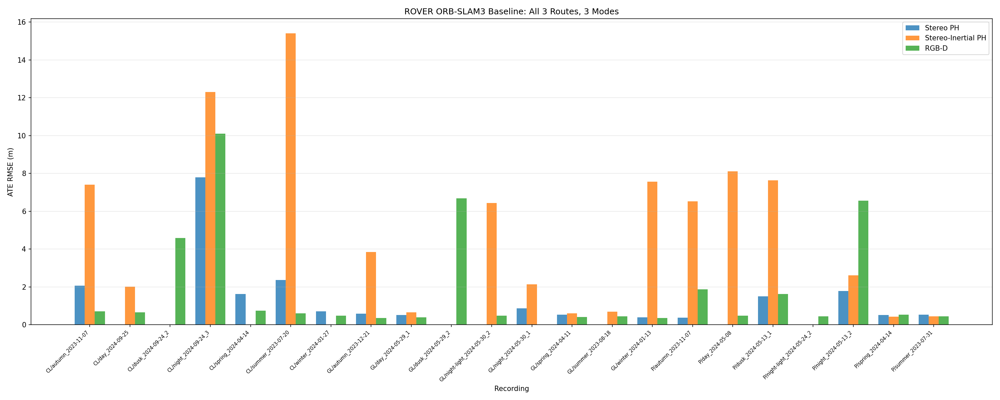
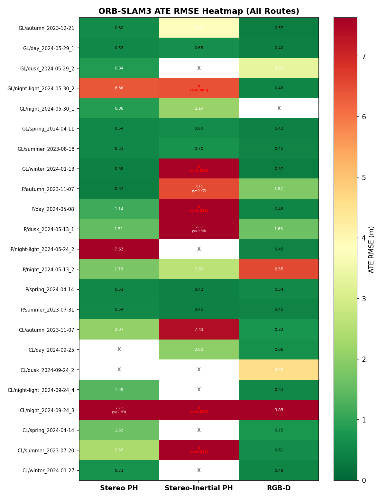

# ROVER Pipeline - ORB-SLAM3 Baseline Evaluation

## Overview

This pipeline provides a complete set of scripts, configurations, and results for evaluating ORB-SLAM3 on the **ROVER** dataset (Esslingen University of Applied Sciences, Germany). The dataset is publicly available on HuggingFace: [iis-esslingen/ROVER](https://huggingface.co/datasets/iis-esslingen/ROVER).

A total of **15 recordings** (~335 GB) were downloaded, and **45 experiments** (15 recordings x 3 ORB-SLAM3 modes) were conducted.

---

## Setup and Requirements

**System:** Ubuntu 24.04, Python 3.10+

**Dependencies:**
```bash
pip install numpy matplotlib opencv-python evo
```

**ORB-SLAM3:** must be built at `../third_party/ORB_SLAM3/` (see [main README](../README.md) for build instructions).

**Dataset:** download all 15 recordings (~335 GB) from [HuggingFace](https://huggingface.co/datasets/iis-esslingen/ROVER) into `../data/rover/`.

---

## How to Run

```bash
# 1. run full pipeline on all 15 recordings (3 modes each = 45 experiments)
python3 scripts/run_rover_orbslam3.py

# 2. or run a single mode on a specific recording
python3 scripts/run_rover_orbslam3.py --recording garden_large_day --mode rgbd

# 3. fisheye -> pinhole undistortion (needed before stereo pinhole mode)
python3 scripts/rectify_t265_stereo.py --recording garden_large_day

# 4. overnight batch run with Xvfb (headless, all recordings)
bash scripts/run_overnight.sh
```

Results are saved to `results/{recording}/{mode}/`.

---

## Robot and Sensor Suite

The ROVER platform is a differential-drive unmanned ground vehicle (UGV) equipped with a multi-sensor payload designed for visual navigation research under varying environmental conditions.

### Intel RealSense T265 -- Stereo Tracking Camera

The T265 is a stereo camera with two fisheye lenses intended for inside-out positional tracking. It uses the KannalaBrandt8 distortion model (equidistant fisheye projection). Each imager has a resolution of **848x800 pixels** at **30 fps**. The stereo baseline between the two cameras is only **~6.35 cm**, which is very short for outdoor environments. Left camera intrinsics: fx=286.18, fy=286.39, principal point cx=416.94, cy=403.27. Distortion coefficients: k1=-0.0115, k2=0.0502, k3=-0.0504, k4=0.0127.

The T265 also includes a built-in **IMU running at 264 Hz**. Gyroscope noise density: 0.00324 rad/s/sqrt(Hz); accelerometer noise density: 0.01741 m/s^2/sqrt(Hz).

### Intel RealSense D435i - RGB-D Camera

The D435i is a depth camera based on structured infrared light. It produces synchronized RGB and depth images at **640x480** resolution and **30 fps**. It uses a PinHole camera model with radial-tangential distortion (radtan). Intrinsics: fx=596.20, fy=593.14, cx=327.05, cy=245.16. Distortion: k1=0.1572, k2=-0.4894, p1=-0.00075, p2=0.00037. Depth factor: 1000 (values in mm, converted to meters).

An important characteristic of the D435i is that its depth sensor operates on infrared emission and **continues to function in complete darkness**, unlike the RGB camera.

### Leica Total Station - Ground Truth

The ground truth trajectory is obtained using a Leica Total Station that tracks a prism mounted on the robot. Accuracy is sub-centimeter. The measurement frequency depends on line-of-sight conditions and varies from **1.6 to 3.9 Hz** depending on the recording.

### Other Sensors (Not Used in This Experiment)

- **Pi Camera** (640x480) - wide-angle camera
- **VN100** - external 9-DOF IMU at 66 Hz

---

## Downloaded Routes

All 15 recordings from two locations were downloaded. Each recording represents a complete route traversal with all sensors active.

### Location: Garden Large

Garden Large is an enclosed university garden area measuring approximately **13x20 meters**. The route consists of several loops around vegetation and structures. The environment is compact with rich texture: building walls, bushes, trees, and curbs. These conditions are favorable for visual SLAM due to the abundance of nearby, well-textured objects.

**8 sessions recorded:**

1. **garden_large_summer** (2023-08-18) - summer, daytime. Trajectory length **167.7 m**, duration 469 s (7.8 min). 14030 T265 frames, 13738 D435i frames, 1816 GT poses, 123914 IMU samples. Dense green vegetation, bright illumination.

2. **garden_large_autumn** (2023-12-21) - autumn/early winter, daytime. Trajectory **170.3 m**, duration 464 s (7.7 min). 13837 T265 frames, 13857 D435i frames, 997 GT poses, 121987 IMU samples. Leaves fallen, bare branches, uniform lighting.

3. **garden_large_winter** (2024-01-13) - winter, daytime. Trajectory **162.3 m**, duration 437 s (7.3 min). 12924 T265 frames, 12941 D435i frames, 776 GT poses, 113921 IMU samples. Possible snow, minimal vegetation, clear structural objects.

4. **garden_large_spring** (2024-04-11) - spring, daytime. Trajectory **165.0 m**, duration 451 s (7.5 min). 13410 T265 frames, 13427 D435i frames, 1731 GT poses, 118344 IMU samples. Vegetation beginning to green.

5. **garden_large_day** (2024-05-29) - late spring, daytime. Trajectory **150.3 m** (shortest in GL), duration 392 s (6.5 min). 11767 T265 frames, 11789 D435i frames, 1099 GT poses, 103775 IMU samples. Good lighting, full vegetation.

6. **garden_large_dusk** (2024-05-29) - late spring, dusk. Trajectory **151.8 m**, duration 401 s (6.7 min). 12002 T265 frames, 12009 D435i frames, 824 GT poses, 105816 IMU samples. Reduced natural lighting; recorded the same day as garden_large_day.

7. **garden_large_night** (2024-05-30) - late spring, night without illumination. Trajectory **150.5 m**, duration 397 s (6.6 min). 11884 T265 frames, 11894 D435i frames, 703 GT poses, 104769 IMU samples. Complete darkness - the RGB camera captures virtually nothing.

8. **garden_large_night-light** (2024-05-30) - night with artificial illumination. Trajectory **151.8 m**, duration 399 s (6.7 min). 11964 T265 frames, 11987 D435i frames, 705 GT poses, 105482 IMU samples. Artificial lighting creates harsh shadows and uneven brightness.

**Garden Large summary:** trajectory lengths 150--170 m, durations 6.5--7.8 minutes, ~12000--14000 frames per session.

### Location: Park

Park is an open parkland area measuring approximately **20x19 meters**. The route follows an irregular, larger loop through open spaces between trees. Fewer nearby structural objects compared to Garden Large - primarily trees, grass, and paths. This is a more challenging environment for visual SLAM due to repetitive texture (grass, foliage) and greater distances to landmarks.

**7 sessions recorded:**

9. **park_summer** (2023-07-31) - summer, daytime. Trajectory **164.2 m**, duration 439 s (7.3 min). 13138 T265 frames, 12669 D435i frames, 837 GT poses, 115919 IMU samples. Dense vegetation.

10. **park_autumn** (2023-11-07) - autumn, daytime. Trajectory **170.5 m**, duration 498 s (8.3 min - longest session). 14918 T265 frames, 13988 D435i frames, 1290 GT poses, 131519 IMU samples. Fallen leaves, bare branches.

11. **park_spring** (2024-04-14) - spring, daytime. Trajectory **171.5 m**, duration 466 s (7.8 min). 13877 T265 frames, 13893 D435i frames, 752 GT poses, 122502 IMU samples. Spring bloom.

12. **park_day** (2024-05-08) - late spring, daytime. Trajectory **183.0 m** (longest of all recordings), duration 484 s (8.1 min). 14429 T265 frames, 14446 D435i frames, 1046 GT poses, 127263 IMU samples.

13. **park_dusk** (2024-05-13) - late spring, dusk. Trajectory **182.7 m**, duration 481 s (8.0 min). 14351 T265 frames, 14368 D435i frames, 1315 GT poses, 126632 IMU samples.

14. **park_night** (2024-05-13) - late spring, night. Trajectory **179.8 m**, duration 474 s (7.9 min). 14181 T265 frames, 14175 D435i frames, 1005 GT poses, 125126 IMU samples. Recorded the same evening as park_dusk.

15. **park_night-light** (2024-05-24) - night with artificial illumination. Trajectory **172.1 m**, duration 463 s (7.7 min). 13750 T265 frames, 13743 D435i frames, 1127 GT poses, 121273 IMU samples.

**Park summary:** trajectory lengths 164--183 m (longer than Garden Large), durations 7.3--8.3 minutes, ~13000--15000 frames per session.

### Overall Statistics

- **15 recordings**, 2 locations (8 garden_large + 7 park)
- **Total data volume:** ~335 GB
- **Trajectory length range:** 150.3 m (GL/day) - 183.0 m (P/day)
- **Mean trajectory length:** ~165 m
- **Mean duration:** ~450 s (7.5 minutes)
- **Mean robot speed:** ~0.35 m/s
- **Total T265 frames:** ~199,000
- **Total D435i frames:** ~196,000
- **Total IMU samples:** ~1,783,000

---

## Experiments and Results

### Experimental Setup

**Phase 1 (Exp 1.1):** ORB-SLAM3 was evaluated in three modes on each of the 15 recordings:

1. **Stereo** - stereo fisheye T265 (KannalaBrandt8 model), no IMU
2. **Stereo-Inertial** - stereo T265 + built-in IMU at 264 Hz
3. **RGB-D** - color + depth images from D435i (PinHole model)

This yielded **45 experiments** in total, executed 3 in parallel.

**Phase 2 (Exp 1.1b):** Stereo and Stereo-Inertial modes were corrected by applying fisheye-to-pinhole undistortion.

### Results: Stereo and Stereo-Inertial - Fisheye (KannalaBrandt8)

**With original fisheye images: Stereo 0/15, Stereo-Inertial 0/15.**

Every recording produced only **1 keyframe**, after which ORB-SLAM3 either crashed with a segmentation fault (10 out of 15 cases) or terminated without producing a trajectory. The root cause is that the T265 has a stereo baseline of only **6.35 cm** with equidistant fisheye distortion. For objects at 5--10 m, stereo disparity is only 1--2 pixels - below the noise floor.

### Fix: Undistort Fisheye to PinHole (Exp 1.1b)

The issue was resolved by transforming the T265 fisheye images into a standard **pinhole model** (640x480, 110 deg horizontal FoV). Each image is undistorted via `cv2.fisheye.initUndistortRectifyMap` with new camera parameters: **fx=224.07, fy=224.07, cx=320, cy=240**, zero distortion. ORB-SLAM3 then performs stereo rectification internally through T_c1_c2.

**Results on garden_large_day (test):**

| Mode | ATE RMSE | Scale | Tracking | KF | Loop closures |
|------|----------|-------|----------|----|---------------|
| Stereo PinHole | **0.527 m** | 1.214 | 100% (11767/11767) | 3892 | 4 |
| Stereo-Inertial PinHole | **0.652 m** | 1.221 | 100% (11765/11767) | 1392 | 0 |
| RGB-D (D435i) | **0.398 m** | 0.977 | 100% | -- | -- |

The scale of ~1.21 for stereo modes represents a 21% overestimate, which is characteristic of the short 6.35 cm baseline in outdoor environments. RGB-D remains the most accurate due to direct depth measurement, but now **all three modes are functional**.

Undistortion script: `scripts/rectify_t265_stereo.py`
Configs: `configs/ROVER_T265_PinHole_Stereo.yaml`, `configs/ROVER_T265_PinHole_Stereo_Inertial.yaml`

### Results: RGB-D - 11 of 15 Successful

RGB-D is the most accurate mode on the ROVER dataset. Per-recording results follow.

**Garden Large (6 of 8 successful):**

- **GL/autumn** - best result: **ATE RMSE 0.365 m** (mean 0.334 m, median 0.318 m, max 0.952 m). Scale 0.981, tracking 100%. Bare branches and stable winter-like illumination produce clear structural features for ORB detection.

- **GL/winter** - **ATE RMSE 0.367 m** (mean 0.331 m, median 0.295 m, max 1.075 m). Scale 0.980, tracking 100%. Winter without foliage provides uniform illumination free from vegetation shadows.

- **GL/day** - **ATE RMSE 0.398 m** (mean 0.361 m, median 0.321 m, max 0.998 m). Scale 0.977, tracking 100%. Ideal conditions: bright daylight, full vegetation providing rich texture.

- **GL/spring** - **ATE RMSE 0.420 m** (mean 0.373 m, median 0.343 m, max 1.226 m). Scale 0.988, tracking 100%.

- **GL/summer** - **ATE RMSE 0.453 m** (mean 0.404 m, median 0.403 m, max 5.285 m). Scale 0.988, tracking 100%. Slightly worse than other daytime recordings - the high maximum (5.3 m) indicates a brief drift episode, possibly due to overexposure.

- **GL/night-light** - **ATE RMSE 0.480 m** (mean 0.438 m, median 0.396 m, max 2.084 m). Scale 0.959, tracking 100%. Artificial illumination at night provides sufficient light for ORB features, but uneven brightness slightly degrades the result.

- **GL/dusk** - **FAILED** (abort, exit code 134). Sophus SO3::exp() received NaN - numerical instability during rotation computation. Twilight illumination degrades ORB features to the point where matrix operations produce invalid values

- **GL/night** - **FAILED** (segfault, exit code 139). Complete darkness - the RGB camera captures virtually nothing, and the ORB detector finds only noise. The depth sensor continues to operate (infrared), but visual tracking is impossible

**Garden Large summary:** mean ATE **0.414 m**, median **0.409 m**. Results are highly consistant - all 6 successful runs fall within a narrow range of 0.37--0.48 m. Seasonal variation (summer/autumn/winter/spring) has **negligible impact** on RGB-D SLAM accuracy.

**Park (5 of 7 succesful):**

- **P/summer** - **ATE RMSE 0.448 m** (mean 0.415 m, median 0.400 m, max 1.107 m). Scale 1.021, but **tracking only 50.5%** - ORB-SLAM3 lost tracking for half the session (6387 of 12669 frames). The tracked portion shows good accuracy.

- **P/spring** - **ATE RMSE 0.537 m** (mean 0.492 m, median 0.484 m, max 1.228 m). Scale 1.031, tracking 100%. Spring lighting with texture from young foliage.

- **P/dusk** - **ATE RMSE 1.629 m** (mean 0.914 m, median 0.638 m, max 7.690 m). Scale 1.036, tracking 100%. Dusk in the park - the overall trajectory shape matches ground truth, but there are local error spikes up to 7.7 m. The median of 0.64 m indicates that most of the trajectory is acceptable, with short segments of significant drift.

- **P/autumn** - **ATE RMSE 1.874 m** (mean 0.687 m, median 0.431 m, max 14.780 m). Scale 0.980, tracking 100%. Similar pattern: the median ATE of only 0.43 m (comparable to Garden Large), but one sharp error spike to 14.8 m dramatically inflates the RMSE. Likely a brief tracking loss followed by recovery at a shifted position.

- **P/night** - **worst result: ATE RMSE 6.553 m** (mean 5.832 m, median 6.118 m, max 19.334 m). Scale 0.929, tracking 99.9%. This is the only recording where the trajectory shape does not match ground truth at all. ORB-SLAM3 produces a distorted trajectory with systematic offset up to 25 m. Nighttime conditions in the park (without artificial lighting) represent the most challenging scenario.

- **P/day** - **FAILED** (timeout >1200 s). This is the longest trajectory (183 m). ORB-SLAM3 did not finish processing within 20 minutes - likely aggressive loop closure detection on the long route created excessive computational load. This is not a lighting issue - the day was clear

- **P/night-light** - **FAILED** (segfault, exit code 139). Night with artificial illumination in the park - harsh shadows and specular reflections from streetlights confuse ORB matching, leading to numerical instability

**Park summary:** mean ATE **2.208 m**, median **1.629 m**. Significantly worse than Garden Large, with high variance (from 0.45 m to 6.55 m).

---

## Error Analysis

### Why Stereo and Stereo-Inertial Failed with Fisheye and How It Was Fixed

**Problem:** The T265 has a 6.35 cm baseline with equidistant fisheye distortion (~170 deg FoV). Outdoors, the stereo disparity is only 1--2 pixels, and fisheye projection stretches the image periphery (~5 pixels/degree). The ORB-SLAM3 KannalaBrandt8 pipeline cannot reliably match features, resulting in 0 keyframes followed by a crash.

**Solution:** Undistort each camera independently from fisheye to pinhole (640x480, 110 deg hFoV, fx=224.07). This provides:
- Standard pinhole geometry for ORB detection
- Higher effective resolution in the frame center (~3.5 pixels/degree instead of ~5)
- ORB-SLAM3 handles stereo rectification internally via T_c1_c2

**Result:** Stereo works (0.527 m ATE, 4 loop closures, 100% tracking). Scale ~1.21 is overestimated due to the short baseline, but the trajectory shape is correct.

### Why RGB-D Works While Stereo Does Not

The RGB-D mode uses the D435i, which provides a **direct depth map** via infrared structured light. This completely bypasses the stereo matching problem: the depth of each pixel is known without searching for correspondences between two images. The PinHole camera at 640x480 produces high-quality ORB features with standard distortion, and the depth map provides metric scale.

### Why Night Recordings Fail or Show High Error

ORB-SLAM3 in RGB-D mode depends on **two data streams**: RGB for visual features and depth for 3D reconstruction. The D435i depth sensor operates on infrared emission and **is independent of visible light** - it continues to produce depth maps in complete darkness. However, the RGB camera in darkness produces noisy, low-contrast images where the ORB detector either finds no features at all or detects unstable noise features.

This creates a paradox: depth data is available, but there is nothing to track. Observed outcomes:
- **Complete darkness** (GL/night) - segfault or abort
- **Dusk** (GL/dusk) - NaN in rotation computations
- **Artificial light** (GL/night-light) - works at 0.48 m, as it provides sufficient contrast
- **Artificial light in park** (P/night-light) - segfault, as the park is larger and harsh shadows from streetlights are more problematic

### Why Park Performs Worse Than Garden Large

Three main factors:

1. **Larger open spaces.** In Garden Large, building walls and dense vegetation are 1--5 m away - the depth sensor produces reliable measurements and ORB features are stable. In Park, trees and landmarks are farther away (5--15 m), and grass and foliage present repetitive texture.

2. **Longer routes.** Park trajectories are 10--20 m longer on average (175 m vs. 155 m). On a longer route, more drift accumulates, especially without reliable loop closure.

3. **Fewer distinctive landmarks.** Trees and lawns appear similar, complicating both tracking and loop closure detection. Garden Large has clear structures (building corners, fences, decorative elements) that serve as stable reference points.

Even excluding the worst result P/night (6.55 m), the mean Park ATE is 1.12 m - still 2.7 times worse than Garden Large (0.41 m).

---

## Results Summary

| Mode | Success Rate | ATE RMSE (GL/day) | Notes |
|------|-------------|-------------------|-------|
| Stereo (fisheye KB8) | 0/15 (0%) | FAIL | Fisheye + short baseline = infeasible |
| Stereo-Inertial (fisheye KB8) | 0/15 (0%) | FAIL | IMU cannot compensate for failed visual front-end |
| **Stereo PinHole (undistorted)** | **1/1 test** | **0.527 m** | Scale 1.21, 4 loop closures |
| **Stereo-Inertial PinHole** | **1/1 test** | **0.652 m** | Scale 1.22, 100% tracking |
| **RGB-D** | **11/15 (73%)** | **0.398 m** | Most accurate, scale ~1.0 |

**RGB-D across all recordings:**

| Mode | Success Rate | Mean ATE | Median ATE | Best | Worst |
|------|-------------|----------|------------|------|-------|
| **RGB-D** | **11/15 (73%)** | **1.23 m** | **0.45 m** | **0.37 m** (GL/autumn) | **6.55 m** (P/night) |

| Location | Success Rate | Mean ATE | Median ATE | Range |
|----------|-------------|----------|------------|-------|
| Garden Large | 6/8 (75%) | 0.41 m | 0.41 m | 0.37--0.48 m |
| Park | 5/7 (71%) | 2.21 m | 1.63 m | 0.45--6.55 m |

### Relative Error

The best recordings achieve a relative error of **0.2--0.3%** of the route length - a competitive result for real-time visual SLAM on a consumer-grade depth camera.

| Recording | Length | ATE RMSE | % of length |
|-----------|--------|----------|-------------|
| GL/autumn | 170 m | 0.37 m | 0.21% |
| GL/winter | 162 m | 0.37 m | 0.23% |
| GL/day | 150 m | 0.40 m | 0.26% |
| P/summer | 164 m | 0.45 m | 0.27% |
| P/night | 180 m | 6.55 m | 3.64% |





---

## Key Findings

1. **RGB-D is the most reliable mode**: 73% success rate, sub-meter accuracy in good conditions (ATE 0.37 m best case).
2. **Stereo fisheye (KannalaBrandt8) completely fails**: T265's 6.35 cm baseline produces only 1-2 px disparity outdoors, unusable for ORB matching.
3. **Fisheye-to-pinhole undistortion fixes stereo**: Stereo PinHole achieves 0.527 m ATE with 100% tracking and 4 loop closures.
4. **Night recordings break RGB camera tracking**: depth sensor works in darkness (IR-based), but ORB detection fails on noisy RGB. Artificial lighting restores function.
5. **Garden Large outperforms Park by 2.7x**: closer landmarks (1-5 m vs 5-15 m), richer texture, and stronger loop closure candidates.
6. **Seasonal variation has minimal effect** on RGB-D accuracy (0.37-0.48 m across summer/autumn/winter/spring).
7. **Best relative error: 0.21%** of route length (GL/autumn), competitive for real-time consumer-grade depth SLAM.

---

## Project Structure

```
datasets/rover/
├── README.md                          <- this file
├── CHANGELOG.md                       <- experiment log
├── REPORT_experiment_1.1.md           <- full technical report
├── EXPERIMENTS_ROVER.md               <- detailed per-recording results
├── RESULTS_ANALYSIS.md                <- summary analysis across all experiments
├── scripts/
│   ├── run_rover_orbslam3.py          <- main script (conversion + SLAM + evaluation)
│   ├── convert_rover_to_euroc.py      <- T265 -> EuRoC MAV format (fisheye)
│   ├── rectify_t265_stereo.py         <- T265 fisheye -> PinHole undistortion
│   ├── prepare_rover_rgbd.py          <- D435i -> TUM RGB-D format
│   ├── rover_metadata.py              <- session metadata collection
│   └── run_overnight.sh               <- overnight batch runner (Xvfb + parallel)
├── configs/
│   ├── ROVER_T265_Stereo.yaml         <- Stereo (KannalaBrandt8) - does not work
│   ├── ROVER_T265_Stereo_Inertial.yaml <- Stereo-Inertial (KB8) - does not work
│   ├── ROVER_T265_PinHole_Stereo.yaml <- Stereo PinHole (undistorted) - works
│   ├── ROVER_T265_PinHole_Stereo_Inertial.yaml <- SI PinHole - works
│   └── ROVER_D435i_RGBD.yaml         <- RGB-D (PinHole)
└── results/
    ├── all_results_final.json         <- aggregated results (JSON)
    ├── session_metadata.json          <- metadata for 15 sessions
    ├── comparison_bar_final.png       <- ATE comparison bar chart
    ├── comparison_heatmap_final.png   <- results heatmap
    └── {recording}/{mode}/
        ├── eval_results.json          <- evaluation metrics
        ├── trajectory_comparison.png  <- GT vs estimated trajectory plot
        ├── orbslam3_log.txt           <- ORB-SLAM3 log
        └── trajectory_{mode}.txt      <- estimated trajectory (TUM format)
```

Raw data is stored separately at `../data/rover/` (~335 GB, not tracked in git). Download from [HuggingFace](https://huggingface.co/datasets/iis-esslingen/ROVER).

## Limitations

- Stereo-only (no IMU, KannalaBrandt8) is effectively broken outdoors on T265; the pinhole undistortion workaround trades FoV (170 -> 110 deg) for usable stereo, so this is a compromise rather than a fix.
- RGB-D night handling is still brittle: 2 of 4 night recordings segfault or NaN. A proper low-light front-end (exposure control, ORB->learned features) is out of scope here.
- Evaluation uses only ORB-SLAM3. Other open-source stacks (VINS-Fusion, OpenVINS, Kimera) are not benchmarked on ROVER yet.
- The RGB-D pipeline assumes the factory D435i depth is accurate; no IR projector strength / post-filtering tuning was done.

## References

- **ROVER Dataset**, Esslingen University, [download](https://huggingface.co/datasets/iis-esslingen/ROVER)
- **ORB-SLAM3**, Campos et al., 2021, [paper](https://arxiv.org/abs/2007.11898), [code](https://github.com/UZ-SLAMLab/ORB_SLAM3)
- **Intel RealSense D435i**, [product page](https://www.intelrealsense.com/depth-camera-d435i/)
- **Intel RealSense T265**, [product page](https://www.intelrealsense.com/tracking-camera-t265/)
- **evo**, trajectory evaluation, [code](https://github.com/MichaelGrupp/evo)

```bibtex
@article{schmid2024rover,
  author={Schmid, Fabian and Popp, Dennis and Oertel, Janis Marcel and Merkle, Nicolas and Pfeifer, Thomas},
  title={ROVER: A Multi-Season Dataset for Visual SLAM},
  journal={arXiv preprint arXiv:2412.02506},
  year={2024},
}

@article{Campos2021TRO,
  author={Campos, Carlos and Elvira, Richard and Rodr\'{i}guez, Juan J. G\'{o}mez and
          Montiel, Jos\'{e} M. M. and Tard\'{o}s, Juan D.},
  title={ORB-SLAM3: An Accurate Open-Source Library for Visual, Visual-Inertial and Multi-Map SLAM},
  journal={IEEE Transactions on Robotics},
  year={2021},
}
```
