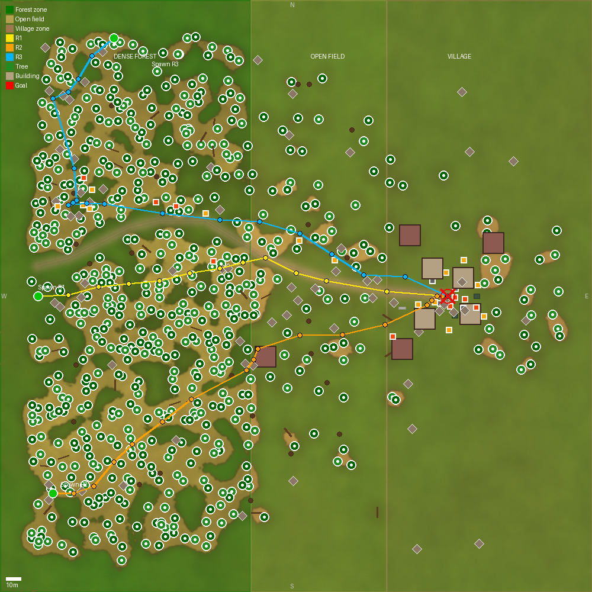
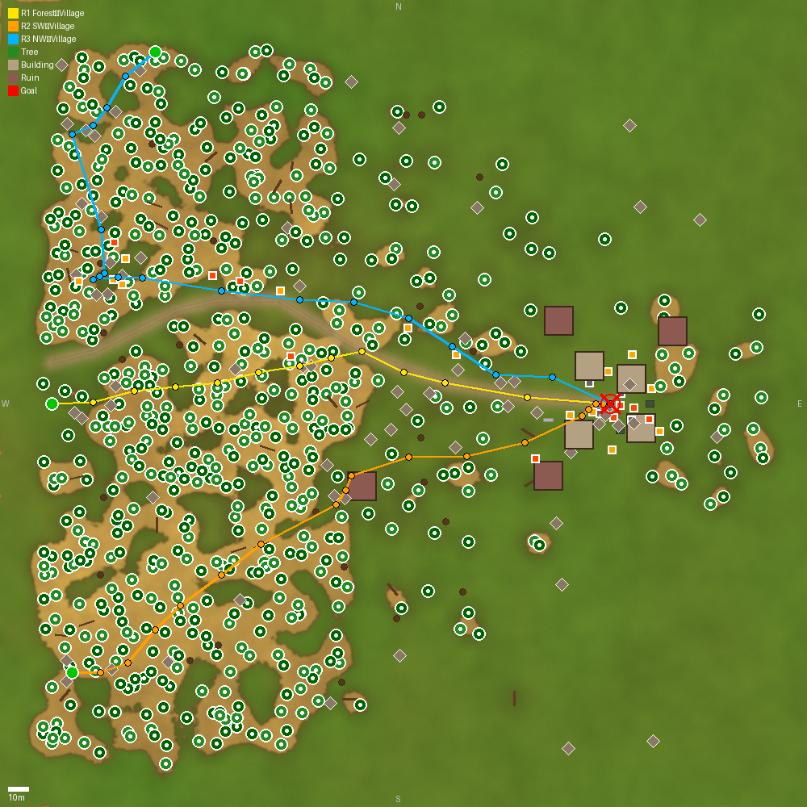

# Simulation Environment

Procedurally generated outdoor world for autonomous UGV navigation simulation.





## General Parameters

| Parameter | Value |
|-----------|-------|
| Terrain size | 220 x 150 m |
| Heightmap | 257 x 257 px, 16-bit grayscale PNG |
| Z range | 10 m |
| Physics engine | Bullet |
| Total models | 370 |
| Spawn point | (-105, -8) |
| Generator | `scripts/generate_world_v2.py` |
| Seed | 42 (deterministic) |

## Zones

The map is divided into three zones along the X axis:

```
 <-- West                                                      East -->
+------------------+-------------------+----------------------+
|  DENSE FOREST    |  OPEN FIELD       |  VILLAGE             |
|  x < -60         |  -60 < x < 40    |  x > 40              |
|                  |                   |                      |
|  Oaks, pines,    |  Sparse trees,    |  Buildings, barrels, |
|  fallen trees,   |  rocks            |  barriers            |
|  bushes          |                   |                      |
+------------------+-------------------+----------------------+
```

## Terrain Generation

### Heightmap

Terrain is generated procedurally using Fractal Brownian Motion (FBM):

1. **Base FBM** - 6 octaves of noise with persistence 0.5, lacunarity 2.0
2. **Domain warping** - coordinates are offset by additional noise (4 octaves, amplitude 15 px), producing natural bends and ridges
3. **Zone-based amplitude** - the forest zone uses full amplitude; the village zone is reduced (0.25-1.0)
4. **Road smoothing** - within a ROAD_WIDTH=5 m band along the road polyline, terrain is smoothed to a linear interpolation between endpoints with a 15 cm depression
5. **Footprint smoothing** - under each building, terrain is flattened within a radius of footprint/2 + 2 m

Parameters:
- Resolution: 220/256 = 0.86 m/pixel
- Format: 16-bit grayscale PNG (65536 height levels)
- Smoothstep interpolation: `f(t) = t^2 * (3 - 2t)`

### Terrain Mesh

Two separate meshes are used for rendering and collision:

**Visual mesh (OBJ)**:
- Resolution: 257 x 257 vertices (66049 vertices, 131072 triangles)
- UV coordinates for texturing
- Format: Wavefront OBJ + MTL
- Texture: `terrain_texture.png`

**Collision mesh (STL)**:
- Resolution: 65 x 65 vertices (downsampled with step 4)
- Gaussian smoothing (sigma=1.5) to eliminate micro-bumps
- Z-offset: +15 cm above the visual mesh to ensure reliable wheel contact
- Format: binary STL

### Texture

Procedural texture, 2048 x 2048 px:
- **Grass base** - FBM noise with 5 octaves, green tones
- **Rock blend** - on steep slopes (slope > 5%), gradually transitions to rock tones
- **Dirt road** - along the road polyline, width ROAD_WIDTH, brown tones

## Road System

A dirt road connects the western part of the map to the village. The road path is defined as a Bezier curve through a series of control points in the world frame.

- Width: 5 m
- Blend zone: 3 m (smooth transition between road and grass)
- Terrain along the road is smoothed and depressed by 15 cm

## Objects

All objects are static models sourced from Gazebo Fuel (OpenRobotics):

| Type | Count | Zone | Fuel Model |
|------|-------|------|------------|
| Oak trees | ~170 | Forest + transition + village | OpenRobotics/Oak tree |
| Pine trees | ~127 | Forest + transition + village | OpenRobotics/Pine Tree |
| Fallen trees | 40 | Forest | Pine Tree (pitch 1.5 rad) |
| Rocks | 23 | All zones | OpenRobotics/Falling Rock 1 |
| Buildings | 5 | Village | Lake House, Depot, Collapsed House |
| Barrels | ~10 | Village | OpenRobotics/Construction Barrel |
| Misc (cones, hydrants) | ~5 | Village | Various OpenRobotics models |

**Total: 370 models**

### Placement Rules

Each object is validated against:
1. **Minimum distance** - 2 m from any other object
2. **Road clearance** - ROAD_WIDTH/2 + 2 m from the road centerline
3. **Building clearance** - footprint/2 + 4 m from building centers
4. **Slope limit** - no more than 25 degrees
5. Up to 300 stochastic placement attempts per object

## Physics

- **Engine:** Bullet (more stable than ODE on uneven terrain)
- **Step size:** 4 ms (250 Hz)
- **Real-time factor:** 1.0
- **Collision mesh:** separate STL (65x65, smoothed, +15 cm offset)
- **Road friction:** mu=1.0, mu2=0.8

## Lighting

- **Sun** - directional light, warm tint (1.0, 0.97, 0.92), shadows enabled
- **Fill** - directional light from the opposite side, cool tint (0.25, 0.28, 0.35), no shadows

## Reproduction

```bash
cd /workspace/simulation

# Generate the world (heightmap, terrain meshes, texture, SDF)
python3 scripts/generate_world_v2.py --seed 42 --size 220 --max-height 10

# Render 2D map with routes
python3 scripts/render_map.py --output map_routes.png --size 1600
```

## File Structure

```
src/ugv_gazebo/worlds/
├── outdoor_terrain.sdf      # SDF world file (Bullet physics)
├── heightmap.png             # 257x257 16-bit grayscale
├── terrain.obj               # Visual mesh (257x257 vertices)
├── terrain.mtl               # Material file
├── terrain_texture.png       # 2048x2048 procedural texture
├── terrain_collision.stl     # Collision mesh (65x65, smoothed)
└── media/materials/textures/ # Additional textures (legacy)
    ├── grass_diffusespecular.png
    ├── grass_normal.png
    ├── dirt_diffusespecular.png
    ├── dirt_normal.png
    ├── rock_diffusespecular.png
    └── rock_normal.png
```

## See Also

- [Robot model](robot.md) - Husky A200 platform and sensors
- [Simulation launch](simulation.md) - how to build, launch, and operate the simulation
