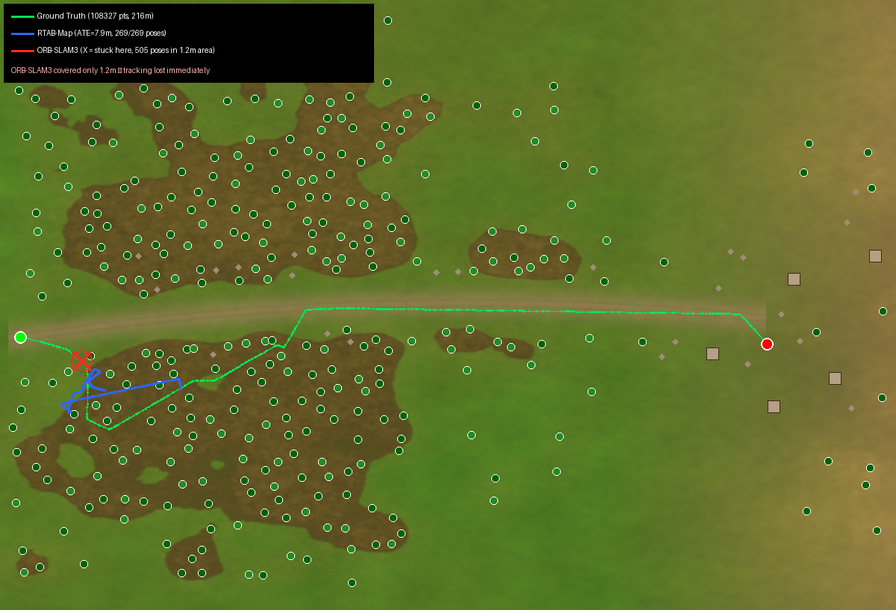

# SLAM Comparison Results - 220x150m World

## Experiment Setup

**Date:** 2026-03-27
**World:** 220x150m, 370 models (297 trees, 40 fallen, 23 rocks, 6 buildings)
**Route:** (-105, -8) -> (78, -10), curved dirt road through forest -> open field -> village
**Distance:** 216m (GT measured)
**Duration:** ~19 min manual drive (click-to-drive via web UI)
**Robot speed:** 0.9 m/s max

### Sensor Configuration
| Sensor | Resolution | Rate (requested) | Rate (actual) |
|--------|-----------|-----------------|---------------|
| RGB Camera | 640x480 | 30 Hz | ~17 Hz |
| Depth Camera | 640x480 | 30 Hz | ~17 Hz (synced) |
| IMU | - | 250 Hz | ~143 Hz |
| LiDAR | - | Disabled | - |
| Chase Camera | 160x90 | 2 Hz | ~0.6 Hz |

### Camera Intrinsics
- fx = fy = 382.0, cx = 320.0, cy = 240.0
- No distortion (simulated)
- Depth range: 0.4-10.0m

### Data Collected
| Data | Size/Count |
|------|------------|
| Rosbag (uncompressed) | 41 GB |
| RGB frames | 20,006 |
| Depth frames | 20,006 |
| IMU samples | 165,007 |
| GT trajectory | 108,327 points @ ~50Hz |
| RTAB-Map database | 240 MB |

## Results

### Trajectory Comparison



**Legend:**
- Green = Ground Truth (Gazebo dynamic_pose, <1cm accuracy)
- Blue = RTAB-Map (269 keyframes)
- Red X = ORB-SLAM3 (stuck - 505 poses covering only 1.2m)

### RTAB-Map

| Metric | Value |
|--------|-------|
| Algorithm | RTAB-Map 0.22.1 (rgbd_odometry + mapping) |
| Mode | Live (ran during drive, not replay) |
| Keyframes | 269 |
| ATE RMSE | 9.23m |
| ATE Mean | 7.91m |
| Scale factor | 0.277 |
| Coverage | Forest section (~40% of route) |
| Config | `publish_tf:=false`, `approx_sync:=true`, `approx_sync_max_interval:=0.5` |
| Database | `rtabmap.db` (240 MB) |

**What worked:**
- RTAB-Map built a trajectory through the dense forest where trees provide depth features
- 269 keyframes across ~80m of the route
- Visual odometry quality 660-690 features per frame in forest
- Database saved successfully with 3D map data

**What failed:**
- Tracking lost when exiting forest into open field
- Open terrain = flat green surface with no depth variation -> no features for visual odometry
- Scale drift: 0.277 means odom underestimates distances by ~3.6x (skid-steer wheel slip)
- Did not reach village

### ORB-SLAM3

| Metric | Value |
|--------|-------|
| Algorithm | ORB-SLAM3 RGB-D (no IMU - initialization failed) |
| Mode | Offline (extracted frames from rosbag) |
| Input frames | 2,751 (every 3rd from 8,251) |
| Tracked frames | 505 (18%) |
| Trajectory coverage | 1.2m x 0.5m (essentially stationary) |
| ATE | Not meaningful (trajectory too short for alignment) |
| Config | `nFeatures:1500, scaleFactor:1.2, nLevels:8, iniThFAST:20, minThFAST:7` |

**What worked:**
- ORB extractor found some features in first few frames (forest area)
- Initial map created with 30-196 map points

**What failed:**
- Constant tracking loss -> map reset (repeated cycle)
- "Fail to track local map!" - not enough feature matches between consecutive frames
- IMU initialization failed: "not enough acceleration" (robot moves slowly at 0.9 m/s)
- Less than 15 feature matches between frames in most areas
- Created 174+ separate maps, none with continuous trajectory

### Comparison Table

| | RTAB-Map | ORB-SLAM3 |
|---|---------|-----------|
| **Trajectory length** | ~80m (37% of route) | ~1.2m (0.6% of route) |
| **Keyframes/poses** | 269 | 505 (but no real progress) |
| **Tracking stability** | Stable in forest, lost in open | Never stable |
| **Features per frame** | 660-690 (dense depth) | 30-196 (sparse ORB) |
| **Handles low-texture** | Partially (depth helps) | No |
| **3D map output** | Yes (240MB .db) | No |
| **Real-time capable** | Yes (ran live) | Offline only |

## Analysis

### Why Both Struggle

1. **Gazebo ogre2 render limitations:**
   - Procedural terrain texture appears as uniform green/brown from camera distance
   - Mipmapping reduces texture detail at >5m range
   - Tree models are smooth green blobs without distinctive bark/leaf texture
   - Shadows are basic, no ambient occlusion

2. **Open field problem:**
   - Between forest (x≈-40) and village (x≈55) there are ~95m of open terrain
   - Flat grass surface = no depth variation for RTAB-Map visual odometry
   - No corners/edges for ORB feature extraction
   - Road is slightly different color but geometrically flat

3. **Camera limitations:**
   - 10-17 Hz effective rate (GPU bottleneck with 370 models)
   - At 0.9 m/s and 10Hz, robot moves 9cm between frames
   - Sufficient for tracking but leaves no margin for feature-poor areas

### Key Finding

**Visual SLAM in Gazebo simulation requires structured environments.** Both algorithms work in the forest where trees provide:
- Depth discontinuities (tree trunks at various distances)
- Visual features (tree canopy edges against sky)
- Geometric landmarks (trunk positions)

On open terrain, the simulation lacks the micro-texture detail that real-world grass/dirt provides for feature tracking.

### Recommendations for Improvement

1. **Add more objects on open field** - rocks, posts, fences every 5-10m along route
2. **Use photorealistic textures** - real grass photos instead of procedural
3. **Higher camera resolution/rate** - 1280x720 or reduce models for >20Hz
4. **Fuse with wheel odometry** - RTAB-Map can use odom as prior, reducing visual dependency
5. **Use LiDAR SLAM** instead - 2D LiDAR unaffected by texture quality

## Reproducibility

### Scripts (in `scripts/` directory)
1. `01_extract_frames.py` - Extract RGB/Depth/IMU from rosbag to TUM format
2. `02_fix_timestamps.py` - Clean null bytes, align timestamps, create sparse version
3. `03_run_orb_slam3.sh` - Run ORB-SLAM3 RGB-D offline
4. `04_compare_trajectories.py` - Compare single SLAM trajectory with GT
5. `05_run_rtabmap.sh` - Run RTAB-Map on rosbag replay (had TF issues)
6. `06_compare_all.py` - Compare both SLAM + GT, generate comparison plot

### Files
| File | Description |
|------|-------------|
| `gt_trajectory.csv` | Ground truth (108,327 points) |
| `rtabmap.db` | RTAB-Map database (240 MB, 269 keyframes) |
| `rtabmap_poses.txt` | RTAB-Map exported poses (TUM format) |
| `CameraTrajectory.txt` | ORB-SLAM3 output (505 poses) |
| `trajectory_comparison.png` | Visual comparison plot |
| `results.json` | Metrics in JSON format |
| `gazebo_d435i.yaml` | ORB-SLAM3 camera config |

### How to Reproduce

```bash
# 1. Launch simulation
ros2 launch ugv_gazebo full_sim.launch.py headless:=true

# 2. Start RTAB-Map (standalone, no TF conflict)
ros2 run rtabmap_slam rtabmap --ros-args \
  -p subscribe_depth:=true -p subscribe_rgb:=true \
  -p approx_sync:=true -p publish_tf:=false \
  -p frame_id:=base_link -p odom_frame_id:=odom \
  -p database_path:=/tmp/rtabmap.db \
  -r rgb/image:=/camera/color/image_raw \
  -r depth/image:=/camera/depth/image_rect_raw \
  -r rgb/camera_info:=/camera/camera_info \
  -r odom:=/odom

# 3. Record rosbag simultaneously
ros2 bag record -o bags/route_1_clean \
  --topics /camera/color/image_raw /camera/depth/image_rect_raw \
  /camera/camera_info /imu/data /odom /tf /clock

# 4. Drive robot via web UI (http://localhost:8765)

# 5. After drive: extract frames and run ORB-SLAM3
python3 scripts/01_extract_frames.py  # (while playing bag)
python3 scripts/02_fix_timestamps.py
bash scripts/03_run_orb_slam3.sh sparse

# 6. Compare all
python3 scripts/06_compare_all.py
```
