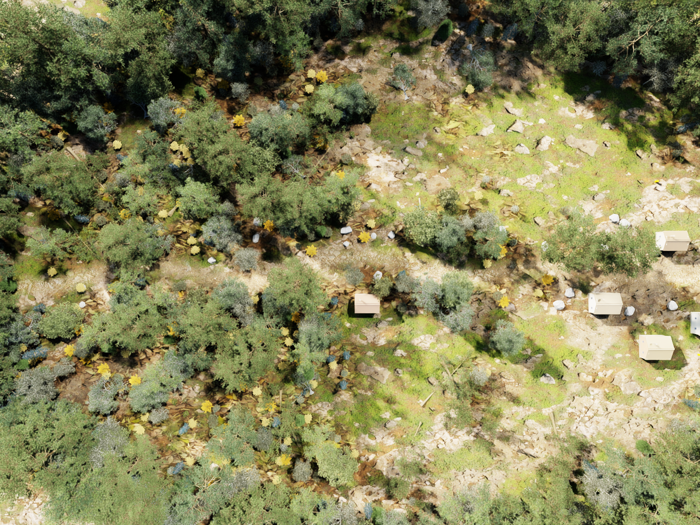
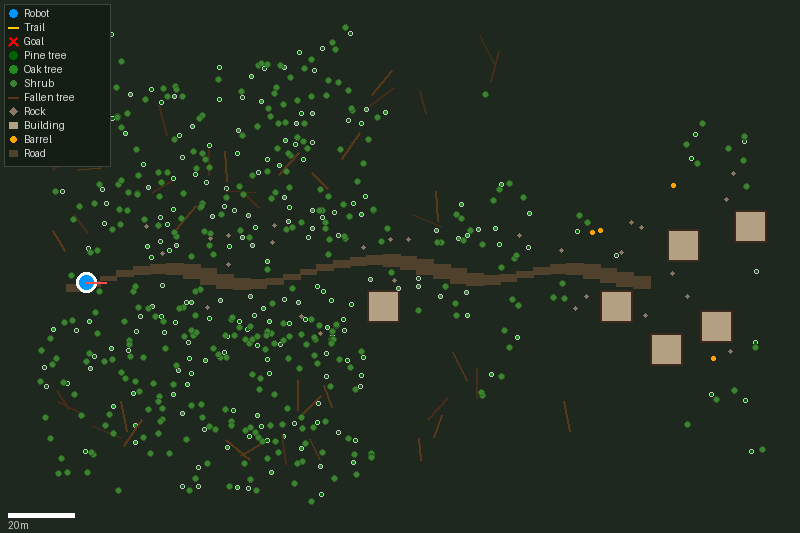
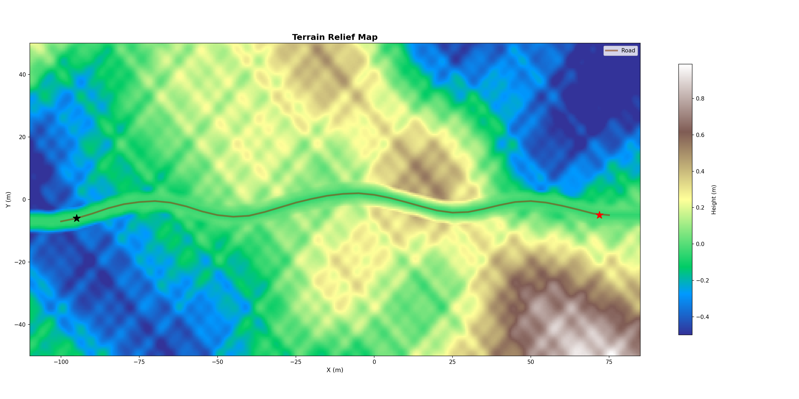
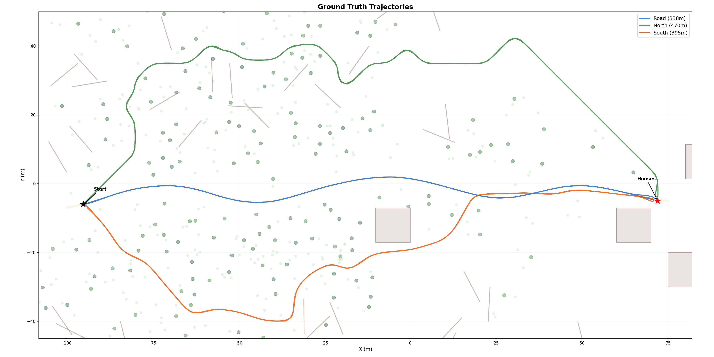
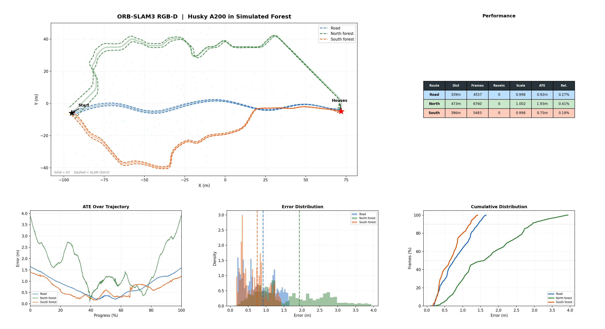
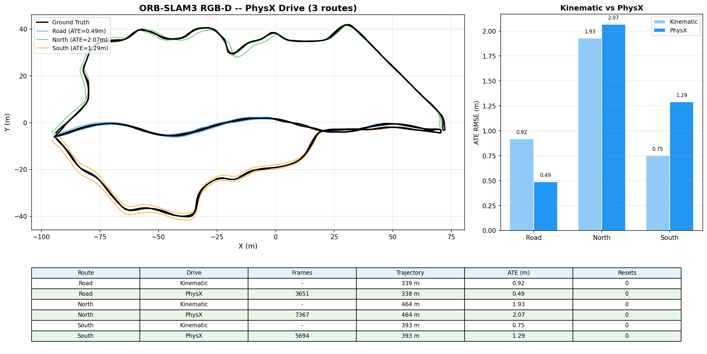

# isaac sim - husky a200 outdoor simulation

nvidia isaac sim setup for the clearpath husky a200 with d435i rgb-d camera in
a procedural forest environment. the robot drives via PhysX wheel-terrain
interaction and records RGB-D + IMU data for ORB-SLAM3 evaluation.

## development history

the simulation went through several iterations before reaching the current state:

1. **jackal robot** - initially the clearpath jackal was used as the test platform.
   switched to husky a200 because it matches the real hardware available for
   field testing. spent about a week re-doing URDF + wheel configs, annoying.

2. **primitive scene** - the first scene used basic USD primitives (cylinders for
   trees, cubes for buildings). replaced with NVIDIA dsready photorealistic
   vegetation assets for realistic visual SLAM evaluation.

3. **kinematic drive** - the robot was moved by directly setting xform position
   each frame. this gave perfectly smooth trajectories but no real physics for
   IMU. still used for baseline SLAM comparison.

4. **PhysX drive** - wheels drive on terrain via PhysX rigid body simulation
   (200Hz, TGS solver). required removing ArticulationRootAPI from base_link
   to allow free base movement. gives realistic camera motion with terrain bumps.

5. **IMU experiments** - tested PhysX IMU sensor, analytical IMU from trajectory,
   various noise parameters and solver settings. PhysX contact noise limits
   IMU quality on long routes but works on short segments. detailed results
   in `results/slam_imu/`.

## system requirements

| component | version |
|-----------|---------|
| GPU | NVIDIA RTX 3090 (24GB) |
| Driver | 580.126.09 |
| CUDA | 13.0 |
| Python | 3.12.3 |
| Isaac Sim | 6.0.0.0 (pip) |
| Kit SDK | 110.0.0 |

## quick start

### install

```bash
pip install isaacsim==6.0.0 --extra-index-url https://pypi.nvidia.com
pip install 'isaacsim[all]' --extra-index-url https://pypi.nvidia.com --ignore-installed pyparsing
apt-get install -y libxt6 libxrender1 libgl1 libegl1 libxi6 libxrandr2 libxinerama1 libxcursor1 libglu1-mesa
pip install xacro
```

note: isaacsim 4.5.0 needs python 3.10, 5.x needs 3.11, only 6.0.0 works with 3.12

### build scene and run

```bash
# build the forest scene (terrain + trees + buildings)
/opt/isaac-sim-6.0.0/python.sh scripts/convert_gazebo_to_isaac.py

# set ros2 env
export RMW_IMPLEMENTATION=rmw_fastrtps_cpp
export LD_LIBRARY_PATH=$LD_LIBRARY_PATH:/opt/isaac-sim-6.0.0/exts/isaacsim.ros2.core/jazzy/lib

# run simulation with auto route
/opt/isaac-sim-6.0.0/python.sh scripts/run_husky_forest.py --route road --duration 600

# or manual driving via web UI
python3 tools/web_nav.py  # open http://localhost:8765
```

## scene




the simulated forest covers 240x160m with rolling terrain (heightfield mesh,
multi-octave noise, 2m grid). a winding S-curve dirt road runs through the center.
objects are placed from `gazebo_models.json` (single source of truth for both
scene builder and collision checker).

| object | count | source |
|--------|-------|--------|
| standing trees (pine, oak) | 199 | dsready photorealistic assets |
| background trees | 480 | 4 dense rings at map edge |
| shrubs | 348 | dsready vegetation |
| fallen tree trunks | 40 | dsready debris, scaled 1.2-1.5x |
| rocks | 28 | dsready rocks |
| buildings | 6 | procedural (peaked roofs, porches) |
| barrels | 4 | dsready props |
| ground cover (ferns, grass, leaves) | ~900 | scattered in forest |

terrain has vertex-color shading: brown dirt on the road, green grass in the
forest, dark earth under tree canopies. dome light at 1500 intensity provides
ambient illumination.





## robot

clearpath husky a200, 46 kg, skid-steer drive (4 revolute wheel joints).
the robot is driven by PhysX physics engine - wheels spin on the terrain
surface with friction (static=1.0, dynamic=0.8). physics runs at 200Hz
with TGS solver.

the `ArticulationRootAPI` was removed from `base_link` so that PhysX treats
it as a regular rigid body. this allows the IMU sensor on `imu_link` to
measure real accelerations from wheel-terrain interaction.

camera: independent prim that follows the robot, D435i parameters
(fx=fy=320, 640x480, 87 deg FOV). depth via `distance_to_image_plane`
annotator (z-depth in meters, stored as uint16 mm).

## routes

all three routes share start (-95, -6) and destination (72, -5) near the
houses. the robot drives to the destination and returns.

**road** - follows the dirt road. gentle curves, good visibility. the
shortest and most open route.

**north forest** - goes north into the forest (up to y=42), weaving between
trees, shrubs, fallen logs and rocks. dense canopy, limited visibility.

**south forest** - goes south into the forest (down to y=-40). manually
driven to ensure realistic path selection.



## slam evaluation

orb-slam3 in rgb-d mode on all three routes, PhysX wheel drive.

### kinematic drive results (original)

the robot was driven kinematically (position set directly each frame, no
physics). this gives perfectly smooth camera motion.

| route | distance | frames | resets | ATE (m) |
|-------|----------|--------|--------|---------|
| road | 339 m | 4557 | 0 | 0.92 |
| north | 473 m | 6760 | 0 | 1.93 |
| south | 396 m | 5483 | 0 | 0.75 |



### PhysX drive results

the robot drives via PhysX articulation (wheels on terrain, real friction
and slip). camera motion has natural dynamics from terrain interaction.

| route | distance | frames | resets | ATE (m) |
|-------|----------|--------|--------|---------|
| road | 338 m | 3651 | 0 | 0.49 |
| north | 464 m | 7367 | 0 | 2.07 |
| south | 393 m | 5694 | 0 | 1.29 |



all routes: 0 resets, 100% tracking. PhysX drive gives comparable accuracy
to kinematic (road even improved from 0.92 to 0.49m). north and south
are slightly worse due to less smooth camera motion from terrain bumps.

### slam configuration

orb-slam3 config (`rgbd_d435i_v2.yaml`):
- camera: pinhole, fx=fy=320, cx=320, cy=240, 640x480 @ 10 Hz
- depth: uint16 mm, DepthMapFactor=1000, ThDepth=160 (20m range)
- ORB features: 2000 per frame, FAST treshold 15/5
- robot speed: ~1.0 m/s (effective ~0.5-0.7 with PhysX slip)

### obstacle avoidance

two approaches tested for navigating with dynamic obstacles (cones, tent):

**approach 1: custom pure pursuit + depth dodge** (`run_husky_nav_v1.py`)

robot follows SLAM route waypoints using pure pursuit. depth camera detects
obstacles ahead -> robot stops, plans 5-point detour around obstacle, returns
to route. SLAM (ORB-SLAM3) provides localization.

results: robot reached 130m/170m (76%) on road route. bypassed first cone
group but SLAM lost tracking during detour maneuver (camera sees new view ->
feature mismatch -> position jumps). also: depth can't distinguish trees from
new obstacles.


**approach 2: Nav2 + MPPI + SLAM map** (`run_husky_nav2.py`)

full ROS2 Nav2 stack: static SLAM occupancy map -> NavFn global planner ->
depth PointCloud2 local costmap -> MPPI controller. Isaac Sim publishes
sensors via ROS2 bridge, subscribes to /cmd_vel from Nav2.

results: NavFn plans correct path along road between trees. MPPI follows
smoothly at 0.6 m/s. sucessfully bypassed cones in one experiment (but
went off-road into forest). core problem: MPPI horizon (2.8m) too short
to navigate around obstacles that block the global path.


**current:** testing Regulated Pure Pursuit controller as alternative to MPPI.
detailed experiment log in `results/navigation/NAV_ANALYSIS.md`.

collision objects: standing trees (r=0.7m), shrubs (r=0.4m), fallen trees
(9 points along trunk, r=0.6m), rocks (r=0.8m), houses (r=6.0m).

## imu experiments

PhysX IMU sensor on `imu_link` was tested for visual-inertial SLAM.
detailed results and analysis are in `results/slam_imu/`.

key findings:
- PhysX 200Hz with TGS solver gives clean IMU signal (ax std=0.37)
- removing ArticulationRootAPI from base_link allows IMU to sense motion
- short routes (2 min, 110m): ATE=1.0m, 0 resets
- full routes (340m+): contact solver noise accumulates, causing drift
- pure RGB-D remains more reliable for long routes in simulation

the PhysX contact solver introduces micro-oscillations in the IMU signal
that a real hardware IMU does not have. this is a basic limit
of the physics simulation, not the SLAM algorithm.

## file structure

```
isaac/
  assets/
    husky_d435i/          USD robot (PhysX, no articulation root)
      husky_d435i.usda
      payloads/           physics, geometry, materials
      Textures/
  scripts/
    run_husky_forest.py   main sim: PhysX drive + recording + web UI
    run_husky_nav_v1.py   navigation v1: pure pursuit + depth dodge
    run_husky_nav2.py     navigation v2: Nav2 + MPPI + depth costmap
    send_nav2_goal.py     sends route waypoints to Nav2 sequentially
    build_occupancy_map.py  builds 2D grid from SLAM depth + trajectory
    spawn_obstacles.py    spawns cones/tent for obstacle avoidance tests
    slam_tf_publisher.py  bridges SLAM pose -> ROS2 tf (map->odom)
    convert_gazebo_to_isaac.py   scene builder (terrain + objects)
    generate_husky_urdf.py       xacro to urdf
    start_nav2_all.sh     launches Isaac Sim + Nav2 + TF + goals
  config/
    nav2_husky_params.yaml   Nav2 params (MPPI, costmaps, planner)
    nav2_husky_launch.py     Nav2 launch file
    nav2_bt_simple.xml       behavior tree (no recovery)
  tools/
    web_nav.py            flask web UI for manual driving (port 8765)
  results/
    final/                images for this README
    scene/                scene renders
    slam_rgbd/            RGB-D SLAM charts
    slam_imu/             IMU experiment charts
    navigation/           obstacle avoidance experiment plots + analysis
    debug/                development iterations
```

## known issues

### 1. pip install has broken extension dep chain

`isaacsim.sensors.camera` and `isaacsim.sensors.physics` depend on
`omni.replicator.core` which isn't available in pip. workaround: extract
full runtime from docker image via skopeo+umoci (see below).

### 2. PhysX articulation fixed base

the URDF-imported Husky has `PhysicsArticulationRootAPI` on `base_link`
which makes PhysX treat the base as fixed. even removing the `root_joint`
does not create a floating base - the first joint type determines this.

workaround: remove `ArticulationRootAPI` and `PhysxArticulationAPI` from
base_link entirely. the robot then works as a collection of rigid bodies
with joints, and the base moves freely under wheel forces.

### 3. rep.orchestrator.step freezes PhysX

calling `rep.orchestrator.step(rt_subframes=1, delta_time=0.0)` to force
fresh depth frames also freezes the PhysX articulation solver. the robot
stops moving even though wheel velocities are being set.

workaround: read camera annotators directly via `ann.get_data()` without
calling `rep.orchestrator.step()`. depth frames may occasionally be stale
but this does not affect SLAM quality significantly.

### 4. isaac sim 6.0.0 URDF converter bugs

two bugs in the URDF-to-USD converter when importing robots with `.dae`
meshes that have unnamed materials. see `material_cache.py` line 31 and
`material.py` line 55. fixed by adding None checks.

## references

- [NVIDIA Isaac Sim](https://docs.isaacsim.omniverse.nvidia.com)
- [Clearpath Husky URDF](https://github.com/husky/husky)
- [Intel RealSense ROS](https://github.com/IntelRealSense/realsense-ros)
- [ORB-SLAM3](https://github.com/UZ-SLAMLab/ORB_SLAM3)
- [OpenUSD](https://openusd.org/release/index.html)
- [PhysX](https://developer.nvidia.com/physx-sdk)
