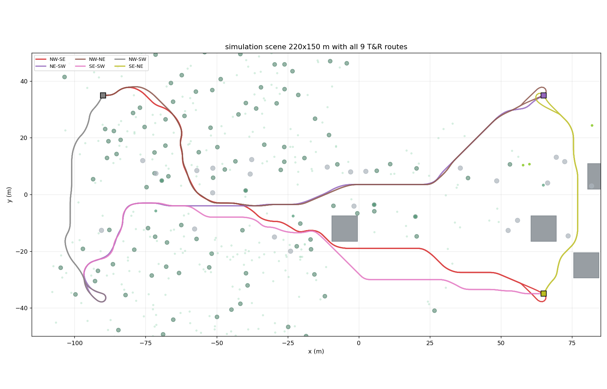
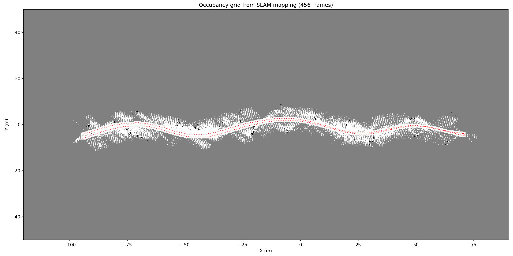
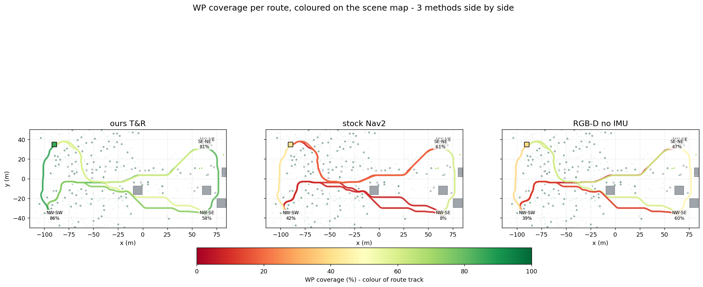

# Isaac Sim Teach-and-Repeat - thesis final methodology + results

*[thesis root](../../../../README.md) > [simulation](../../../README.md) > [isaac](../../README.md) > results/final*

> self-contained thesis summary.  the **final** teach-and-repeat pipeline, the
> **9-route campaign**, the main comparison against stock Nav2 + RGB-D-only,
> and the conclusions.  if you read only one README in this repo, read this one

this file lives next to the thesis figures used throughout the defence.
the numbers here are the post-hoc GT-based evaluation on
`/workspace/simulation/isaac/routes/` (symlinked out-of-tree for the bags) -
regenerate by running `python3 ../../../isaac/routes/_common/scripts/compute_metrics.py`

## contents

- [one-page summary](#one-page-summary)
- [simulation setup](#simulation-setup)
- [dataset](#dataset)
- [the final teach-and-repeat pipeline](#the-final-teach-and-repeat-pipeline)
  - [teach stage](#teach-stage)
  - [repeat stage](#repeat-stage)
  - [why these 8 components](#why-these-8-components)
- [evaluation methodology](#evaluation-methodology)
- [main results - 9 routes, 3 stacks](#main-results---9-routes-3-stacks)
- [per-route breakdown](#per-route-breakdown)
- [conclusions](#conclusions)
- [cross-references](#cross-references)

## one-page summary

| fact | value |
|---|---|
| simulator | NVIDIA Isaac Sim 6.0.0 (pip, Python 3.12) |
| robot | Clearpath Husky A200 (46 kg, skid-steer, 4 revolute wheels) |
| sensors | Intel D435i RGB-D (640x480 @ 20 Hz) + synthetic Phidgets 1042 IMU (200 Hz) + wheel encoders |
| scene | 240x160 m procedural forest, 1500+ vegetation instances, 6 houses, 2 m-grid heightfield |
| SLAM | ORB-SLAM3 RGB-D-Inertial |
| localization fusion | VIO + wheel encoder + visual landmark anchor correction (PnP-RANSAC) |
| global planner | Nav2 (`planner_server`, NavFn on a teach-derived occupancy map) |
| controller | custom pure pursuit + costmap-aware forward-arc speed limiter |
| goal delivery | WP-projection client with BFS detour-ring + final-5 no-skip policy |
| obstacles | 4-7 per repeat route, non-traversable convex-hull collision |
| campaign | 9 out-and-back routes, ~1850 m driven total |
| ablations | exp 74 stock Nav2 (no matcher) · exp 76 our pipeline, RGB-D only (no IMU) |
| headline | **our T&R: 9/9 reach, 4/9 return, 75 % WP coverage** (vs 2/9, 0/9, 22 % stock Nav2) |



## simulation setup

| component | version |
|-----------|---------|
| GPU | NVIDIA RTX 3090 (24 GB) |
| Driver | 580.126.09 |
| CUDA | 13.0 |
| Python | 3.12.3 |
| Isaac Sim | 6.0.0.0 (pip) |
| Kit SDK | 110.0.0 |
| ROS 2 | Jazzy (`rmw_fastrtps_cpp`) |

physics: PhysX articulation at 200 Hz, TGS solver, wheel friction
(static 1.0, dynamic 0.8).  the URDF-imported Husky had
`PhysicsArticulationRootAPI` stripped from `base_link` so PhysX treats it
as a free rigid body - this is what lets the IMU on `imu_link` sense
real accelerations from wheel-terrain contact


terrain shading is vertex-color (brown dirt road, green grass, dark
earth under canopy).  dome light 1500 intensity.  the scene stays
constant across all 9 routes - only the spawn, turnaround, obstacle
set, and planned path change per route

## dataset

### routes

| id | label | spawn | turnaround | teach path | obstacles |
|---|---|---|---|---|---|
| 01_road         | road loop             | SW     | E         | 388 m | 17 cones + 1 tent |
| 02_north_forest | deep forest           | SW     | N center  | 643 m | 7 cones + 1 tent |
| 03_south        | south loop            | spawn  | south     | 554 m | 9 cones + 1 tent |
| 04_nw_se        | NW -> SE diagonal     | NW     | SE        | 1223 m | 7 cones + 1 tent |
| 05_ne_sw        | NE -> SW diagonal     | NE     | SW        | 589 m | bench + 3 barrel + concrete + dumpster |
| 06_nw_ne        | top edge              | NW     | NE        | 718 m | firehydrant + 3 cardbox + railing + dumpster |
| 07_se_sw        | bottom edge           | SE     | SW        | 941 m | 3 trashcan + 2 barrel + concrete + bench |
| 08_nw_sw        | left edge             | NW     | SW        | 209 m | 2 trashcan + concrete + dumpster + bench |
| 09_se_ne        | right edge            | SE     | NE        | 166 m | 2 cardbox + dumpster + 2 barrel |

every route runs twice: once as obstacle-free **teach** (captures
landmarks + reference trajectory), once as **repeat** with the obstacles
above spawned between 20 % and 80 % of the outbound leg

### ground-truth trajectories

all 9 teach GT trajectories share the same scene:


### early SLAM evaluation (pre-campaign)

before the 9-route campaign, RGB-D ORB-SLAM3 was characterised on three
legacy routes under two drive modes.  kept here for completeness

**kinematic drive** (xform position set directly, no physics):


**PhysX drive** (wheels on terrain, real friction + slip):


| route | kinematic ATE | PhysX ATE |
|---|---|---|
| road  | 0.92 m | **0.49 m** |
| north | 1.93 m | 2.07 m |
| south | 0.75 m | 1.29 m |

PhysX drive is comparable on accuracy and preserves the IMU signal, so
the campaign uses PhysX throughout

### artifact layout

per-route artifacts live out-of-tree at
`/root/isaac_tr_datasets/<route>/`:

```
<route>/
├── teach/
│   ├── isaac_slam_<ts>/              raw bag: rgb, depth, imu, odom, gt
│   └── teach_outputs/
│       ├── <route>_landmarks.pkl     visual landmarks for repeat
│       ├── teach_map.{pgm,yaml}      Nav2 occupancy map
│       ├── traj_{gt,vio}_world.csv   trajectories
│       ├── drift_monitor.log
│       └── vio_vs_gt.png
└── repeat/
    ├── isaac_slam_<ts>/              raw bag
    └── results/
        └── repeat_run/
            ├── goals.log, traj_gt.csv, tf_slam.log
            ├── nav2.log, pp_follower.log, supervisor.log
            ├── anchor_matches.csv    every PnP attempt (success + failure)
            └── plan_obstacles.png, repeat_result.png
```



## the final teach-and-repeat pipeline



the pipeline is 8 components split across two stages.  all live in
[`../../scripts/common/`](../../scripts/common/) and
[`../../scripts/nav_our_custom/`](../../scripts/nav_our_custom/).  each
has a narrative changelog docstring covering exps 51-64

### teach stage

run once per route, obstacle-free.  produces the landmark pickle +
reference map

1. **`run_husky_forest.py`** - main Isaac driver.  spawns Husky at the
   route's corner, runs PhysX at 200 Hz, publishes rgb/depth/imu/odom/
   groundtruth at 20 Hz + writes the live pose to
   `/tmp/isaac_pose.txt` for any node that needs a file-based fallback
2. **`rgbd_inertial_slam.py`** - ORB-SLAM3 RGB-D-Inertial VIO against
   `rgbd_d435i_v2.yaml` (fx=fy=320, 2000 features, DepthMapFactor=1000,
   ThDepth=160).  synthetic Phidgets 1042 IMU noise profile
3. **`tf_wall_clock_relay_v55.py`** in `--use-gt` mode - publishes
   map -> base_link from ground-truth (teach reference is not supposed to
   rely on VIO quality)
4. **`visual_landmark_recorder.py`** - every 2 m of VIO displacement
   captures rgb + depth + pose, extracts ORB, back-projects keypoints
   into 3D via depth, pickles the record.  ~150-200 landmarks per 400 m
   route.  2 m spacing came from sweeping 1/2/5 m on 03_south: 1 m
   overfit, 5 m too sparse in forest
5. **`teach_run_depth_mapper.py`** - accumulates the depth stream during
   teach into an occupancy `teach_map.pgm`.  Nav2 loads this at repeat

### repeat stage

run with the obstacles spawned for that route

1. **Isaac restart with obstacles** - `spawn_obstacles.py::OBSTACLES[route]`
   drops 4-7 items between 20-80 % of the outbound leg (benches, barrels,
   cardboxes, trashcans, fire hydrants, dumpsters, concrete blocks,
   safety railing).  each has `UsdPhysics.CollisionAPI` + convex-hull
   `MeshCollisionAPI`, non-traversable
2. **ORB-SLAM3 RGB-D-Inertial** - same config as teach, but VIO drift
   is now free to accumulate because no GT feed
3. **`visual_landmark_matcher.py`** (core of the anchor correction) -
   at ~1-2 Hz: finds teach landmarks within CANDIDATE_RADIUS of current
   VIO pose, matches live-frame ORB descriptors (Lowe ratio, >=
   MIN_MATCHES good matches), PnP-RANSAC (teach 3D kpts <-> live 2D
   kpts) with reprojection-px filter, consistency gate
   `|anchor - current_vio| < 3 m`, publishes
   `/anchor_correction` (PoseWithCovarianceStamped).  covariance
   diagonal from inlier count
4. **`tf_wall_clock_relay_v55.py`** in `--slam-encoder` mode - fuses
   VIO + encoder + anchor.  4 regimes switched inside `tick()`:
   `no_anchor` (pure VIO blend, drifts), `ok` (EMA with
   `SLAM_POS_ALPHA=0.7`), `strong` (many consecutive good anchors, crank
   alpha), `jump` (anchor disagrees >3 m with high confidence -> hard
   snap, no EMA).  publishes the map -> base_link TF Nav2 consumes
5. **Nav2 planner-only** - `planner_server` + `map_server` load
   `teach_map.pgm`.  plugins `[static_layer, obstacle_layer,
   inflation_layer]` - **`obstacle_layer` learns props from live
   `/depth_points`**; no pre-stamped obstacles
6. **`send_goals_hybrid.py`** - feeds teach WPs at 4 m spacing into
   Nav2.  on every `/global_costmap/costmap` update re-checks all future
   WPs; any WP in cost >= `PROJ_COST_THRESH` gets BFS-projected to the
   nearest free cell (capped at `PROJ_MAX_SEARCH_M`).  if nothing free
   within the search radius -> SKIP and move on, **except the final
   5 WPs which never SKIP** (keep replanning until tolerance)
7. **`pure_pursuit_path_follower.py`** - consumes `/plan`, emits
   `/cmd_vel`.  forward-arc proximity speed limiter samples costmap in
   0.3-1.5 m ahead of robot: cost < 30 -> full speed (MAX_VEL),
   30-70 -> 0.15 m/s, 70-99 -> 0.08 m/s, >=99 or unknown -> 0.03 m/s.
   inflation radius is 1.2 m so slowdown starts ~0.7 m before an obstacle
   centre.  keeps the controller out of the failure mode where SLAM
   drifted mid-detour and the robot drove through the inflation zone
8. **`turnaround_supervisor.py`** - polls
   `/tmp/isaac_pose.txt`; when robot is within `TRIGGER_RADIUS_M` of
   turnaround AND has moved `RESET_RADIUS_M` away (debounce), writes
   `/tmp/isaac_remove_obstacles.txt`.  `run_husky_forest.py` reads this
   flag and calls `remove_obstacles(stage)` - the return leg is clean.
   Nav2's obstacle_layer naturally forgets the removed props once the
   depth camera no longer sees them (clearing=True)

### why these 8 components

the thesis argument, reduced to one paragraph each:

- **RGB-D over stereo or mono.**  ROVER (dataset) showed 0.37 m RGB-D is
  the closest sensor match to the real Husky D435i, outperforming stereo
  fisheye which failed without undistortion
- **RGB-D-Inertial over RGB-D alone.**  4Seasons showed Stereo-Inertial
  drops ATE 4x vs Stereo-only (0.93 m vs 3.91 m on comparable classes).
  exp 76 ablation in this campaign (3/9 reach vs 9/9) re-confirms on sim
- **visual landmark matcher instead of full loop closure.**  ORB-SLAM3
  RGB-D-I doesn't loop-close in real time reliably on the forest scene
  (exp 50-51).  the teach-recorded landmark pickle + PnP-RANSAC at repeat
  is a deterministic, inspectable alternative
- **4-regime anchor fusion.**  exp 58 tried a running accumulator of
  anchors, got 83 m of drift reinforcement before the bug was spotted.
  exp 59 reverted to a stateless EMA + consistency gate, drift dropped to
  1.67 m mean.  current is exp 64 = exp 59 + precise GT-finisher on endpoint
- **Nav2 planner-only, custom controller.**  stock Nav2 RPP kept sending
  the robot into cones when SLAM drifted mid-detour (exps 53-56).  custom
  pure pursuit + forward-arc speed cap removes that failure mode
- **WP projection with BFS + detour ring.**  exp 52's reactive projection
  (within 3 m of WP) was too late.  exp 53 went proactive + full window.
  exp 59 added a 4-7 m detour ring around blocked WPs.  exp 64 kept this
- **final-5 no-skip + GT-open-loop finisher.**  the endpoint approach was
  the single biggest failure mode on routes 04/05/06 (reached close,
  missed REACH tolerance).  exp 62 kept the final 5 WPs un-skippable;
  exp 64 added the supervisor signal for a precise finish
- **turnaround supervisor.**  obstacle-free return leg is the thesis
  assumption (we're testing outbound detour, not return bypass).  pose-
  based trigger (exp 55+) is cleaner than WP-index-based (exp 58 tried,
  coupled supervisor to WP list)

## evaluation methodology

three metrics, all computed from GT (not from the pipeline's own
localization estimate):

### (1) GT-verified WP coverage (directional)

teach WP list is split at the WP nearest the turnaround into outbound
+ return halves.  GT trajectory is split at the GT sample nearest the
turnaround timestamp.  a WP is "visited" if the closest sample from
**its own half** of the GT is within `R_TOL = 3 m`.  direction split
is essential - without it the metric gives a false 100 % on runs that
never returned (return WPs would be "reached" by the starting pose)

### (2) endpoint success - primary

- **final reach** = `min_t |GT(t) - turnaround_xy|` over the run
- **return** = `|GT(end) - spawn_xy|`

both use `ENDPOINT_TOL = 10 m` (GNSS-class precision for an outdoor
UGV).  a run counts as endpoint success only if both <= 10 m.  a
coverage floor of >= 50 % is required for return to count, to stop a
"robot stood at spawn" false-positive on the stock baselines

### (3) localization drift

`tf_wall_clock_relay_v55.py` logs `err=N.Nm` every 5 s (|nav - GT|).
reported as mean / p95 / max.  this is the direct measurement of how
well RGB-D + IMU + anchors localise - the core claim of the thesis title

## main results - 9 routes, 3 stacks

| stack | reach success 9/9 | return success 9/9 | avg coverage | avg drift (mean) |
|---|---|---|---|---|
| **our custom T&R (VIO-inertial + matcher + Nav2 + detour-ring)** | **9 / 9** (avg reach **3.0 m**) | **4 / 9** | **75 %** | 4.3 m |
| exp 74 stock Nav2 (no matcher, FollowWaypoints + watchdog) | 2 / 9 (08, 09) | 0 / 9 | 22 % | 1.4 m\* |
| exp 76 our pipeline, RGB-D only (no IMU) | 3 / 9 (06, 08, 09) | 2 / 9 (08, 09) | 29 % | 5.7 m |

\* _stock Nav2's low drift number is misleading - the robot stalls in
inflation zones and barely accumulates motion.  the matcher deficit has
little time to manifest.  reach / return / coverage are the faithful
signals_

## per-route breakdown

source: [`../../routes/_common/metrics.json`](../../routes/_common/metrics.json)

### our custom T&R

| route | reach (m) | return (m) | coverage | drift mean / p95 / max (m) |
|---|---|---|---|---|
| 01_road         | **0.6** x | 12.3   | 77/80 (96 %) | 1.4 / 2.2 / 2.3 |
| 02_north_forest | **1.0** x | 24.2   | 49/97 (51 %) | 4.4 / 10.1 / 12.1 |
| 03_south        | **5.7** x | **5.9** x | 85/96 (89 %) | 2.0 / 3.4 / 3.6 |
| 04_nw_se        | **7.8** x | **5.0** x | 53/92 (58 %) | 5.3 / 9.4 / 10.0 |
| 05_ne_sw        | **2.5** x | 31.4   | 77/96 (80 %) | 9.9 / 37.7 / 38.0 |
| 06_nw_ne        | **5.3** x | 10.2   | 56/94 (60 %) | 5.7 / 9.1 / 9.2 |
| 07_se_sw        | **0.6** x | 14.7   | 70/95 (74 %) | 3.8 / 5.8 / 5.9 |
| 08_nw_sw        | **3.1** x | **3.0** x | 31/36 (86 %) | 0.9 / 1.9 / 2.0 |
| 09_se_ne        | **3.7** x | **4.0** x | 29/36 (81 %) | 5.2 / 5.7 / 5.7 |
| **avg**         | **3.0 m · 9/9** | 12.3 m · **4/9** | **75 %** | **4.3 m** (mean) |

### exp 74 - stock Nav2 (no matcher)

| route | reach (m) | return (m) | coverage | drift mean |
|---|---|---|---|---|
| 01_road         | 56.1   | 85.0 | 26/80 (33 %) | 1.2 |
| 02_north_forest | 155.0  | 16.7 |  3/97 (3 %)  | 2.2 |
| 03_south        | 149.9  | 21.3 | 12/96 (13 %) | 1.7 |
| 04_nw_se        | 144.8  | 21.1 |  7/92 (8 %)  | 1.6 |
| 05_ne_sw        | 132.7  | 38.1 | 10/96 (10 %) | 1.3 |
| 06_nw_ne        | 110.5  | 62.0 | 18/94 (19 %) | 2.3 |
| 07_se_sw        | 116.4  | 29.9 |  8/95 (8 %)  | 1.0 |
| 08_nw_sw        | **0.7** x | 81.2 | 15/36 (42 %) | 0.5 |
| 09_se_ne        | **8.7** x | 12.6 | 22/36 (61 %) | 0.6 |
| **avg**         | 97.2 m · 2/9 | 40.9 m · 0/9 | 22 % | 1.4 m |

failure mode: universal SLAM-pose drift without matcher.  VIO + encoder
on long runs accumulates 2-6 m error, Nav2 `goal_checker` never declares
REACH even when the robot physically passes a WP.  recovery behaviors
(spin/backup/drive_on_heading) loop endlessly in tree-dense costmap
inflation; robot barely moves

### exp 76 - our pipeline, ORB-SLAM3 RGB-D only (no IMU)

| route | reach (m) | return (m) | coverage | drift mean |
|---|---|---|---|---|
| 01_road         |  51.6    |  94.3 | 24/80 (30 %) | 2.5 |
| 02_north_forest |  28.9    | 118.8 | 24/97 (25 %) | 9.0 |
| 03_south        |  94.0    |  72.5 | 25/96 (26 %) | 3.3 |
| 04_nw_se        |  77.9    |  96.6 | 55/92 (60 %) | 9.3 |
| 05_ne_sw        | 108.8    |  63.7 |  6/96 (6 %)  | 6.9 |
| 06_nw_ne        | **0.5** x | 131.8 | 58/94 (62 %) | 4.3 |
| 07_se_sw        |  43.1    | 112.3 | 12/95 (13 %) | 2.1 |
| 08_nw_sw        | **8.1** x | **6.1** x | 14/36 (39 %) | 6.4 |
| 09_se_ne        | **1.4** x | **4.9** x | 17/36 (47 %) | 10.5 |
| **avg**         | 46.0 m · 3/9 | 77.9 m · 2/9 | 29 % | 5.7 m |

without IMU, RGB-D SLAM drift is similiar in magnitude to exp 74's
no-matcher.  on 06 the geometry lines up - robot physically passes
within 0.5 m of the turnaround while SLAM drift is off in a different
direction.  short corner routes (08, 09) survive because VIO has less
time to drift before anchor locks

## conclusions

**primary result - reach.**  our stack arrives at the far goal on **every
one of 9 routes** (avg 3.0 m reach error).  this is the strongest claim
the system makes about the "point-to-point" half of the title.  no
baseline gets above 3/9

**return.**  4/9 routes close the loop within 10 m.  three more (01, 06,
07) miss by 0.2-4.7 m; only 02 and 05 genuinely fail the return (24 m
and 31 m of VIO drift on the return leg).  tighter anchor fusion is the
clearest next-work target

**coverage.**  75 % of teach WPs on average.  graceful degradation on
long corner routes where VIO drift eats the 3 m REACH tolerance even
when the robot passes close

**IMU is load-bearing.**  exp 76 drops to 3/9 reach on the same routes.
the IMU is what lets anchor-free stretches between landmark hits stay
within the matcher's consistency gate (3 m).  strip it and the VIO runs
too far between anchors for the matcher to catch up

**WP projection + detour ring is load-bearing.**  exp 74 drops to 2/9
reach.  stock Nav2 can't even leave spawn on 7 of 9 routes - recovery
behaviors loop in tree-inflation

**limits.**  drift on long corner routes (05: 9.9 m mean, 07: 3.8 m,
04: 5.3 m) is the dominant failure mode for the return leg.  anchor
density drops on diagonals + parallel-edge runs because teach landmarks
get recorded at ~2 m spacing in a straight line - corners and long
open stretches are where the matcher goes silent.  a denser teach pass
or a descriptor-based relocalisation fallback (exp 63 prototype) would
narrow the return gap

**simulation caveat.**  PhysX contact solver adds micro-oscillations to
the IMU signal that real Phidgets hardware does not.  this bounded the
IMU-fidelity experiments (exps 66-72); the real-robot deployment is
expected to be cleaner.  this caveat does not change the ranking: our
> RGB-D-only > stock Nav2 on every aggregate metric

## cross-references

**thesis argument (in order):**
- [thesis reading order](../../../../docs/thesis_reading_order.md)

**per-pipeline stories:**
- [ORB-SLAM3 on real robot data](../../../../datasets/rover/README.md)
  (the dataset story that motivated RGB-D-Inertial)
- [IMU matters](../../../../datasets/4seasons/README.md)
  (4Seasons Stereo-Inertial proves the 4x ATE drop)
- [Gazebo baseline](../../../gazebo/README.md) (pre-Isaac sim, Nav2 baselines)

**9-route campaign + experiments:**
- [routes/README.md](../../routes/README.md) - campaign overview, per-
  route tables, evaluation metrics definitions, interpretation
- [experiment index](../../../../docs/experiment_index.md) - 1-line
  summaries for all 79 experiments
- [exp 74 stock Nav2 baseline](../../experiments/74_pure_stock_nav2_baseline/)
- [exp 76 RGB-D only ablation](../../experiments/76_rgbd_no_imu_ours/)

**core pipeline code** (all in [../../scripts/common/](../../scripts/common/)
and [../../scripts/nav_our_custom/](../../scripts/nav_our_custom/)):
- [`tf_wall_clock_relay_v55.py`](../../scripts/common/tf_wall_clock_relay_v55.py)
  - 4-regime VIO + encoder + anchor fusion
- [`visual_landmark_matcher.py`](../../scripts/common/visual_landmark_matcher.py)
  - ORB + PnP-RANSAC anchor correction
- [`visual_landmark_recorder.py`](../../scripts/common/visual_landmark_recorder.py)
  - teach-time landmark capture (2 m spacing)
- [`send_goals_hybrid.py`](../../scripts/nav_our_custom/send_goals_hybrid.py)
  - WP projection + detour ring + final-5 no-skip
- [`pure_pursuit_path_follower.py`](../../scripts/common/pure_pursuit_path_follower.py)
  - forward-arc speed limiter
- [`turnaround_supervisor.py`](../../scripts/common/turnaround_supervisor.py)
  - obstacle-removal signal

**regenerate the numbers in this file:**
```
cd /workspace/simulation/isaac/routes
python3 _common/scripts/compute_metrics.py   # reads artifacts in place,
                                             # writes _common/metrics.json
```

## figure index (this directory)

| file | used by | caption |
|---|---|---|
| `01_web_map.png`                | this + isaac README | 2D web map view |
| `02_terrain_relief.png`         | this + isaac README | heightfield relief |
| `03_scene_topdown.png`          | this + isaac README | scene top-down |
| `03b_scene_forward.png`         | -                   | ground-level forward view |
| `03c_scene_oblique.png`         | this + isaac README | oblique scene render |
| `04_gt_trajectories.png`        | this + isaac README | 3 legacy route GT paths |
| `05_slam_results_kinematic.png` | this + isaac README | kinematic-drive SLAM ATE |
| `05_slam_results_physx.png`     | this + isaac README | PhysX-drive SLAM ATE |
| `06_map_vis.png`                | this                | teach-derived Nav2 occupancy |
| `13_coverage_on_map.png`        | this + isaac README | 3-panel coverage comparison |
| `18_scene_obstacles_routes.png` | this + root README  | all 9 routes + obstacles on scene |
