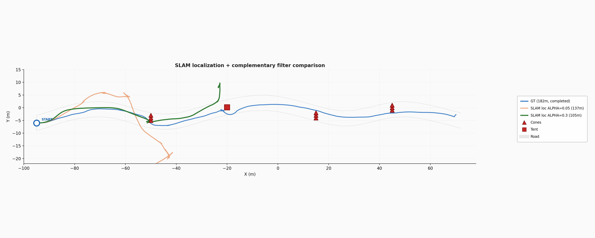
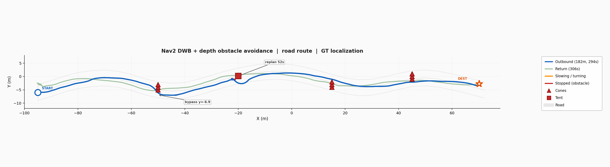
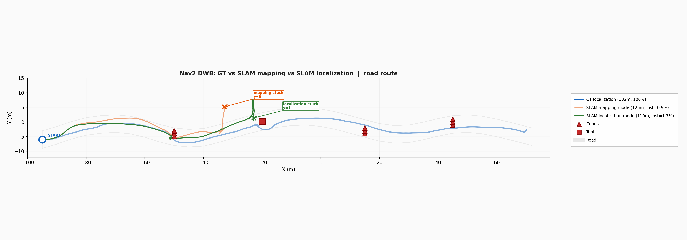

# nav2 DWB navigation experiment (2026-04-08)

## goal

navigate husky along SLAM-mapped road route using Nav2 stack with
obstacle avoidance. two-phase: outbound with obstacles, return without.

## architecture

```
Isaac Sim (PhysX wheels)
  ├── cameras: /camera/color, /camera/depth (sim_time headers)
  ├── cmd_vel subscriber
  └── pose -> /tmp/isaac_pose.txt (20 Hz)

tf_wall_clock_relay.py (reads pose file)
  ├── /tf: map->odom, odom->world, world->base_link (wall clock)
  ├── /tf_static: base_link->camera_link
  ├── /odom (wall clock)
  ├── /camera/depth/image_wall (re-stamped depth)
  └── /camera/depth/camera_info_wall (re-stamped)

Nav2 (use_sim_time=false)
  ├── map_server: static SLAM occupancy map (trees/buildings)
  ├── planner_server: NavFn (A* on static map)
  ├── controller_server: DWB (sim_time=1.5s, 0.8 m/s max)
  ├── behavior_server: backup + wait (no spin)
  ├── depth_image_proc: /image_wall -> /depth_points (PointCloud2)
  └── local_costmap: depth obstacle layer (5m range)

send_nav2_goal.py
  ├── phase 1: outbound waypoints -> destination (72, -5)
  ├── signal obstacle removal via /tmp/nav2_phase.json
  └── phase 2: return waypoints -> start (-95, -6)
```

## key problem solved: sim_time vs wall_clock TF mismatch

isaac sim's ROS2 bridge (OmniGraph) publishes TF and odom with simulation
time timestamps. nav2 uses wall clock (use_sim_time=false). the TF buffer
sees sim_time entries as "data from the past" and drops them.

additionally, isaac sim's PublishTF and PublishOdom nodes always publish
on /tf regardless of the topicName setting - cannot redirect to a
seperate topic.

**solution:** removed all TF/odom/clock publishing from OmniGraph. isaac
sim writes robot pose to /tmp/isaac_pose.txt each frame. a seperate
python node (tf_wall_clock_relay.py) reads the file and publishes all
TF + odom with wall clock timestamps. depth images are also re-stamped
with wall clock before feeding to depth_image_proc.

DDS zombie participants from killed processes pollute the TF buffer.
solution: use unique ROS_DOMAIN_ID for each run, clean /dev/shm/fastrtps_*.

## DWB controller vs MPPI

MPPI gave only 0.06 m/s (7.5% of max) despite max_vel=0.8. tried:
reducing critics, increasing temperature/batch_size, fewer timesteps.
no effect - MPPI optimization for skid-steer consistently underperforms.

DWB (Dynamic Window B) gives 0.8 m/s immediately - samples velocity
space directly, no optimization loop. works well for diff-drive/skid-steer.

| controller | speed | waypoints/100s | obstacle reaction |
|-----------|-------|---------------|-------------------|
| MPPI (96 steps) | 0.06 m/s | 2-3 | none (too slow) |
| MPPI (56 steps) | 0.08 m/s | 2-3 | none |
| DWB (1.5s) | 0.80 m/s | 9 | stops at cones |
| DWB (3.0s) | 0.00 m/s | 0 | won't move (sees trees) |

## results: road route outbound


- distance: 44m / 167m (26%) in 60s at 0.8 m/s
- waypoints: 9/34 reached before stuck
- stuck at x=-50 (first cone group: 3 cones at y=-5,-4,-3)
- DWB sees cones via depth costmap, stops, BT does backup+retry
- NavFn replans same path through cones (not in static map)
- robot oscillates: forward -> cone collision -> backup -> repeat

## obstacle avoidance failure analysis

the cone group is a 2m wall (3 cones, 1m apart). bypassing requires
~3m lateral maneuver. DWB sim_time=1.5s at 0.8 m/s = 1.2m lookahead -
not enough to plan a 3m detour.

increasing DWB sim_time to 3.0s makes the robot see roadside trees at
2.4m distance and refuse to move at all (no collision-free trajectory).

adding depth to global costmap (obstacle_max_range=3m) causes trees
near the road to be marked -> inflation closes the road -> NavFn can't
find any path.

**core dilemma:** local controller horizon too short for obstacle groups,
but extending it or adding depth to global costmap blocks the road
with tree detections.

## files

- `scripts/run_husky_nav2.py` - isaac sim bridge (cameras + cmd_vel + pose file)
- `scripts/tf_wall_clock_relay.py` - TF/odom/depth relay with wall clock
- `scripts/send_nav2_goal.py` - two-phase waypoint sender
- `scripts/start_nav2_all.sh` - orchestration script
- `config/nav2_husky_params.yaml` - Nav2 params (DWB controller)
- `config/nav2_husky_launch.py` - Nav2 launch (no velocity_smoother)
- `config/nav2_bt_simple.xml` - BT with backup+wait recovery

## experiment 2: depth obstacle_layer in global costmap (height+range filtered)

key insight: previous experiments failed because depth in global costmap
marked trees near the road, inflation closed the road, NavFn couldn't
find any path. solution: filter by height and range.

global costmap obstacle_layer params:
- `max_obstacle_height: 1.2` - cones (1m) pass, tree trunks (5m+) cut
- `min_obstacle_height: 0.2` - ignore ground noise
- `obstacle_max_range: 4.0` - see only what's ahead, not trees 5m to side
- `raytrace_max_range: 5.0` - clear costmap after passing obstacle

navigation cycle:
1. drive along global path (NavFn on static SLAM map)
2. depth sees obstacle ahead -> marks in global costmap obstacle_layer
3. NavFn replans around obstacle (1 Hz replan rate)
4. DWB follows new path
5. after passing -> raytrace clears obstacle from costmap

also solved: depth_image_proc sync issue. Isaac Sim depth images had
sim_time timestamps, depth_image_proc message_filter couldn't sync
image+camera_info. solution: built depth->pointcloud conversion directly
into tf_wall_clock_relay.py, bypassing depth_image_proc entirely.

### results (GT localization)


| metric | value |
|--------|-------|
| distance (outbound) | 182 m |
| time (outbound) | 294 s |
| avg speed | 0.62 m/s (0.8 on straights) |
| waypoints reached | 34/34 (100%) |
| obstacles bypassed | 4/4 (3 cone groups + tent) |
| cone group 1 (x=-50) | bypassed south, y=-6.9 |
| tent (x=-20) | backup + replan, ~90s delay |
| cone group 2 (x=15) | passed without stopping |
| cone group 3 (x=45) | passed without stopping |
| return (no obstacles) | completed, 35/35 waypoints |

### controller: DWB vs MPPI

| controller | speed | obstacle bypass | notes |
|-----------|-------|----------------|-------|
| MPPI | 0.06 m/s | no | optimization underperforms for skid-steer |
| DWB 1.5s | 0.80 m/s | yes (with global replan) | samples velocity space directly |

## experiment 3: SLAM localization mode (atlas-based)

previous SLAM runs used mapping mode (builds new map from scratch).
in localization mode, ORB-SLAM3 loads a pre-built atlas (519 keyframes,
167MB) from the mapping run and matches features against it every frame.

setup:
- `rgbd_d435i_v2_localization.yaml` with `System.LoadAtlasFromFile: "husky_forest_atlas"`
- `rgbd_live` runs from `/root/bags/husky_real/tum_road/` where `.osa` lives
- `wz_max: 0.4 rad/s` (reduced from 0.8 to preserve SLAM tracking)

### SLAM mapping vs localization mode

| metric | mapping mode | localization mode |
|--------|-------------|-------------------|
| lost frames | 7 (0.9%) | 13-28 (1-1.7%) |
| Y drift at x=-23 | 5.8 m | 2-3 m |
| cones bypassed | yes | yes |
| stuck at | x=-32, y=5.8 | x=-23, y=3-9 |

localization mode has slightly more lost frames but similar drift pattern.
the atlas matching helps on sections that overlap with the mapping run,
but new views (obstacle bypass maneuvers) still cause drift.

## experiment 4: complementary filter for SLAM

fuse SLAM position with cmd_vel dead reckoning to smooth jumps and
reduce noise. implemented in `tf_wall_clock_relay.py`.

### filter architecture

```
cmd_vel (20 Hz) -> dead reckoning -> predicted position
                                          down
                                    complementary
                                      filter
                                          up
SLAM pose (10 Hz) -> world transform -> SLAM position

output: fused position -> map->odom TF
```

predict step: integrate cmd_vel (linear, angular) to get smooth delta.
correct step: blend toward SLAM with configurable alpha.
jump rejection: if SLAM position or yaw jumps beyond threshold, ignore
that reading and use odometry-only prediction.

### filter parameters tested

| param | run 1 (a=0.05) | run 2 (a=0.3) |
|-------|---------------|--------------|
| ALPHA (position) | 0.05 | 0.3 |
| YAW_ALPHA | 0.03 | 0.4 |
| JUMP_THRESHOLD | 1.0 m | 0.5 m |
| YAW_JUMP_THRESHOLD | - | 0.3 rad |

### results



| metric | GT | SLAM a=0.05 | SLAM a=0.3 |
|--------|-----|------------|------------|
| distance | 182 m (100%) | 137 m | 105 m |
| max Y drift | 0 | 18.6 m | 9 m |
| cones x=-50 | bypassed | bypassed | bypassed |
| stuck at | completed | x=-43, y=-18 | x=-23, y=9 |
| cause | - | odom drift (skid slip) | SLAM drift (lateral) |

ALPHA=0.05 (odometry-dominated): cmd_vel integration on skid-steer
drifts badly due to wheel slip -> 18.6m lateral error. worse than raw SLAM.

ALPHA=0.3 (SLAM-dominated): fused tracks SLAM closely, filter only
smooths frame-to-frame jitter. drift matches raw SLAM (~9m). better
than a=0.05 but doesn't solve fundamental SLAM drift.

### conclusion

complementary filter helps with:
- smoothing SLAM jitter between frames
- rejecting sudden position/yaw jumps

complementary filter does NOT help with:
- slow accumulated SLAM drift (passes through filter)
- lateral drift on straight roads (too few side features for SLAM)

fundamental limitation: monocular RGB-D SLAM on a straight forest road
lacks lateral constraints. the camera sees trees ahead but depth-based
lateral correction is weak. solutions would require:
- IMU fusion (visual-inertial SLAM)
- stereo camera (wider baseline)
- loop closure on return trip
- periodic GPS/external corrections

## summary of all navigation experiments





| experiment | distance | obstacles | localization | notes |
|-----------|----------|-----------|-------------|-------|
| Nav v1 (pure pursuit) | 130 m | 1/3 | SLAM mapping | SLAM lost on detours |
| Nav2 MPPI | 7 m | 0/4 | GT | 0.06 m/s, too slow |
| Nav2 DWB (no depth global) | 44 m | 0/4 | GT | stuck at cones (no replan) |
| Nav2 DWB + depth global | **182 m** | **4/4** | **GT** | **full route completed** |
| Nav2 DWB + SLAM mapping | 126 m | 2/4 | SLAM mapping wz=0.4 | drift y=5.8 |
| Nav2 DWB + SLAM localization | 119 m | 2/4 | SLAM loc atlas | drift y=7 |
| Nav2 DWB + SLAM loc + filter a=0.3 | 105 m | 2/4 | SLAM loc + filter | drift y=9 |

## files

- `scripts/run_husky_nav2.py` - isaac sim bridge (cameras + cmd_vel + pose file + SLAM)
- `scripts/tf_wall_clock_relay.py` - TF/odom/depth relay with wall clock + complementary filter
- `scripts/send_nav2_goal.py` - two-phase waypoint sender
- `scripts/start_nav2_all.sh` - orchestration script
- `config/nav2_husky_params.yaml` - Nav2 params (DWB, costmaps with depth obstacle_layer)
- `config/nav2_husky_launch.py` - Nav2 launch
- `config/nav2_bt_simple.xml` - BT with backup+wait recovery
- `/root/bags/husky_real/rgbd_d435i_v2_localization.yaml` - SLAM config with atlas loading
